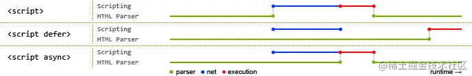

关于HTML其实没有太多介绍的，因为这是基础中的基础。
所以这里只简单的介绍一下，更多的是解释何为H5。

## 什么是HTML？什么又是H5？
> 取自chatGPT
>
> HTML（超文本标记语言）是一种用于创建和呈现网页内容的标准标记语言。它使用一系列预定义的标签来描述网页元素，如文本、图像、链接等。
>
> H5是HTML5的简称，它是HTML的第五个主要版本。相较于HTML4.01，HTML5引入了许多新的特性和功能，如图形绘制、媒体播放、离线存储等，同时也提高了网页性能和用户体验。

然后我们打开vscode，新建一个html文件，! + tab 看看自动生成的html

```html
<!DOCTYPE html>
<html lang="en">
<head>
    <meta charset="UTF-8">
    <meta http-equiv="X-UA-Compatible" content="IE=edge">
    <meta name="viewport" content="width=device-width, initial-scale=1.0">
    <title>Document</title>
</head>
<body>
    
</body>
</html>
```

这就是一个简单的html了，不过还没有引入style和script，这个后面会讲，我们可以先来看看每一行有什么意思

```html
<!DOCTYPE html> 
<!-- 
类型声明 告诉浏览器（解析器）应该以什么样（html或xhtml）的文档类型定义来解析文档 
<!Doctype html> 的作用就是让浏览器进入标准模式，使用最新的 HTML5 标准来解析渲染页面；如果不写，浏览器就会进入混杂模式
CSS1Compat：标准模式（Strick mode），默认模式，浏览器使用W3C的标准解析渲染页面。在标准模式中，浏览器以其支持的最高标准呈现页面。
BackCompat：怪异模式(混杂模式)(Quick mode)，浏览器使用自己的怪异模式解析渲染页面。在怪异模式中，页面以一种比较宽松的向后兼容的方式显示。
-->
<html lang="en"> // 声明这是一个HTML文档，lang=en就是表示该文档主语言是English
<head> // 包含文档的元信息，它的子内容不会直接显示在网页上
    <meta charset="UTF-8"> // 声明字符集
    <meta http-equiv="X-UA-Compatible" content="IE=edge"> // 设置浏览器兼容模式，要求IE用最新的渲染引擎渲染
    <meta name="viewport" content="width=device-width, initial-scale=1.0"> // 适配移动端，可以控制视口的大小和比例
  	<!--meta 就是元标签， 用来描述网页文档的属性-->
    <title>Document</title>
</head>
<body> // 包含实际显示在网页上的内容
    
</body>
</html>
```

介绍完基本的HTML，接下来再看看H5。

对于H5，可能听到过最多的一种说法就是H5小程序，看看chatGPT怎么说。

> H5小程序是一种基于HTML5技术开发的轻量级应用程序。这些小程序可以嵌入在网页或其他应用程序中，无需下载和安装，用户可以直接访问和使用。
>
> 微信小程序和支付宝小程序分别是腾讯微信和阿里巴巴支付宝推出的小程序平台。它们都是基于自家平台的技术体系，允许开发者创建轻量级应用程序，并在微信或支付宝环境中运行。与H5小程序相比，微信和支付宝小程序更侧重于与其平台的整合，为用户提供更丰富的功能和更好的体验。
>
> 总的来说，H5小程序、微信小程序和支付宝小程序都是轻量级应用程序，它们的目的都是为用户提供便捷的应用使用体验。其中，H5小程序主要依赖HTML5技术，而微信和支付宝小程序则分别依赖于微信和支付宝的技术体系。在实际应用中，开发者需要根据需求和目标用户来选择合适的小程序平台。

基于此，我们接下来就去了解了解H5具体有哪些内容。

###  语义化标签

其实我看来就是为了杜绝万物皆div的写法，虽然现在可能还是会这么写... 官方一点的回答就是两点：

**语义化是指根据内容的结构化（内容语义化），选择合适的标签（代码语义化）**。通俗来讲就是用正确的标签做正确的事情。

- 对机器友好，带有语义的文字表现力丰富，更适合搜索引擎的爬虫爬取有效信息，有利于SEO。除此之外，语义类还支持读屏软件，根据文章可以自动生成目录；
- 对开发者友好，使用语义类标签增强了可读性，结构更加清晰，开发者能清晰的看出网页的结构，便于团队的开发与维护。

常见的有

```html
<header></header>  头部
<nav></nav>  导航栏
<section></section>  区块
<main></main>  主要区域
<article></article>  主要内容
<aside></aside>  侧边栏
<footer></footer>  底部
```

### 媒体标签

就是video, audio等标签，然后还有source，对于source标签，实习的时候刚好用过，大概是这样

```html
<picture>
  <source media="(min-width: 800px)" srcset="large.jpg">
  <source media="(min-width: 500px)" srcset="medium.jpg">
  
</picture>
```

其实就是用于在不同环境/条件下加载不同的资源，这个例子中，picture是一个容器，用于包含一个或多个`<source>`标签和一个``标签。`<source>`标签用于指定不同条件下要使用的图像资源，而``标签则作为默认的图像资源，用于在没有合适`<source>`标签的情况下显示。当然它也可以去指定video，audio的资源，

`<source>`标签通常包含以下属性：

1. `srcset`：指定图像资源的URL。可以包含多个URL，用逗号分隔，以提供不同分辨率的图像。
2. `media`：定义一个媒体查询，用于指定何时使用该`<source>`标签。例如，可以根据设备屏幕宽度选择不同的图像资源。
3. `sizes`：定义图像在不同视口尺寸下的显示大小。此属性通常与`srcset`属性一起使用，以便浏览器选择最合适的图像资源。
4. `type`：指定图像资源的MIME类型（如`image/jpeg`、`image/png`等）。这可以让浏览器根据支持的图像格式选择合适的资源。

>  这里的sizes和srcset 也同样适用于img

然后当时实习的碰到的就是关于图片格式兼容的，兼容性高的浏览器就用webp/avif，不高的就用jpg，png，然后这里简单再介绍一下各个图片格式的区别吧。

> （1）**BMP**，是无损的、既支持索引色也支持直接色的点阵图。这种图片格式几乎没有对数据进行压缩，所以BMP格式的图片通常是较大的文件。
>
> （2）**GIF**是无损的、采用索引色的点阵图。采用LZW压缩算法进行编码。文件小，是GIF格式的优点，同时，GIF格式还具有支持动画以及透明的优点。但是GIF格式仅支持8bit的索引色，所以GIF格式适用于对色彩要求不高同时需要文件体积较小的场景。
>
> （3）**JPEG**是有损的、采用直接色的点阵图。JPEG的图片的优点是采用了直接色，得益于更丰富的色彩，JPEG非常适合用来存储照片，与GIF相比，JPEG不适合用来存储企业Logo、线框类的图。因为有损压缩会导致图片模糊，而直接色的选用，又会导致图片文件较GIF更大。
>
> （4）**PNG-8**是无损的、使用索引色的点阵图。PNG是一种比较新的图片格式，PNG-8是非常好的GIF格式替代者，在可能的情况下，应该尽可能的使用PNG-8而不是GIF，因为在相同的图片效果下，PNG-8具有更小的文件体积。除此之外，PNG-8还支持透明度的调节，而GIF并不支持。除非需要动画的支持，否则没有理由使用GIF而不是PNG-8。
>
> （5）**PNG-24**是无损的、使用直接色的点阵图。PNG-24的优点在于它压缩了图片的数据，使得同样效果的图片，PNG-24格式的文件大小要比BMP小得多。当然，PNG24的图片还是要比JPEG、GIF、PNG-8大得多。
>
> AVIF：
>
> - AVIF是基于AV1视频编码格式的图像文件格式。AV1是一种开放、免费的视频编码格式，由AOMedia开发，旨在提供更高的压缩效率和更低的带宽需求。
> - AVIF图像格式具有出色的压缩性能，可以在相同的图像质量下提供比JPEG、PNG和WebP更小的文件大小。这有助于减少网页加载时间和带宽消耗。
> - AVIF还支持许多高级功能，如高动态范围（HDR）、宽色域、透明度（alpha通道）等。
> - 尽管AVIF具有诸多优点，但目前它在浏览器支持方面还不如WebP。然而，随着时间的推移，越来越多的浏览器和设备开始支持AVIF。
>
> WebP：
> - WebP是由Google开发的一种图像格式，旨在提供更好的压缩效果，以减小文件大小并提高网页加载速度。
> - WebP格式支持无损和有损压缩，可以在相同的图像质量下比JPEG和PNG提供更小的文件大小。此外，WebP还支持透明度（alpha通道）和动画。
> - WebP在现代浏览器中的支持较好，包括Chrome、Firefox、Safari和Microsoft Edge等。然而，在一些较旧的浏览器（如Internet Explorer）中，WebP仍不受支持。
>
> **SVG：** SVG可缩放矢量图形（Scalable Vector Graphics）是基于可扩展标记语言XML描述的2D图形的语言，SVG基于XML就意味着SVG DOM中的每个元素都是可用的，可以为某个元素附加Javascript事件处理器。在 SVG 中，每个被绘制的图形均被视为对象。如果 SVG 对象的属性发生变化，那么浏览器能够自动重现图形。
>
> 其特点如下：
>
> - 不依赖分辨率
> - 支持事件处理器
> - 最适合带有大型渲染区域的应用程序（比如谷歌地图）
> - 复杂度高会减慢渲染速度（任何过度使用 DOM 的应用都不快）
> - 不适合游戏应用
>
> **（2）Canvas：** Canvas是画布，通过Javascript来绘制2D图形，是逐像素进行渲染的。其位置发生改变，就会重新进行绘制。
>
> 其特点如下：
>
> - 依赖分辨率
> - 不支持事件处理器
> - 弱的文本渲染能力
> - 能够以 .png 或 .jpg 格式保存结果图像
> - 最适合图像密集型的游戏，其中的许多对象会被频繁重绘

### Drag

这也是一个比较重要的新特性吧，不然之前只能通过Js + 定位或者translate来实习类似的功能，现在提供原生API肯定是更方便的。

+ dragstart：事件主体是被拖放元素，在开始拖放被拖放元素时触发。

+ darg：事件主体是被拖放元素，在正在拖放被拖放元素时触发。

+ dragenter：事件主体是目标元素，在被拖放元素进入某元素时触发。

+ dragover：事件主体是目标元素，在被拖放在某元素内移动时触发。

+ dragleave：事件主体是目标元素，在被拖放元素移出目标元素是触发。

+ drop：事件主体是目标元素，在目标元素完全接受被拖放元素时触发。

+ dragend：事件主体是被拖放元素，在整个拖放操作结束时触发。

### 其余特性

其余的就比如一些表单的新类型，比如自带正则的email啊，URL啊，number啊，然后还有一些日期控件之类的，然后还有progress标签，这里提一下表单的onInput事件，这也是h5的新事件，在原生的html中，onInput和onChange是有区别的，前者是输入就会触发，后者是只有表单失去焦点才会变化，而react中的事件，都是合成事件，是对原生事件的在封装，所以react和vue等框架中,onChange和o nInput的特性基本一样，而且有着更好的兼容性，所以在框架中我们一般用onChange而不是onInput。 然后还有canvas, svg,Geolocation,ws等。

还有一些就是和Js相关的特性了，比如querySlector等API，localStorage等存储功能

## 其余基本概念

还有一些什么基本概念，简单说说，不懂就直接GPT或者Google走起。

+ 行内元素/块级元素/行内块元素
+ 替换元素
+ web worker

在 HTML 页面中，如果在执行脚本时，页面的状态是不可相应的，直到脚本执行完成后，页面才变成可相应。web worker 是运行在后台的 js，独立于其他脚本，不会影响页面的性能。 并且通过 postMessage 将结果回传到主线程。这样在进行复杂操作的时候，就不会阻塞主线程了

+ h5离线存储

离线存储指的是：在用户没有与因特网连接时，可以正常访问站点或应用，在用户与因特网连接时，更新用户机器上的缓存文件。

**使用方法：** （1）创建一个和 html 同名的 manifest 文件，然后在页面头部加入 manifest 属性：

```html
<html lang="en" manifest="index.manifest">
复制代码
```

（2）在 `cache.manifest` 文件中编写需要离线存储的资源：

```html
CACHE MANIFEST
    #v0.11
    CACHE:
    js/app.js
    css/style.css
    NETWORK:
    resourse/logo.png
    FALLBACK:
    / /offline.html
复制代码
```

- **CACHE**: 表示需要离线存储的资源列表，由于包含 manifest 文件的页面将被自动离线存储，所以不需要把页面自身也列出来。
- **NETWORK**: 表示在它下面列出来的资源只有在在线的情况下才能访问，他们不会被离线存储，所以在离线情况下无法使用这些资源。不过，如果在 CACHE 和 NETWORK 中有一个相同的资源，那么这个资源还是会被离线存储，也就是说 CACHE 的优先级更高。
- **FALLBACK**: 表示如果访问第一个资源失败，那么就使用第二个资源来替换他，比如上面这个文件表示的就是如果访问根目录下任何一个资源失败了，那么就去访问 offline.html 。

（3）在离线状态时，操作 `window.applicationCache` 进行离线缓存的操作。

**如何更新缓存：**

（1）更新 manifest 文件

（2）通过 javascript 操作

（3）清除浏览器缓存

**注意事项：**

（1）浏览器对缓存数据的容量限制可能不太一样（某些浏览器设置的限制是每个站点 5MB）。

（2）如果 manifest 文件，或者内部列举的某一个文件不能正常下载，整个更新过程都将失败，浏览器继续全部使用老的缓存。

（3）引用 manifest 的 html 必须与 manifest 文件同源，在同一个域下。

（4）FALLBACK 中的资源必须和 manifest 文件同源。

（5）当一个资源被缓存后，该浏览器直接请求这个绝对路径也会访问缓存中的资源。

（6）站点中的其他页面即使没有设置 manifest 属性，请求的资源如果在缓存中也从缓存中访问。

（7）当 manifest 文件发生改变时，资源请求本身也会触发更新。

**原理：**HTML5的离线存储是基于一个新建的 `.appcache` 文件的缓存机制(不是存储技术)，通过这个文件上的解析清单离线存储资源，这些资源就会像cookie一样被存储了下来。之后当网络在处于离线状态下时，浏览器会通过被离线存储的数据进行页面展示.

**在线的情况下**，浏览器发现 html 头部有 manifest 属性，它会请求 manifest 文件，如果是第一次访问页面 ，那么浏览器就会根据 manifest 文件的内容下载相应的资源并且进行离线存储。如果已经访问过页面并且资源已经进行离线存储了，那么浏览器就会使用离线的资源加载页面，然后浏览器会对比新的 manifest 文件与旧的 manifest 文件，如果文件没有发生改变，就不做任何操作，如果文件改变了，就会重新下载文件中的资源并进行离线存储。

**离线的情况下**，浏览器会直接使用离线存储的资源。

## style标签和script标签

如果没有defer或async属性，浏览器会立即加载并执行相应的脚本。它不会等待后续加载的文档元素，读取到就会开始加载和执行，这样就阻塞了后续文档的加载。



蓝色代表js脚本网络加载时间，红色代表js脚本执行时间，绿色代表html解析。

**defer 和 async属性都是去异步加载外部的JS脚本文件，它们都不会阻塞页面的解析**，其区别如下：

- **执行顺序：** 多个带async属性的标签，不能保证加载的顺序；多个带defer属性的标签，按照加载顺序执行；
- **脚本是否并行执行：** async属性，表示**后续文档的加载和执行与js脚本的加载和执行是并行进行的**，即异步执行；defer属性，加载后续文档的过程和js脚本的加载(此时仅加载不执行)是并行进行的(异步)，js脚本需要等到文档所有元素解析完成之后才执行，DOMContentLoaded事件触发执行之前。

## iframe

主要目的其实就是引入其他网站的内容，最常用的就是引用YouTube啊b站啊之类的视频，比较高级一点的就是作为微前端方案。
iframe 元素会创建包含另外一个文档的内联框架（即行内框架）。
优点：

1. 用来加载速度较慢的内容（如广告）
2. 可以使脚本可以并行下载
3. 可以实现跨子域通信

缺点：

1. iframe 会阻塞主页面的 onload 事件
2. 无法被一些搜索引擎索识别
3. 会产生很多页面，不容易管理
4. 增加额外性能开销
5. 有访问性问题（比如用CSP）


###  Canvas和SVG的区别

**（1）SVG：** SVG可缩放矢量图形（Scalable Vector Graphics）是基于可扩展标记语言XML描述的2D图形的语言，SVG基于XML就意味着SVG DOM中的每个元素都是可用的，可以为某个元素附加Javascript事件处理器。在 SVG 中，每个被绘制的图形均被视为对象。如果 SVG 对象的属性发生变化，那么浏览器能够自动重现图形。

其特点如下：

- 不依赖分辨率
- 支持事件处理器
- 最适合带有大型渲染区域的应用程序（比如谷歌地图）
- 复杂度高会减慢渲染速度（任何过度使用 DOM 的应用都不快）
- 不适合游戏应用

**（2）Canvas：** Canvas是画布，通过Javascript来绘制2D图形，是逐像素进行渲染的。其位置发生改变，就会重新进行绘制。

其特点如下：

- 依赖分辨率
- 不支持事件处理器
- 弱的文本渲染能力
- 能够以 .png 或 .jpg 格式保存结果图像
- 最适合图像密集型的游戏，其中的许多对象会被频繁重绘


