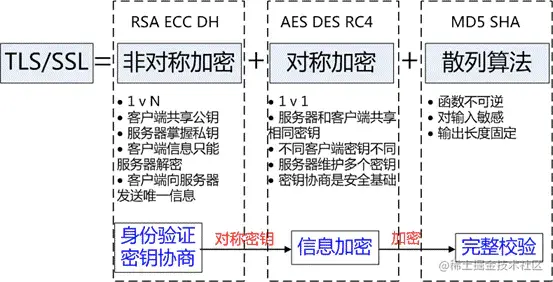

## HTTP协议

### HTTP请求方法

+ GET: 向服务器获取数据；
+ POST：将实体提交到指定的资源，通常会造成服务器资源的修改；
+ PUT：上传文件，更新数据；
+ DELETE：删除服务器上的对象；
+ HEAD：获取报文首部，与GET相比，不返回报文主体部分；
+ OPTIONS：询问支持的请求方法，用来跨域请求；
+ CONNECT：要求在与代理服务器通信时建立隧道，使用隧道进行TCP通信；
+ TRACE: 回显服务器收到的请求，主要⽤于测试或诊断。

#### GET和POST区别

Post 和 Get 是 HTTP 请求的两种方法，其区别如下：

+ 应用场景： GET 请求是一个幂等的请求，一般 Get 请求用于对服务器资源不会产生影响的场景，比如说请求一个网页的资源。而 Post 不是一个幂等的请求，一般用于对服务器资源会产生影响的情景，比如注册用户这一类的操作。
+ 是否缓存： 因为两者应用场景不同，浏览器一般会对 Get 请求缓存，但很少对 Post 请求缓存。
+ 发送的报文格式： Get 请求的报文中实体部分为空，Post 请求的报文中实体部分一般为向服务器发送的数据。
+ 安全性： Get 请求可以将请求的参数放入 url 中向服务器发送，这样的做法相对于 Post 请求来说是不太安全的，因为请求的 url 会被保留在历史记录中。
+ 请求长度： 浏览器由于对 url 长度的限制，所以会影响 get 请求发送数据时的长度。这个限制是浏览器规定的，并不是 RFC 规定的。
+ 参数类型： post 的参数传递支持更多的数据类型。

####  POST和PUT请求的区别

+ PUT请求是向服务器端发送数据，从而修改数据的内容，但是不会增加数据的种类等，也就是说无论进行多少次PUT操作，其结果并没有不同。（可以理解为时更新数据）
+ POST请求是向服务器端发送数据，该请求会改变数据的种类等资源，它会创建新的内容。（可以理解为是创建数据

####  OPTIONS请求方法及使用场景
OPTIONS是除了GET和POST之外的其中一种 HTTP请求方法。
OPTIONS方法是用于请求获得由Request-URI标识的资源在请求/响应的通信过程中可以使用的功能选项。通过这个方法，客户端可以在采取具体资源请求之前，决定对该资源采取何种必要措施，或者了解服务器的性能。该请求方法的响应不能缓存。
OPTIONS请求方法的主要用途有两个：

+ 获取服务器支持的所有HTTP请求方法；
+ 用来检查访问权限。例如：在进行 CORS 跨域资源共享时，对于复杂请求，就是使用 OPTIONS 方法发送嗅探请求，以判断是否有对指定资源的访问权限。

#### 常见的HTTP请求头和响应头
HTTP Request Header 常见的请求头：

+ Accept:浏览器能够处理的内容类型
+ Accept-Charset:浏览器能够显示的字符集
+ Accept-Encoding：浏览器能够处理的压缩编码
+ Accept-Language：浏览器当前设置的语言
+ Connection：浏览器与服务器之间连接的类型
+ Cookie：当前页面设置的任何Cookie
+ Host：发出请求的页面所在的域
+ Referer：发出请求的页面的URL
+ User-Agent：浏览器的用户代理字符串

HTTP Responses Header 常见的响应头：

+ Date：表示消息发送的时间，时间的描述格式由rfc822定义
+ server:服务器名称
+ Connection：浏览器与服务器之间连接的类型
+ Cache-Control：控制HTTP缓存
+ content-type:表示后面的文档属于什么MIME类型

常见的 Content-Type 属性值有以下四种：
（1）application/x-www-form-urlencoded：浏览器的原生 form 表单，如果不设置 enctype 属性，那么最终就会以 application/x-www-form-urlencoded 方式提交数据。该种方式提交的数据放在 body 里面，数据按照 key1=val1&key2=val2 的方式进行编码，key 和 val 都进行了 URL转码。
（2）multipart/form-data：该种方式也是一个常见的 POST 提交方式，通常表单上传文件时使用该种方式。
（3）application/json：服务器消息主体是序列化后的 JSON 字符串。
（4）text/xml：该种方式主要用来提交 XML 格式的数据。

与缓存相关的HTTP请求头
强缓存：Expires、Cache-Control
协商缓存：Etag、If-None-Match、Last-Modified、If-Modified-Since

### HTTP状态码
**1xxs - 信息性**：服务器正在处理请求。

**2xxs - 成功信息**：请求已经完成，服务器向浏览器提供了预期的响应。

**3xxs –重定向**：你的请求被重定向到了其他地方。服务器收到了请求，但是有某种重定向。

**4xxs – 客户端错误**：客户端发生错误，导致服务器无法处理请求。

**5xxs – 服务端错误**：客户端发出了有效的请求，但是服务器未能正确处理请求

#### 1xxs

**100 Continue**：表明目前为止，所有的请求内容都是可行的，客户端应该继续请求，如果完成，则忽略它。

**101 Switching Protocol**：该状态码是响应客户端`Upgrade`标头发送的，并且指示服务器也正在切换协议。

**103 Early Hints**：主要用于与`Link`链接头一起使用，以允许用户代理在服务器仍在准备响应时开始预加载资源。

#### 2xxs

- 200 OK

  ：请求成功。成功的含义取决于HTTP方法：

  - `GET`：资源已被提取并在消息正文中传输。
  - `HEAD`：实体标头位于消息正文中。
  - `POST`：描述动作结果的资源在消息体中传输。
  - `TRACE`：消息正文包含服务器收到的请求信息。（方法不安全，一般不用）

说到了HTTP的方法，可以戳[HTTP请求方法](https://link.juejin.cn?target=https%3A%2F%2Fwww.runoob.com%2Fhttp%2Fhttp-methods.html)这个解析教程来了解一下。

- **201 Created**：请求已经成功，并因此创建了一个新的资源。这通常是在`PUT`或`POST`请求之后发送的响应。
- **202 Accepted**：请求已经接收到，但是没有响应，没有结果。意味着不会有一个异步的响应去表明当前请求的结果，预期另外的进程和服务去处理请求，或者批处理。
- **204 No Content**：服务器成功处理了请求，但不需要返回任何实体内容，并且希望返回更新了的元信息。遇到`复杂请求`时候，浏览器会发送一个`OPTION`方法进行预处理返回响应。

关于复杂请求和简单请求，可以参考这篇文章[CORS非简单请求](https://link.juejin.cn?target=https%3A%2F%2Fmabiao8023.github.io%2F2018%2F03%2F30%2FCORS%E9%9D%9E%E7%AE%80%E5%8D%95%E8%AF%B7%E6%B1%82%2F)。

- **205 Reset Content**：服务器已经成功处理了请求，但是没有返回任何内容。与204响应不同，返回此状态码的响应要求请求者重置文档视图。

#### 3xxs

上文已经提到过，这一大类是提示`重定向`，可是有一个奇葩--304，它并不是表示重定向的信息提示，而是表示`资源未被更改`。至于为什么会被放在这个分类里面，URL 重定向，也称为 URL 转发，是一种当实际资源，如单个页面、表单或者整个 Web 应用被迁移到新的 URL 下的时候，保持（原有）链接可用的技术。HTTP 协议提供了一种特殊形式的响应—— HTTP 重定向（HTTP redirects）来执行此类操作。

- **301 Moved Permanently**：被请求的资源已`永久`移动到新位置，并且将来任何对此资源的引用都应该使用响应返回的若干个URI之一。
- **302 Found(Previously "Moved temporarily")**：请求的资源现在`临时`从不同的URI响应请求。由于这样的重定向是临时的，客户端应当继续向原有地址发送以后的请求。只有在`Cache-Control`或`Expires`中进行了指定的情况下，这个响应才是可缓存的。
- **303 See Other**：对当前的请求的响应可以在另一个URI上被找到，而且客户端应该采用`GET`的方式访问那个链接。这个方法的存在主要是为了允许由脚本激活的POST请求输出重定向到一个新的资源。
- **304 Not Modified**：如果客户端发送了一个带条件的 GET 请求且该请求已被允许，而文档的内容（自上次访问以来或者根据请求的条件）并没有改变，则服务器应当返回这个状态码。304 响应禁止包含消息体，因此始终以消息头后的第一个空行结尾。请求的时候一般结合`If-Modified-Since`头部使用。

> HTTP状态码304是多好还是少好
> 服务器为了提高网站访问速度，对之前访问的部分页面指定缓存机制，当客户端在此对这些页面进行请求，服务器会根据缓存内容判断页面与之前是否相同，若相同便直接返回304，此时客户端调用缓存内容，不必进行二次下载。
> 状态码304不应该认为是一种错误，而是对客户端有缓存情况下服务端的一种响应。
> 搜索引擎蜘蛛会更加青睐内容源更新频繁的网站。通过特定时间内对网站抓取返回的状态码来调节对该网站的抓取频次。若网站在一定时间内一直处于304的状态，那么蜘蛛可能会降低对网站的抓取次数。相反，若网站变化的频率非常之快，每次抓取都能获取新内容，那么日积月累，的回访率也会提高。

- **307 Temporary Redirect**：307的意义如上302。与历史上302不同的是`在重新发出原始请求时不允许更改请求方法`。比如，使用POST请求始终就该用POST请求。

**同样是重定向，307，303，302的区别？**
302是http1.0的协议状态码，在http1.1版本的时候为了细化302状态码⼜出来了两个303和307。 303明确表示客户端应当采⽤get⽅法获取资源，他会把POST请求变为GET请求进⾏重定向。 307会遵照浏览器标准，不会从post变为get。

#### 4xxs

**400 Bad Request:** 请求报文错误

**402**：指你没付费

**401 Unauthorized**：这意味着你的登录凭证无效。服务器不知道你是谁，这时，你需要尝试重新登录。

**403 Forbidden**：服务器已经理解请求，但是拒绝执行它。与401不同，403知道是你登录了，但是还是拒绝了你。

**404 Not Found**：请求失败，你请求所希望得到的资源未在服务器上发现。

**405: 请求方法错误**

**410 Gone**：被请求的资源在服务器上已经不再可用，而且没有任何已知的转发地址。

**422 Unprocessable Entity**：请求格式良好，但是由于语义错误而无妨遵循。这时候要检查下自己的传参格式语义有没有正确了。

**429 Too Many Requests**：用户在给定的时间内发送了太多请求（“限制请求速率”）。在DDOS攻击中就可以使用到了。

#### 5xxs

**500 Internal Server Error**：服务器内部错误，服务器遇到了不知道如何处理的情况。

**HTTP501状态码代表的意思是** **服务器不支持的请求方法**，即 **HTTP 501 Not Implemented** 响应状态。

502 Bad GaTeWay 该状态码表明扮演网关或代理角色的服务器，从上游服务器中接收到的响应是无效的

**503 Service Unavailable**：服务器没有准备好处理请求。常见的原因是服务器因维护或重载而停机。

**504 Gateway Timeout**：网关超时，服务器未能快速的做出反应。请求接口返回pedding时间过长基本就是这个问题了

(5xx就是后端的问题！ 别问 问就是甩锅！！！)

### HTTP报文结构
+ 请求报文
请求报⽂有4部分组成:请求⾏，请求头部，空⾏，请求体
（1）请求⾏包括：请求⽅法字段、URL字段、HTTP协议版本字段。它们⽤空格分隔。例如，GET /index.html HTTP/1.1。 

（2）请求头部:请求头部由关键字/值对组成，每⾏⼀对，关键字和值⽤英⽂冒号“:”分隔，比如
+ User-Agent：产⽣请求的浏览器类型。
+ Accept：客户端可识别的内容类型列表。
+ Host：请求的主机名，允许多个域名同处⼀个IP地址，即虚拟主机。

（3）请求体: post put等请求携带的数据

+ 响应报文
响应报⽂有4部分组成:响应⾏，响应头部，空⾏，响应体
+ 响应⾏：由网络协议版本，状态码和状态码的原因短语组成，例如 HTTP/1.1 200 OK 。
+ 响应头：响应部⾸组成
+ 响应体：服务器响应的数据

### HTTP协议的优点和缺点
HTTP 是超文本传输协议，它定义了客户端和服务器之间交换报文的格式和方式，默认使用 80 端口。它使用 TCP 作为传输层协议，保证了数据传输的可靠性。
HTTP协议具有以下优点：

+ 支持客户端/服务器模式
+ 简单快速：客户向服务器请求服务时，只需传送请求方法和路径。由于 HTTP 协议简单，使得 HTTP 服务器的程序规模小，因而通信速度很快。
+ 无连接：无连接就是限制每次连接只处理一个请求。服务器处理完客户的请求，并收到客户的应答后，即断开连接，采用这种方式可以节省传输时间。
+ 无状态：HTTP 协议是无状态协议，这里的状态是指通信过程的上下文信息。缺少状态意味着如果后续处理需要前面的信息，则它必须重传，这样可能会导致每次连接传送的数据量增大。另一方面，在服务器不需要先前信息时它的应答就比较快。
+ 灵活：HTTP 允许传输任意类型的数据对象。正在传输的类型由 Content-Type 加以标记。

HTTP协议具有以下缺点：

+ 无状态： HTTP 是一个无状态的协议，HTTP 服务器不会保存关于客户的任何信息。
+ 明文传输： 协议中的报文使用的是文本形式，这就直接暴露给外界，不安全。
+ 不安全

（1）通信使用明文（不加密），内容可能会被窃听；
（2）不验证通信方的身份，因此有可能遭遇伪装；
（3）无法证明报文的完整性，所以有可能已遭篡改；

### HTTP2.0
可以先看1.0和1.1的区别（现在基本都是1.1）

+ 连接方面，http1.0 默认使用非持久连接，而 http1.1 默认使用持久连接。http1.1 通过使用持久连接来使多个 http 请求复用同一个 TCP 连接，以此来避免使用非持久连接时每次需要建立连接的时延。
+ 资源请求方面，在 http1.0 中，存在一些浪费带宽的现象，例如客户端只是需要某个对象的一部分，而服务器却将整个对象送过来了，并且不支持断点续传功能，http1.1 则在请求头引入了 range 头域，它允许只请求资源的某个部分，即返回码是 206（Partial Content），这样就方便了开发者自由的选择以便于充分利用带宽和连接。
+ 缓存方面，在 http1.0 中主要使用 header 里的 If-Modified-Since、Expires 来做为缓存判断的标准，http1.1 则引入了更多的缓存控制策略，例如 Etag、If-Unmodified-Since、If-Match、If-None-Match 等更多可供选择的缓存头来控制缓存策略。
+ http1.1 中新增了 host 字段，用来指定服务器的域名。http1.0 中认为每台服务器都绑定一个唯一的 IP 地址，因此，请求消息中的 URL 并没有传递主机名（hostname）。但随着虚拟主机技术的发展，在一台物理服务器上可以存在多个虚拟主机，并且它们共享一个IP地址。因此有了 host 字段，这样就可以将请求发往到同一台服务器上的不同网站。
+ http1.1 相对于 http1.0 还新增了很多请求方法，如 PUT、HEAD、OPTIONS 等。

再看看2.0和1.1的区别

+ 二进制协议：HTTP/2 是一个二进制协议。在 HTTP/1.1 版中，报文的头信息必须是文本（ASCII 编码），数据体可以是文本，也可以是二进制。HTTP/2 则是一个彻底的二进制协议，头信息和数据体都是二进制，并且统称为"帧"，可以分为头信息帧和数据帧。 帧的概念是它实现多路复用的基础。
+ 多路复用： HTTP/2 实现了多路复用，HTTP/2 仍然复用 TCP 连接，但是在一个连接里，客户端和服务器都可以同时发送多个请求或回应，而且不用按照顺序一一发送，这样就避免了"队头堵塞"【1】的问题。
+ 数据流： HTTP/2 使用了数据流的概念，因为 HTTP/2 的数据包是不按顺序发送的，同一个连接里面连续的数据包，可能属于不同的请求。因此，必须要对数据包做标记，指出它属于哪个请求。HTTP/2 将每个请求或回应的所有数据包，称为一个数据流。每个数据流都有一个独一无二的编号。数据包发送时，都必须标记数据流 ID ，用来区分它属于哪个数据流。
+ 头信息压缩： HTTP/2 实现了头信息压缩，由于 HTTP 1.1 协议不带状态，每次请求都必须附上所有信息。所以，请求的很多字段都是重复的，比如 Cookie 和 User Agent ，一模一样的内容，每次请求都必须附带，这会浪费很多带宽，也影响速度。HTTP/2 对这一点做了优化，引入了头信息压缩机制。一方面，头信息使用 gzip 或 compress 压缩后再发送；另一方面，客户端和服务器同时维护一张头信息表，所有字段都会存入这个表，生成一个索引号，以后就不发送同样字段了，只发送索引号，这样就能提高速度了。
+ 服务器推送： HTTP/2 允许服务器未经请求，主动向客户端发送资源，这叫做服务器推送。使用服务器推送提前给客户端推送必要的资源，这样就可以相对减少一些延迟时间。这里需要注意的是 http2 下服务器主动推送的是静态资源，和 WebSocket 以及使用 SSE 等方式向客户端发送即时数据的推送是不同的。

> 队头阻塞是由 HTTP 基本的“请求 - 应答”模型所导致的。HTTP 规定报文必须是“一发一收”，这就形成了一个先进先出的“串行”队列。队列里的请求是没有优先级的，只有入队的先后顺序，排在最前面的请求会被最优先处理。如果队首的请求因为处理的太慢耽误了时间，那么队列里后面的所有请求也不得不跟着一起等待，结果就是其他的请求承担了不应有的时间成本，造成了队头堵塞的现象。
> 队头阻塞的解决方案： （1）并发连接：对于一个域名允许分配多个长连接，那么相当于增加了任务队列，不至于一个队伍的任务阻塞其它所有任务。 （2）域名分片：将域名分出很多二级域名，它们都指向同样的一台服务器，能够并发的长连接数变多，解决了队头阻塞的问题。

#### Http2是如何实现多路复用的

HTTP/1.1 中，每个连接只能同时处理一个请求和响应，这就意味着在处理请求和响应期间，连接处于空闲状态，不能处理其他请求。这样会导致连接的效率低下，特别是在处理大量小型资源的情况下。因此，HTTP/2 引入了多路复用机制。

多路复用是指在一个连接上同时处理多个请求和响应。这样，可以将多个请求并发地发送到服务器，服务器也可以并发地响应多个请求，从而提高了连接的效率。HTTP/2 中实现多路复用的核心是帧（Frame）和流（Stream）。

HTTP/2 将消息分解为更小的二进制帧（Frame），每个帧都有一个帧头，其中包含帧的类型、长度和标识符等信息。每个流都由一个或多个帧组成，这些帧通过标识符进行关联。在一个连接中可以有多个流，每个流都有唯一的标识符。这些流可以并发地传输，而且一个流的帧可以插入到另一个流的帧之间。

因此，在 HTTP/2 中，客户端可以同时发送多个请求到服务器，服务器也可以并发地处理这些请求并返回响应，而且不同的流之间互不干扰。多路复用机制大大提高了连接的效率，减少了延迟时间，提高了网页的加载速度

HTTP/2 中的多路复用（Multiplexing）解决了 HTTP/1.x 中的“队头阻塞”（Head-of-Line Blocking）问题。队头阻塞是指在一个 TCP 连接中，一个请求必须等待前一个请求完成后才能开始，导致网络资源无法充分利用，从而降低了网页加载速度。

**HTTP/2 的多路复用通过以下方式解决了队头阻塞问题：**

1. 单一连接：HTTP/2 使用单一的 TCP 连接来传输多个请求和响应。这样可以减少建立多个 TCP 连接所需的时间和资源，同时也减少了潜在的队头阻塞问题。

2. 请求和响应分帧：HTTP/2 将请求和响应拆分成多个较小的“帧”（Frames），每个帧都有一个唯一的流标识符（Stream ID）。这样，多个请求和响应可以在同一个 TCP 连接中并行传输。

3. 优先级和依赖：HTTP/2 允许客户端为每个请求设置优先级和依赖关系。服务器可以根据这些信息来优化资源分配，从而提高页面加载速度。

通过多路复用，HTTP/2 能够充分利用网络资源，提高网页加载速度，从而改善用户体验。同时，HTTP/2 还引入了其他优化措施，如头部压缩（Header Compression）和服务器推送（Server Push），进一步提升了网络性能。

> TCP队头阻塞（TCP Head-of-Line Blocking）是指在一个TCP连接中，数据包必须按照发送顺序进行接收和处理。如果一个数据包丢失或者延迟，那么后续的数据包即使已经到达接收端，也必须等待前面丢失或延迟的数据包被重新传输并成功接收后才能被处理。这种现象称为队头阻塞，因为阻塞发生在队列的头部。
>
> 在TCP协议中，为了确保数据的可靠传输，发送方会对每个数据包分配一个序列号，接收方收到数据包后需要返回一个确认（ACK）信号。如果发送方在一定时间内没有收到确认信号，就会认为数据包丢失，并触发重传机制。这种按序处理数据包的方式导致了队头阻塞问题。
>
> 队头阻塞会导致网络性能下降，增加延迟，降低吞吐量。为了解决这个问题，有一些新的传输协议（如QUIC）被提出，它们采用了不同的方法来避免队头阻塞，例如在更高层次上实现可靠性，从而允许接收端乱序处理数据包。

**注： HTTP2大部分用于HTTPS，可以充分发挥性能优势和提供更好的安全性**

**为什么需要头部压缩？**假定一个页面有100个资源需要加载（这个数量对于今天的Web而言还是挺保守的）, 而每一次请求都有1kb的消息头（这同样也并不少见，因为Cookie和引用等东西的存在）, 则至少需要多消耗100kb来获取这些消息头。HTTP2.0可以维护一个字典，差量更新HTTP头部，大大降低因头部传输产生的流量。具体参考：HTTP/2 头部压缩技术介绍

**HTTP2.0多路复用有多好？**HTTP 性能优化的关键并不在于高带宽，而是低延迟。TCP 连接会随着时间进行自我「调谐」，起初会限制连接的最大速度，如果数据成功传输，会随着时间的推移提高传输的速度。这种调谐则被称为 TCP 慢启动。由于这种原因，让原本就具有突发性和短时性的 HTTP 连接变的十分低效。HTTP/2 通过让所有数据流共用同一个连接，可以更有效地使用 TCP 连接，让高带宽也能真正的服务于 HTTP 的性能提升。

HTTP/1.1 中，每个连接只能同时处理一个请求和响应，这就意味着在处理请求和响应期间，连接处于空闲状态，不能处理其他请求。这样会导致连接的效率低下，特别是在处理大量小型资源的情况下。因此，HTTP/2 引入了多路复用机制。

多路复用是指在一个连接上同时处理多个请求和响应。这样，可以将多个请求并发地发送到服务器，服务器也可以并发地响应多个请求，从而提高了连接的效率。HTTP/2 中实现多路复用的核心是帧（Frame）和流（Stream）。

HTTP/2 将消息分解为更小的二进制帧（Frame），每个帧都有一个帧头，其中包含帧的类型、长度和标识符等信息。每个流都由一个或多个帧组成，这些帧通过标识符进行关联。在一个连接中可以有多个流，每个流都有唯一的标识符。这些流可以并发地传输，而且一个流的帧可以插入到另一个流的帧之间。

因此，在 HTTP/2 中，客户端可以同时发送多个请求到服务器，服务器也可以并发地处理这些请求并返回响应，而且不同的流之间互不干扰。多路复用机制大大提高了连接的效率，减少了延迟时间，提高了网页的加载速度。

在 HTTP 协议中，`Referer`是一个请求头字段，用于表示当前请求是从哪个页面发起的。换句话说，`Referer` 可以告诉服务器用户是从哪个页面点击链接或提交表单来到当前页面的。这对于分析用户行为、防止 CSRF（跨站请求伪造）攻击以及实现一些特定的业务逻辑非常有用。

#### Referer

`Referer` 的一些用途如下：

1. 日志分析和用户行为追踪：服务器可以通过分析 `Referer` 字段来了解用户是如何进入当前页面的，从而分析用户的行为和流量来源。

2. 防止 CSRF 攻击：在某些情况下，服务器可以通过检查 `Referer` 字段来判断请求是否来自合法的来源，从而防止 CSRF 攻击。然而，这种方法并不完全可靠，因为 `Referer` 字段可能会被篡改或删除。

3. 内容过滤：有些网站可能会根据 `Referer` 字段来判断请求是否来自合法的来源，从而决定是否提供内容。例如，一个图片网站可能会检查 `Referer` 字段，以确保图片只能在合法的网站上显示。

4. 缓存控制：服务器可以根据 `Referer` 字段来决定是否为不同的来源提供不同的缓存策略。

需要注意的是，`Referer` 字段并不总是可靠的，因为它可以被浏览器插件、代理服务器或恶意用户篡改。此外，出于隐私考虑，某些浏览器或用户设置可能会禁用或删除 `Referer` 字段。因此，在实际应用中，你需要权衡利弊，决定是否依赖 `Referer` 字段来实现特定的功能。

# 

### 

#### 对Keep-alive理解
HTTP1.0 中默认是在每次请求/应答，客户端和服务器都要新建一个连接，完成之后立即断开连接，这就是短连接。当使用Keep-Alive模式时，Keep-Alive功能使客户端到服务器端的连接持续有效，当出现对服务器的后继请求时，Keep-Alive功能避免了建立或者重新建立连接，这就是长连接。其使用方法如下：
keep-Alive的建立过程：

+ 客户端向服务器在发送请求报文同时在首部添加发送Connection字段
+ 服务器收到请求并处理 Connection字段
+ 服务器回送Connection:Keep-Alive字段给客户端
+ 客户端接收到Connection字段
+ Keep-Alive连接建立成功

服务端自动断开过程（也就是没有keep-alive）：

+ 客户端向服务器只是发送内容报文（不包含Connection字段）
+ 服务器收到请求并处理
+ 服务器返回客户端请求的资源并关闭连接
+ 客户端接收资源，发现没有Connection字段，断开连接

客户端请求断开连接过程：

+ 客户端向服务器发送Connection:close字段
+ 服务器收到请求并处理connection字段
+ 服务器回送响应资源并断开连接
+ 客户端接收资源并断开连接

开启Keep-Alive的优点：

+ 较少的CPU和内存的使⽤（由于同时打开的连接的减少了）；
+ 允许请求和应答的HTTP管线化；
+ 降低拥塞控制 （TCP连接减少了）；
+ 减少了后续请求的延迟（⽆需再进⾏握⼿）；
+ 报告错误⽆需关闭TCP连；

开启Keep-Alive的缺点：

+ 长时间的Tcp连接容易导致系统资源无效占用，浪费系统资源

#### HTTP2的头部压缩算法是怎样的？
HTTP2的头部压缩是HPACK算法。在客户端和服务器两端建立“字典”，用索引号表示重复的字符串，采用哈夫曼编码来压缩整数和字符串，可以达到50%~90%的高压缩率。

具体来说:

+ 在客户端和服务器端使用“首部表”来跟踪和存储之前发送的键值对，对于相同的数据，不再通过每次请求和响应发送；
+ 首部表在HTTP/2的连接存续期内始终存在，由客户端和服务器共同渐进地更新；
+ 每个新的首部键值对要么被追加到当前表的末尾，要么替换表中之前的值。

也就是如果请求一发送了所有的头部字段，第二个请求则只需要发送差异数据，这样就可以减少冗余数据，降低开销

#### HTTP3.0
HTTP/3基于UDP协议实现了类似于TCP的多路复用数据流、传输可靠性等功能，这套功能被称为QUIC协议。
（Quick UDP Internet Connections）
1. 流量控制、传输可靠性功能：QUIC在UDP的基础上增加了一层来保证数据传输可靠性，它提供了数据包重传、拥塞控制、以及其他一些TCP中的特性。
2. 集成TLS加密功能：目前QUIC使用TLS1.3，减少了握手所花费的RTT数。
3. 多路复用：同一物理连接上可以有多个独立的逻辑数据流，实现了数据流的单独传输，解决了TCP的队头阻塞问题。
4. 快速握手：由于基于UDP，可以实现使用0 ~ 1个RTT来建立连接
5. 具备拥塞控制 快速重传等功能

> 客户端首先向服务器发送HTTP/3请求，然后使用QUIC协议在UDP协议上建立连接。接下来，客户端和服务器之间进行握手，包括QUIC连接请求和响应，以及加密密钥请求和响应。一旦连接建立并且双方都准备好，客户端就会发送HTTP/3请求数据，服务器会响应HTTP/3响应数据。最后，当连接不再需要时，客户端和服务器都会关闭连接，结束通信

### HTTPS
#### http 和 https 的区别及优缺点？

- http 是超文本传输协议，信息是明文传输，HTTPS 协议要比 http 协议`安全`，https 是具有安全性的 ssl 加密传输协议，可防止数据在传输过程中被窃取、改变，确保数据的完整性需要CV证书。
- http 协议的`默认端口`为 80，https 的默认端口为 443。
- http 的连接很简单，是无状态的。https 握手阶段比较`费时`，会使页面加载时间延长 50%，增加 10%~20%的耗电。
- https `缓存`不如 http 高效，会增加数据开销。
- Https 协议需要 ca 证书，费用较高，功能越强大的`证书费`用越高。
- SSL 证书需要绑定 `IP`，不能再同一个 IP 上绑定多个域名，IPV4 资源支持不了这种消耗。
**SSL/TLS也是传输层协议**

#### https 协议的工作原理

客户端在使用 HTTPS 方式与 Web 服务器通信时有以下几个步骤：

1. 客户端使用 https url 访问服务器，则要求 web 服务器`建立 ssl 链接`。
2. web 服务器接收到客户端的请求之后，会`将网站的证书（证书中包含了公钥），传输给客户端`。
3. 客户端和 web 服务器端开始`协商 SSL 链接的安全等级`，也就是加密等级。
4. 客户端浏览器通过双方协商一致的安全等级，`建立会话密钥`，然后通过网站的公钥来加密会话密钥，并传送给网站。
5. web 服务器`通过自己的私钥解密出会话密钥`。
6. web 服务器`通过会话密钥加密与客户端之间的通信`。

#### TLS/SSL工作原理

TLS/SSL的功能实现主要依赖三类基本算法：散列函数hash、对称加密、非对称加密。这三类算法的作用如下：

+ 基于散列函数验证信息的完整性
+ 对称加密算法采用协商的秘钥对数据加密
+ 非对称加密实现身份认证和秘钥协商

1. 散列函数hash
常见的散列函数有MD5、SHA1、SHA256。该函数的特点是单向不可逆，对输入数据非常敏感，输出的长度固定，任何数据的修改都会改变散列函数的结果，可以用于防止信息篡改并验证数据的完整性。

特点： 在信息传输过程中，散列函数不能三都实现信息防篡改，由于传输是明文传输，中间人可以修改信息后重新计算信息的摘要，所以需要对传输的信息和信息摘要进行加密。
2. 对称加密
对称加密的方法是，双方使用同一个秘钥对数据进行加密和解密。但是对称加密的存在一个问题，就是如何保证秘钥传输的安全性，因为秘钥还是会通过网络传输的，一旦秘钥被其他人获取到，那么整个加密过程就毫无作用了。 这就要用到非对称加密的方法。
常见的对称加密算法有AES-CBC、DES、3DES、AES-GCM等。相同的秘钥可以用于信息的加密和解密。掌握秘钥才能获取信息，防止信息窃听，其通讯方式是一对一。

特点： 对称加密的优势就是信息传输使用一对一，需要共享相同的密码，密码的安全是保证信息安全的基础，服务器和N个客户端通信，需要维持N个密码记录且不能修改密码。
3. 非对称加密
非对称加密的方法是，我们拥有两个秘钥，一个是公钥，一个是私钥。公钥是公开的，私钥是保密的。用私钥加密的数据，只有对应的公钥才能解密，用公钥加密的数据，只有对应的私钥才能解密。我们可以将公钥公布出去，任何想和我们通信的客户， 都可以使用我们提供的公钥对数据进行加密，这样我们就可以使用私钥进行解密，这样就能保证数据的安全了。但是非对称加密有一个缺点就是加密的过程很慢，因此如果每次通信都使用非对称加密的方式的话，反而会造成等待时间过长的问题。

常见的非对称加密算法有RSA、ECC、DH等。秘钥成对出现，一般称为公钥（公开）和私钥（保密）。公钥加密的信息只有私钥可以解开，私钥加密的信息只能公钥解开，因此掌握公钥的不同客户端之间不能相互解密信息，只能和服务器进行加密通信，服务器可以实现一对多的的通信，客户端也可以用来验证掌握私钥的服务器的身份。

特点： 非对称加密的特点就是信息一对多，服务器只需要维持一个私钥就可以和多个客户端进行通信，但服务器发出的信息能够被所有的客户端解密，且该算法的计算复杂，加密的速度慢。

综合上述算法特点，TLS/SSL的工作方式就是客户端使用非对称加密与服务器进行通信，实现身份的验证并协商对称加密使用的秘钥。对称加密算法采用协商秘钥对信息以及信息摘要进行加密通信，不同节点之间采用的对称秘钥不同，从而保证信息只能通信双方获取。这样就解决了两个方法各自存在的问题。

4. 数字证书是什么？
现在的方法也不一定是安全的，因为没有办法确定得到的公钥就一定是安全的公钥。可能存在一个中间人，截取了对方发给我们的公钥，然后将他自己的公钥发送给我们，当我们使用他的公钥加密后发送的信息，就可以被他用自己的私钥解密。然后他伪装成我们以同样的方法向对方发送信息，这样我们的信息就被窃取了，然而自己还不知道。为了解决这样的问题，可以使用数字证书。

首先使用一种 Hash 算法来对公钥和其他信息进行加密，生成一个信息摘要，然后让有公信力的认证中心（简称 CA ）用它的私钥对消息摘要加密，形成签名。最后将原始的信息和签名合在一起，称为数字证书。当接收方收到数字证书的时候，先根据原始信息使用同样的 Hash 算法生成一个摘要，然后使用公证处的公钥来对数字证书中的摘要进行解密，最后将解密的摘要和生成的摘要进行对比，就能发现得到的信息是否被更改了。

这个方法最要的是认证中心的可靠性，一般浏览器里会内置一些顶层的认证中心的证书，相当于我们自动信任了他们，只有这样才能保证数据的安全。

#### HTTPS通信（握手）过程
HTTPS的通信过程如下：

1. 客户端向服务器发起请求，请求中包含使用的协议版本号、生成的一个随机数、以及客户端支持的加密方法。
2. 服务器端接收到请求后，确认双方使用的加密方法、并给出服务器的证书、以及一个服务器生成的随机数。
3. 客户端确认服务器证书有效后，生成一个新的随机数，并使用数字证书中的公钥，加密这个随机数，然后发给服 务器。并且还会提供一个前面所有内容的 hash 的值，用来供服务器检验。
4. 服务器使用自己的私钥，来解密客户端发送过来的随机数。并提供前面所有内容的 hash 值来供客户端检验。
5. 客户端和服务器端根据约定的加密方法使用前面的三个随机数，生成对话秘钥，以后的对话过程都使用这个秘钥来加密信息。

#### HTTPS是如何保证安全的？
先理解两个概念：

+ 对称加密：即通信的双⽅都使⽤同⼀个秘钥进⾏加解密，对称加密虽然很简单性能也好，但是⽆法解决⾸次把秘钥发给对⽅的问题，很容易被⿊客拦截秘钥。
+ ⾮对称加密：
    1. 私钥 + 公钥= 密钥对
    2. 即⽤私钥加密的数据,只有对应的公钥才能解密,⽤公钥加密的数据,只有对应的私钥才能解密
    3. 因为通信双⽅的⼿⾥都有⼀套⾃⼰的密钥对,通信之前双⽅会先把⾃⼰的公钥都先发给对⽅
    4. 然后对⽅再拿着这个公钥来加密数据响应给对⽅,等到到了对⽅那⾥,对⽅再⽤⾃⼰的私钥进⾏解密

⾮对称加密虽然安全性更⾼，但是带来的问题就是速度很慢，影响性能。

解决⽅案：

结合两种加密⽅式，将对称加密的密钥使⽤⾮对称加密的公钥进⾏加密，然后发送出去，接收⽅使⽤私钥进⾏解密得到对称加密的密钥，然后双⽅可以使⽤对称加密来进⾏沟通。

此时⼜带来⼀个问题，中间⼈问题：
如果此时在客户端和服务器之间存在⼀个中间⼈,这个中间⼈只需要把原本双⽅通信互发的公钥,换成⾃⼰的公钥,这样中间⼈就可以轻松解密通信双⽅所发送的所有数据。

所以这个时候需要⼀个安全的第三⽅颁发证书（CA），证明身份的身份，防⽌被中间⼈攻击。 证书中包括：签发者、证书⽤途、使⽤者公钥、使⽤者私钥、使⽤者的HASH算法、证书到期时间等。

但是问题来了，如果中间⼈篡改了证书，那么身份证明是不是就⽆效了？这个证明就⽩买了，这个时候需要⼀个新的技术，数字签名。

数字签名就是⽤CA⾃带的HASH算法对证书的内容进⾏HASH得到⼀个摘要，再⽤CA的私钥加密，最终组成数字签名。当别⼈把他的证书发过来的时候,我再⽤同样的Hash算法,再次⽣成消息摘要，然后⽤CA的公钥对数字签名解密,得到CA创建的消息摘要,两者⼀⽐,就知道中间有没有被⼈篡改了。这个时候就能最⼤程度保证通信的安全了。
