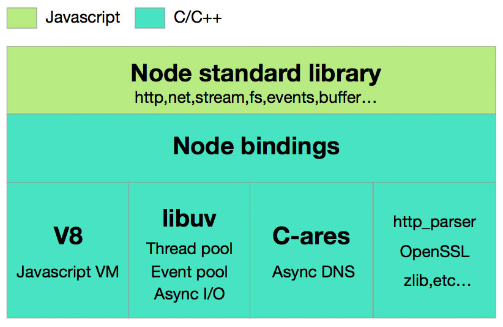

这是Node

Node.js提供的Inspector不仅可以用来调试Node.js代码，还可以实时收集Node.js进程的内存，CPU等数据，同时支持静态、动态开启，是一个非常强大的工具，本文从使用和原理详细讲解Inspector。
浏览器和远程服务器建立连接后，是通过websocket协议通信的。
Node Inspect 是 Node.js 提供的一个调试工具，它允许开发者使用 Chrome 开发者工具来调试 Node.js 应用程序。Node Inspect 使用了 V8 引擎内置的调试协议，与 Chrome 开发者工具通信，从而实现了远程调试功能。

Node Inspect 的工作原理主要可以分为以下几步：

在启动 Node.js 应用程序时，通过指定 --inspect 或 --inspect-brk 命令行参数来启用调试功能。
Node.js 应用程序会创建一个 V8 实例，并打开一个调试端口，等待远程调试器连接。
开发者使用 Chrome 浏览器打开一个调试页面，并通过 DevTools 的 "Chrome DevTools Protocol" 连接到 Node.js 应用程序的调试端口。
开发者在 Chrome DevTools 中设置断点、观察变量等操作，这些操作会通过调试协议发送给 Node.js 应用程序。
Node.js 应用程序接收到调试协议的指令后，会在 V8 引擎中执行相应的调试操作，例如暂停程序、获取变量值等。
V8 引擎将执行结果返回给 Node.js 应用程序，Node.js 应用程序将结果发送回调试器，Chrome DevTools 显示调试信息。
需要注意的是，由于 Node Inspect 是通过远程调试协议与 Chrome DevTools 通信的，因此它的运行会带来一定的性能开销。在生产环境中，应该避免使用 Node Inspect 进行调试，以确保应用程序的性能和稳定性。
Node Inspect 是通过 V8 引擎内置的调试协议实现的。V8 引擎是 Node.js 的核心组件之一，它负责解析和执行 JavaScript 代码。V8 引擎内置了一套调试协议，可以让开发者通过调试器与运行中的 JavaScript 应用程序进行交互。

当开发者在命令行中使用 --inspect 或 --inspect-brk 参数启动 Node.js 应用程序时，Node.js 会在指定的端口上启动一个调试服务器，并且在 V8 引擎中启用调试器。这个调试服务器就是 Node.js 应用程序和调试器之间的桥梁，它会监听来自调试器的连接请求，并将这些请求转发给 V8 引擎。

开发者在 Chrome 浏览器中打开调试页面，并连接到 Node.js 应用程序的调试服务器时，Chrome DevTools 会向调试服务器发送一个连接请求。调试服务器会将这个连接请求转发给 V8 引擎，并与调试器建立连接。此时，V8 引擎就可以通过调试协议与调试器进行交互了。

一旦调试器连接到 Node.js 应用程序，开发者就可以在 Chrome DevTools 中对应用程序进行调试了。开发者可以在 Chrome DevTools 中设置断点、观察变量、执行代码等，这些操作会通过调试协议发送到 V8 引擎中执行。当 V8 引擎执行完这些操作后，它会将执行结果发送给调试器，并且调试器会将结果显示在 Chrome DevTools 中。

总之，Node Inspect 的实现原理就是通过 V8 引擎内置的调试协议，在 Node.js 应用程序和 Chrome DevTools 之间建立一个调试通道，从而实现远程调试功能。
Node Inspect 是通过将 Node.js 应用程序和 Chrome DevTools 之间的通信转换为调试协议的方式来实现的。具体来说，它使用了以下步骤：

在启动 Node.js 应用程序时，通过在命令行中添加 --inspect 或 --inspect-brk 参数来开启调试功能。

Node.js 应用程序会创建一个 V8 实例，并在指定的调试端口上启动调试服务器。调试服务器会等待来自调试客户端的连接。

开发者使用 Chrome 浏览器打开一个调试页面，并使用 Chrome DevTools 连接到 Node.js 应用程序的调试服务器。在连接成功后，Chrome DevTools 会发送一个 Runtime.enable 命令给 Node.js 应用程序，表示已经准备好开始调试了。

开发者在 Chrome DevTools 中设置断点、观察变量等操作，这些操作会通过调试协议发送给 Node.js 应用程序。例如，当开发者在 Chrome DevTools 中设置断点时，DevTools 会发送一个 Debugger.setBreakpoint 命令给 Node.js 应用程序，Node.js 应用程序会在对应的代码位置设置一个断点。

当 Node.js 应用程序运行到某个断点时，V8 引擎会暂停程序的执行，并向调试服务器发送一个 Debugger.paused 事件。调试服务器将这个事件转发给调试客户端（即 Chrome DevTools），同时将当前的调试上下文信息（例如当前的调用栈、变量值等）发送给调试客户端。

开发者在 Chrome DevTools 中查看调试信息，并可以执行一些操作，例如继续执行程序、单步执行、修改变量值等。这些操作会通过调试协议发送给 Node.js 应用程序，Node.js 应用程序会在 V8 引擎中执行相应的操作。

当开发者结束调试并关闭 Chrome DevTools 时，Chrome DevTools 会发送一个 Runtime.disable 命令给 Node.js 应用程序，表示调试结束。Node.js 应用程序会关闭调试服务器，并继续执行程序。

总体来说，Node Inspect 是通过将 Node.js 应用程序和 Chrome DevTools 之间的通信转换为调试协议的方式来实现的。这种方式可以使开发者使用熟悉的 Chrome DevTools 来调试 Node.js 应用程序，提高调试效率。
本地 `node --inspect httpServer.js`
远程 `node --inspect=0.0.0.0:8888 httpServer.js `


事件驱动是一种编程范式，它的核心思想是将程序设计成一组相互独立的模块，这些模块通过事件来协作完成任务。事件驱动的编程模型中，程序会在预定义的事件发生时触发相应的回调函数，以响应事件并执行相应的逻辑。

在事件驱动编程中，通常会有一个事件循环机制，它不断地监听事件，一旦有事件发生就会触发相应的回调函数，然后再进入下一轮事件监听。这种模型能够有效地提高程序的响应能力和并发性能，因为程序不需要在等待某些操作完成时阻塞线程，而是能够立即响应其他的事件。

Node.js是一个基于事件驱动模型的服务器端 JavaScript 运行环境，它采用了单线程的事件循环机制，通过异步 I/O 和非阻塞 I/O 的方式来提高程序的并发性能和响应能力。Node.js 的事件驱动模型使得它能够处理大量的并发连接，而不需要为每一个连接都分配一个线程，从而避免了线程切换和内存开销的问题。

在 Node.js 中，所有的 I/O 操作都是异步的，当一个 I/O 操作完成时，Node.js 会触发相应的回调函数，并将结果传递给回调函数进行处理。这种模型可以让程序在等待 I/O 操作完成时继续执行其他任务，从而提高程序的并发性能和响应能力。

总之，事件驱动是一种编程模型，它通过事件来协作完成任务，并通过事件循环机制来实现异步和非阻塞的 I/O 操作，从而提高程序的并发性能和响应能力。Node.js 采用了事件驱动模型，使得它能够高效地处理大量的并发连接和高并发请求。


Node.js是一个基于Chrome V8引擎的JavaScript运行时，可以用于构建高性能的服务器端应用程序。它具有异步非阻塞I/O、事件驱动、单线程等特点，能够处理大量并发请求，适合构建高吞吐量、低延迟的网络应用程序。

### 关于IO模型

Node.js是事件驱动的非阻塞I/O模型。这意味着在Node.js中，I/O操作（如文件读取、网络请求等）都是异步的，并且不会阻塞程序的主线程。相反，当I/O操作完成时，会触发一个事件，Node.js会调用相应的回调函数来处理这些事件

> 其他语言
>
> - Java：Java 使用 NIO（New I/O）和 AIO（Asynchronous I/O）实现异步 I/O 操作。在 Java 中，NIO 基于事件驱动和回调机制实现异步 I/O 操作，AIO 使用了一种基于回调的异步 I/O 模型。
> - Go：Go 使用 Goroutines 和 Channels 实现并发和异步 I/O 操作。Goroutines 是 Go 中轻量级的线程，而 Channels 是用于在 Goroutines 之间传递数据的通信机制。
> - C++：C++ 有多种 I/O 模型可供选择，包括阻塞式 I/O、非阻塞式 I/O、多路复用 I/O 和异步 I/O。其中，多路复用 I/O 是使用最广泛的模型，C++ 标准库提供了 select、poll 和 epoll 三种实现。
> - Rust：Rust 借助 async/await 和 futures 等机制实现异步 I/O 操作。与 Go 类似，Rust 通过一系列的异步原语来实现并发和异步编程，包括 async/await、futures 和 tokio 等库。
>
> 需要注意的是，虽然不同的编程语言和框架使用不同的 I/O 模型来实现异步 I/O 操作，但在底层实现上，它们通常都会使用操作系统提供的异步 I/O API，如 Linux 中的 epoll、Windows 中的 IOCP 等。

Node.js 是通过 libuv 库实现了事件循环和异步 I/O 操作。在 Node.js 应用程序启动时，Event Loop（事件循环）会被初始化，用于监听事件并调度回调函数。当一个异步操作（例如文件读写、网络请求等）被触发时，libuv 会将事件添加到事件循环中，并为该事件分配一个回调函数，然后控制权会立即返回给应用程序。当该事件完成时，libuv 会将该事件标记为完成，并将其回调函数添加到事件循环中。在下一个循环迭代中，Event Loop 会检查事件是否已完成，如果已完成则调用相应的回调函数来处理事件结果。由于这种机制，Node.js 应用程序可以在执行异步 I/O 操作时保持高度的并发性和响应性。

Node.Js也可以实现其他IO模型

> 1. 基于线程池的同步阻塞 IO 模型，使用 `worker_threads` 模块实现多线程，通过线程池来实现同步 IO 操作，缺点是开销大，容易导致线程数过多。
> 2. 基于 libuv 的异步非阻塞 IO 模型，libuv 是一个跨平台的异步 IO 库，Node.js 就是通过 libuv 来实现事件循环模型的。除了事件循环之外，libuv 还提供了很多其他的异步 IO 相关功能，例如线程池、异步 DNS、异步文件 IO 等。
> 3. 基于 Stream 的 IO 模型，Node.js 的 Stream API 提供了多种流式 IO 操作，例如读写文件、网络传输、压缩解压缩等，可以通过流式操作来实现多种 IO 模型，例如管道、过滤器、缓冲区等。
> 4. 基于 Web Worker 的异步 IO 模型，Node.js 可以使用 Web Worker API 来创建子线程，通过子线程来执行异步 IO 操作，这种方式相比基于线程池的方式更轻量级，但需要注意跨线程通信的问题。


# 原理



1. Node.js应用程序通过Node.js解释器加载和执行。这个解释器使用V8引擎解析和编译JavaScript代码。

核心V8引擎，基于C++编写，V8将JS编写的代码直接编译成机器码在计算机上运行，保证了JS的运行效率，并同时负责在JS代码运行时进行内存垃圾回收

1. Node.js应用程序采用事件驱动、非阻塞I/O模型。这意味着应用程序使用异步事件处理机制来响应客户端请求。当一个请求到达时，Node.js将其分配给一个线程，该线程在后台进行处理，而不会阻塞主线程。
2. Node.js的事件循环机制是其工作原理的核心。事件循环是一个不断运行的循环，它等待并处理事件，直到没有事件要处理为止。当一个事件发生时，事件循环会触发回调函数来处理该事件。这种回调函数机制允许Node.js应用程序同时处理多个请求，而不需要为每个请求分配一个线程。
3. Node.js应用程序还使用了一个内置的模块系统，用于管理和加载JavaScript模块。这个模块系统使得Node.js应用程序可以轻松地利用外部的JavaScript库和模块。

c-ares用于异步DNS请求，http parser用于解析http响应和请求，openSSL用于提供基于SSL协议的https加密，[zlib](https://www.zhihu.com/search?q=zlib&search_source=Entity&hybrid_search_source=Entity&hybrid_search_extra={"sourceType"%3A"answer"%2C"sourceId"%3A704499103})用于文件数据的压缩，这些也都是基于C语言编写的。

综上所述，Node.js的工作原理是基于事件驱动、非阻塞I/O和事件循环机制的。这种工作方式使得Node.js可以高效地处理大量的并发请求，并且能够轻松地扩展应用程序的功能和性能。

- Node Standard Library 是我们每天都在用的标准库，如Http, Buffer 模块。
- Node Bindings 是沟通JS 和 C++的桥梁，封装V8和Libuv的细节，向上层提供基础API服务。
- 这一层是支撑 Node.js 运行的关键，由 C/C++ 实现。
  - V8 是Google开发的JavaScript引擎，提供JavaScript运行环境，可以说它就是 Node.js 的发动机。
  - Libuv 是专门为Node.js开发的一个封装库，提供跨平台的异步I/O能力.
  - C-ares：提供了异步处理 DNS 相关的能力。
  - http_parser、OpenSSL、zlib 等：提供包括 http 解析、SSL、数据压缩等其他的能力。

C++会暴露一些模版，比如函数模版，对象模版，暴露到脚本环境中供Js调用


### v8工作原理

概览

1. 一切都从网络获取JavaScript代码开始。 

通过网络、缓存或service worker来完成。

2. V8解析源代码并将其转换为抽象语法树(AST)。

3. 基于这个AST, Ignition解释器可以开始做它的事情并产生字节码。

> 获取到代码后要先解析，这样编译器才能理解。
>
> 解析有扫描器和解析器两部分， 扫描器获取Js文件然后把它转换为一个内置的[token list](https://github.com/v8/v8/blob/master/src/parsing/keywords.txt)， 就是一个关键字合集(词法分析)
>
> 然后解析器拿到这个列表后开始建立AST(可以通过前序遍历来执行这段代码)后再生成字节码（为什么要用字节码？因为占的内存比机器码要小，牺牲时间换空间）
>
> 这里要注意两个点，预编译和即时编译(JIT)，像C++，Java那些就是预编译，先编译成机器码再执行
>
> 而Js，py这样的动态类型脚本语言显然是不能预编译的，因为在执行前不能知道某个变量确切的类型。
>
> 所以就要用JIT来解决动态语言的编译问题

4. 此时，引擎开始运行代码并收集类型反馈。

5. 为了使它运行得更快，可以将字节代码与反馈数据一起发送到优化编译器(Turbofan)。优化编译器在此基础上进行某些假设，然后生成高度优化的机器代码。

> 热代码: 被多次调用的一块代码
>
> 当存在热代码的时候，V8 会借着 TurboFan 将为热代码的字节码转为机器码并缓存下来，这样一来，当再次调用热代码时，就不在需要将字节码转机器码，当然热代码相对来说还是少部分的，所以缓存也并不会占用太大内存，并且提升了执行效率，此处是牺牲空间换时间。

6. 如果在某个时刻，其中一个假设被证明是不正确的，Turbofan就会去优化并返回到解释器过程

> JS 语言是动态语言，非常之灵活，对象的结构和属性在运行时是可以发生改变的，设想一个问题，如果热代码在某次执行的时候，突然其中的某个属性被修改了，那么编译成机器码的热代码还能继续执行吗？答案是肯定不能。这个时候就要使用到优化编译器的**反优化**了，他会将热代码退回到 AST 这一步，这个时候解释器会重新解释执行被修改的代码，如果代码再次被标记为热代码，那么会重复执行优化编译器的这个步骤。

### 模块

模块是Node.js中的一个基本概念，它是一个可重用的代码单元，可以将相关功能封装在一起，提高代码复用性和可维护性。在Node.js中，每个文件都是一个模块，可以使用require函数引入其他模块，使用module.exports或exports对象导出模块。

### Global对象

> 所有属性都可以在程序的任何地方被访问，即全局变量。在javascript中，通常window是全局对象，而node.js的全局对象是global，所有全局变量都是global对象的属性，如：console、process等。

### Buffer

在Node.js中，Buffer类是随Node内核一起发布的核心库。Buffer库为Node.js带来了一种存储原始数据的方法，可以让Nodejs处理二进制数据，每当需要在Nodejs中处理I/O操作中移动的数据时，就有可能使用Buffer库。原始数据存储在 Buffer 类的实例中。一个 Buffer 类似于一个整数数组，但它对应于 V8 堆内存之外的一块原始内存。

+ 浅拷贝

Buffer更像是可以做指针操作的C语言数组。例如，可以用[index]方式直接修改某个位置的字节。 需要注意的是：Buffer#slice 方法， 不是返回一个新的Buffer， 而是返回对原 Buffer 某个区间数值的引用。

+ 深拷贝

如果想要拷贝一份Buffer，得首先创建一个新的Buffer，并通过.copy方法把原Buffer中的数据复制过去。

Buffer是一个典型的Javascript和C++结合的模块，性能相关部分用C++实现，非性能相关部分用javascript实现。

Node在进程启动时Buffer就已经加装进入内存，并将其放入全局对象，因此无需require。

Buffer内存分配，Buffer对象的内存分配不是在V8的堆内存中，在Node的C++层面实现内存的申请。


### FS文件系统

原理

> 文件系统存储在磁盘上，一般磁盘会被划分为多个分区，每个分区可以是一个独立的文件系统。
>
> 文件系统一个重要的功能是记录文件使用了哪些磁盘块以及磁盘块的管理，标识磁盘块是被使用，还是空闲。实现思路有下面几种。
>
> - 连续分配
>
>   - 把每个文件存储在相邻的磁盘块上。如磁盘块大小2KB,200KB的文件，需要 100个磁盘块，如果磁盘块大小为4KB,刚需要50个磁盘块。
>
>     由于每个文件都是从一个新的磁盘块开始的，这样如果一个文件只占了磁盘块大小的一半，那么另一半就被浪费了，没法被别的文件使用，不过连续分配的实现，实现比较简单，只需要记录文件的第一个磁盘块位置和块数，另外读取快速，因为只需要一次寻道，之后不需要导道和旋转延迟。
>
>     随着时间推移，磁盘碎片比较严重。因为反复写文件，删除文后，容易在磁盘块上形成空洞。
>
> - 链表分配
>
>   - 为每个文件构造磁盘块链表，每个块在前面指向文件的下一个磁盘块。
>
>     因为是一个链表，所以顺序读取很快，但随机读取很慢，且每个块中，指向下一个磁盘块的指针是要占用空间的，这样导致每个磁盘块能够存储的数据不再是2的整数次幂。
>
>     但程序读写文件一般是以2的整数次幂来读写磁盘，这样造成额外的开销，因为读一个块的数据，要读取二个磁盘块。
>
> - inode 节点方案
>
>   - 使用一个特殊的东西来记录每个文件的所使用的磁盘块， 这特殊的东西称为i节点数据结构，其存储了文件 一些属性及文件所使用的到的磁盘块。
>
>     i节点只有在对应的文件被打开时，才会存在内存中，这样即使文件系统文件非常多，只要打开的文件不多，就不会占用太多的内存。
>
>     文件的元数据和文件数据是分开存储，也就是一个文件有i节点和数据文件这两个属性。
>
>     每个存储i节点的磁盘块空间是有限，且一个文件只有一个i节点，那么当一个文件比较大时，怎么解决？大家想没有想起C语言中的指针及指针的指针。
>
>     一种解决办法是预留部分数据块，用来存储指向磁盘块的指针，而不是直接直接指向磁盘块。

文件系统是对磁盘设备的抽象，屏蔽了具体的存储类型，比如磁盘，内存。

流是一种文件的处理方式，用于将输入的数据顺序读取或把数据写入输出。

流的处理方式非常独特，流不是像传统方式那样将文件**一次全部**读取到存储器中，而是逐段读取数据块并处理数据的内容，不将其全部保留在内存中。

### 异常处理

总的来说处理异常有两种方式

- 同步异常用`try/catch` 

不能处理异步 可以理解为 `可以理解为执行catch时，异常还没有发生。` 回调异步的特性

- 异步异常要用各自的处理方式

有callback方式

```javascript
require("fs").mkdir('G://test', function (e) {
  if (e) {
    /*处理异常*/
    console.log(e.message)
  } else {
    console.log('创建目录成功')
  }
})
```

##### event方式

```javascript
let events = require("events");
//创建一个事件监听对象
let emitter = new events.EventEmitter();
//监听error事件
emitter.addListener("error", function (e) {
  /*处理异常*/
  console.log(e.message)
});
//触发error事件
emitter.emit("error", new Error('出错啦'));
```

##### Promise 方式

```javascript
new Promise((resolve, reject) => {
    syncError()
  })
  .then(() => {

  })
  .catch((e) => {
    /*处理异常*/
    console.log(e.message)
  })
```

Promise同样无法处理异步代码块中抛出的异常

```javascript
new Promise((resolve, reject) => {
    asyncError()
})
    .then(() => {
    //...
})
    .catch((e) => {
    /*异常无法被捕获,导致进程退出*/
    console.log(e.message)
})
```

### Async/Await 方式

Async是基于Promise的，可以用Await等待响应就可以用`try/catch`来捕获了。

```javascript
var sleep = function (time) {
    return new Promise(function (resolve, reject) {
        syncError()
    })
};

(async function () {
    try {
        await sleep(100);
    } catch (e) {
        /*处理异常*/
        console.log(e.message)
    }
})()
```

#### 所有异常

##### process方式

process方式可以捕获任何异常(不管是同步代码块中的异常还是异步代码块中的异常)

```javascript
process.on('uncaughtException', function (e) {
    /*处理异常*/
    console.log(e.message)
});

asyncError()
syncError()
```

Promise未捕获

```javascript
process.on('unhandledRejection', function (err, promise) {
  console.error('有Promise没有被捕获的失败函数', err.message);
})

new Promise((resolve, reject) => {
    syncError()
  })
  .then(() => {
    //...
  })
```

Promise中的异步错误

```javascript
new Promise((resolve, reject) => {
    asyncError()
  })
  .then(() => {
    //...
  })


process.on('uncaughtException', function (e) {
  /*处理异常*/
  console.log("uncaughtException:", e.message)
});
```

还有`unhandledRejection`事件

##### domain方式

不过已经被废弃了，当发生一个错误事件或抛出一个错误时，domain对象会被通知，不会丢失上下文环境，也不导致程序错误立即退出


# 理解Node.js 中的进程与线程

进程`Process`是计算机中的程序关于某数据集合上的一次运行活动，是系统进行资源分配和调度的基本单位，是操作系统结构的基础，进程是线程的容器

进程是操作系统中的一个独立的执行单元，它包含了程序代码、数据和一组系统资源，如内存、文件、通信端口等。每个进程都有自己的地址空间和系统资源，进程之间相互独立。每个进程都有自己的进程标识符（PID），用于在操作系统中唯一标识该进程

进程是资源分配的最小单位。我们启动一个服务、运行一个实例，就是开一个服务进程，例如 Java 里的 JVM 本身就是一个进程，Node.js 里通过 `node app.js` 开启一个服务进程，多进程就是进程的复制（fork），fork 出来的每个进程都拥有自己的独立空间地址、数据栈，一个进程无法访问另外一个进程里定义的变量、数据结构，只有建立了 IPC 通信，进程之间才可数据共享。

线程是进程中的一个执行单元，它是进程中的一个分支，共享相同的地址空间和系统资源。每个线程都有自己的程序计数器、堆栈和局部变量，但是它们共享进程的代码、数据和系统资源。线程是操作系统中最小的调度单位，它们之间的切换比进程之间的切换更快。

在多核处理器系统中，一个进程可以包含多个线程，每个线程可以在不同的CPU核心上并行执行，从而提高系统的并发性能。线程之间的通信也比进程之间的通信更快，因为它们共享相同的内存空间。


> #### [#](#单线程的一些说明)单线程的一些说明
>
> - Node.js 虽然是单线程模型，但是其基于事件驱动、异步非阻塞模式，可以应用于高并发场景，避免了线程创建、线程之间上下文切换所产生的资源开销。
> - 当你的项目中需要有大量计算，CPU 耗时的操作时候，要注意考虑开启多进程来完成了。
> - Node.js 开发过程中，错误会引起整个应用退出，应用的健壮性值得考验，尤其是错误的异常抛出，以及进程守护是必须要做的。
> - 单线程无法利用多核 CPU

是单线程，所以使用child_process.fork和cluster，用多进程来达成目的

> Node.js中的`cluster`模块和`process`模块都与进程相关，但它们的功能和使用方式有些不同。
>
> `process`模块是Node.js中的全局对象，用于访问当前进程的信息，例如进程ID、环境变量、命令行参数等。`process`模块还提供了一些方法，如`process.exit()`用于退出当前进程、`process.on()`用于监听进程事件等。
>
> `cluster`模块则是用于创建一个可扩展的Node.js进程集群的模块。它允许开发者在多个进程之间共享网络端口，从而实现负载均衡和高可用性。`cluster`模块通过复制主进程来创建工作进程，每个工作进程都独立运行，它们共享相同的端口，从而可以同时接收和处理网络请求。`cluster`模块还提供了一些方法，如`cluster.fork()`用于创建工作进程、`cluster.on()`用于监听集群事件等。
>
> 综上所述，`process`模块用于管理当前进程的信息，而`cluster`模块用于创建和管理多个进程之间的集群。


# 理解Node中的事件驱动

Node.js是一个事件驱动的平台，这意味着它的核心架构是基于事件的。在Node.js中，几乎所有的操作都是异步的，包括文件I/O、网络I/O、数据库访问等等。这些操作通常会涉及到等待外部系统完成某些任务，这些等待过程可能会耗费很长时间。因此，如果采用同步方式来执行这些操作，会导致应用程序停止响应，直到操作完成。

为了避免这种情况，Node.js采用了事件驱动的方式来处理异步操作。在Node.js中，当某个异步操作完成时，它会触发一个事件，这个事件会被传递给一个事件处理程序，从而使应用程序能够在异步操作完成后响应事件。

Node.js中的事件驱动模型基于事件循环机制。事件循环是一个常驻后台的进程，它等待事件的发生并将它们传递给相应的事件处理程序。在Node.js中，事件循环通过调用异步操作的回调函数来处理事件。

在应用程序中，你可以通过`EventEmitter`类来实现事件的发布和订阅。`EventEmitter`是Node.js中的一个核心模块，用于处理事件的订阅和发布。你可以创建一个`EventEmitter`对象，然后在该对象上注册一个或多个事件处理程序，当事件触发时，相应的事件处理程序就会被调用。

总之，事件驱动模型是Node.js的核心特性之一，它使得Node.js能够高效地处理异步操作，同时提供了一种简单而有效的方式来处理事件和数据的流动


# 消息队列

消息队列是一种用于在应用程序之间传递消息的通信机制。它通常由消息生产者、消息队列和消息消费者组成。

消息生产者将消息发送到消息队列，消息队列将消息存储在其中，然后消息消费者从消息队列中获取消息并进行处理。消息队列可以缓解消息生产者和消息消费者之间的压力差异，提高系统的可靠性和可伸缩性，同时还可以支持异步通信，提高系统的性能和响应速度。

生产者 ：生产消息的

消费者 ：接收消息的

通道 channel：建立连接后，会获取一个 channel 通道

exchange ：交换机，消息需要先发送到 exchange 交换机，也可以说是第一步存储消息的地方

消息队列 : 到达消费者前一刻存储消息的地方,exchange 交换机会把消息传递到此

ack 回执：收到消息后确认消息已经消费的应答

> **生产者发消息的时候必须指定一个 exchange，否则消息无法直接到达消息队列，Exchange 将消息路由到一个或多个 Queue 中（或者丢弃）**

消息队列具有以下特点：

1. 异步通信：消息生产者不需要等待消息消费者的响应，可以立即返回，从而提高系统的性能和吞吐量。
2. 解耦合：消息队列可以将消息生产者和消息消费者解耦，使它们不需要知道彼此的存在，从而提高系统的可扩展性和灵活性。
3. 可靠性：消息队列可以确保消息的可靠性，例如支持消息持久化、消息重试、消息事务等机制，从而保证消息传递的可靠性和系统的稳定性。
4. 多样性：消息队列支持多种消息模式，例如点对点模式和发布/订阅模式等，以适应不同的应用场景需求。


交换机类型

- **fanout**（广播）

一个交换机对应多个消息队列（每个消息队列中的消息一致）。

会把所有发送到该 Exchange 的消息路由到所有与它绑定的 Queue 中，不需要设置路由键。

- **direct**

direct 把消息路由到那些 binding key 与 routing key 完全匹配的 Queue 中。

- **topic**

生产者指定 RoutingKey 消息根据消费端指定的队列通过模糊匹配的方式进行相应转发，两种通配符模式： #：可匹配一个或多个关键字 *：只能匹配一个关键字

- **headers**

header exchange(头交换机)和主题交换机有点相似，但是不同于主题交换机的路由是基于路由键，头交换机的路由值基于消息的 header 数据。 主题交换机路由键只有是字符串,而头交换机可以是整型和哈希值 header Exchange 类型用的比较少

# 内存溢出

为什么会内存溢出？

1. 密集运算 =〉 v8不能及时释放内存，导致内存占用量越来越大，最终溢出
2. 操作的数据量过大 =〉数据量直接超出内存了

v8内存分配机制：V8 是 Google 在 Chrome 浏览器中使用的 JavaScript 引擎。而在浏览器环境中，运算一般不需要多大内存。 V8 对每个进程分配的运行内存，在 32 位系统中约为 700MB，而在 64 位系统中约为 1.4GB。

解决：

1. 使用 async/await 防止事件堆积,变为同步操作，使得v8有回收内存的时间

```js
for (var i = 0; i < 10000000; i++) {
  ((i) => {
    var site = {}
    site.name = 'koala'
    site.domain = '程序员成长指北'
    // 这里是一个保存或更新等操作

    setTimeout(() => {
      console.log(i, site)
    }, 0)
  })(i)
} 
// 上面属于密集运算溢出 改成如下方式
async function dbFuc() {
  for (let i = 0; i < 10000000; i++) {
    var site = {}
    site.name = 'koala'
    site.domain = '程序员成长指北'
    // 这里是一个保存或更新等操作

    await console.log(i, site)
  }
}
dbFuc();
```

2. 增加v8内存

Node.js 提供了一个程序运行参数`--max-old-space-size`，可以通过该参数指定 V8 所占用的内存空间，这样可以在一定程度上避免程序内存的溢出。 如，我们可以在运行示例 2 程序时指定使用 4G 的内存： `node --max-old-space-size=4096 app`

3. 使用非v8内存

Node.js 程序所使用的内存分为两类：

- V8 内存：数组、字符串等 JavaScript 内置对象，运行时使用“V8 内存”

- 系统内存：Buffer 是 Node.js 的一个扩展对象，使用底层的系统内存，不占用 V8 内存空间。与 buffer 相关的文件系统 fs 和 stream 流操作，都不会占用 V8 内存。

  > (注: fs 和 stream 这两个模块我在 Node 进阶系列文章中已经详细介绍了, 这里就不赘述)

在程序允许的情况下，应该将数据保存在 Buffer 中，而不是转换成字符串等 JS 对象，这样可以避免 V8 内存的过多占用。

# 注意事项⚠️

1. 阻塞事件循环

就是在for循环中处理复杂计算，建议使用异步处理

2. 多次调用回调函数
3. 深层嵌套回调函数
4. 期待回调函数同步执行
5. 从回调中抛出错误

从回调中抛出错误不会被try catch 语句捕获，因为try catch语句只能捕获同步错误，而回调函数一般都是异步错误

捕获异步错误： Promise.catch();  使用async/await 改同步写法，catch就能捕获到了

6. 认为Js中的Number是整数形（其实是浮点形）
7. 流式API的使用

流式 API（Stream API）是一种基于事件驱动的 I/O 处理方式，它可以将数据分割成多个块，并逐个块地处理，从而提高数据处理的效率和性能。流式 API 可以用于处理大量的数据或者网络数据，例如读取文件、处理网络请求等。

在 Node.js 中，提供了丰富的流式 API，包括：

1. 可读流（Readable Streams）：用于读取数据的流式 API，例如读取文件、处理网络请求等。
2. 可写流（Writable Streams）：用于写入数据的流式 API，例如写入文件、发送网络请求等。
3. 双工流（Duplex Streams）：即可读可写流，可以同时读取和写入数据。
4. Transform 流（Transform Streams）：继承了可读流和可写流的能力，可以将输入数据进行处理后输出，例如加密、解密、压缩、解压缩等。

Node.js 中的流式 API 都实现了 EventEmitter 接口，可以通过监听各种事件的方式来处理数据。例如，可读流可以监听 data 事件来读取数据块，end事件来标识数据已经读取完毕；可写流可以通过 write() 方法来写入数据，也可以监听 drain 事件来判断是否可以继续写入数据等等。

以下是一些常用的流式 API：

1. fs.createReadStream()：创建一个可读流，用于读取文件中的数据。
2. fs.createWriteStream()：创建一个可写流，用于将数据写入文件中。
3. http.request()：创建一个可写流，用于发送网络请求并将响应数据读取到可读流中。
4. zlib.createGzip()：创建一个 Transform 流，用于将输入数据进行 gzip 压缩。
5. zlib.createGunzip()：创建一个 Transform 流，用于将输入数据进行 gzip 解压缩。
6. crypto.createCipher()：创建一个 Transform 流，用于将输入数据进行加密。
7. crypto.createDecipher()：创建一个 Transform 流，用于将输入数据进行解密。

流式 API 可以极大地简化数据处理的过程，并提高数据处理的效率和性能。在实际开发中，需要根据具体的应用场景和需求来选择合适的流式 API，并合理地使用流式 API 的特性和功能。

比如说有一个返回图片的服务，使用流式API以管道方式响应给客户端，不需要在响应它之前读取完整的数据存入缓存的思路显然优于先读取图片存入buffer再返回给用户好

8. 不使用监控程序

node中最好使用一下监控程序

```
pm2
forever
nodemon
supervisor
```


# Node.Js API 网关

微服务入口，客户端的请求会先经过API Gateway再去访问微服务

所以可以在这做 认证，速率限制，数据汇总，路由和版本控制，协议转换，序列化格式转换

> 网关（Gateway）是一种网络设备或软件，它连接两个不同的网络或应用程序，并提供一个中间层来转换、路由、过滤或增强网络流量。网关通常被用于实现不同协议之间的互操作性，例如将 HTTP 协议转换为 TCP/IP 协议或者将 SOAP 协议转换为 REST 协议等。
>
> 在互联网中，网关通常用于连接企业内部网络和公共互联网，从而实现安全访问、数据传输和网络管理等功能。例如，企业可以通过创建一个 VPN 网关来建立一个安全的虚拟专用网络（VPN），并用于远程访问、数据传输和网络管理等功能；或者通过创建一个 Web 网关来实现 Web 应用程序的负载均衡、缓存、安全过滤等功能。
>
> 网关还可以用于实现 API 网关，即将不同的 API 集成到一个统一的接口中，从而提供一个标准化的 API 接口，方便客户端的调用和管理。API 网关可以实现请求路由、请求转换、数据转换、负载均衡、安全控制、监控和日志等功能，从而提高 API 的可用性、可维护性和安全性。
>
> 需要注意的是，网关在进行数据转换、路由、过滤或增强网络流量时，会对网络延迟和性能产生一定的影响，因此在设计和应用网关时需要考虑网络性能和安全性等方面的问题，以便实现更好的网络服务和数据传输。


>HTTP 状态码中的 500 状态码表示服务器内部错误（Internal Server Error），表示服务器在处理请求时发生了意外的错误，导致请求无法完成。这个错误通常是由服务器端代码的错误或其他系统级别的错误引起的，例如数据库故障、磁盘空间不足、资源不足等。
>
>与网关相关的状态码是 502 Bad Gateway（错误网关）和 503 Service Unavailable（服务不可用）。当网关（例如反向代理服务器或负载均衡器）无法连接到上游服务器或上游服务器无法响应请求时，会返回 502 Bad Gateway 状态码。而当服务器过载或正在进行维护时，会返回 503 Service Unavailable 状态码。
>
>需要注意的是，虽然 500 状态码和网关相关的状态码都表示服务器端错误，但它们的原因和处理方式是不同的。当出现 500 状态码时，需要检查服务器端代码或其他系统级别的错误，进行修复和调试；而当出现 502 或 503 状态码时，需要检查网关或上游服务器的状态，进行故障排查和修复。


###  线程池

线程池，是一种线程的使用模式，它为了降低线程使用中频繁的创建和销毁所带来的资源消耗与代价。 通过创建一定数量的线程，让他们时刻准备就绪等待新任务的到达，而任务执行结束之后再重新回来继续待命。

这就是线程池最核心的设计思路，「复用线程，平摊线程的创建与销毁的开销代价」。

> **在 Node.js 中经典的代码调用方式：都是从 JavaScript 调用 Node 核心模块，核心模块调用 C++ 内建模块，内建模块通过 libuv 进行系统调用。请记住这段话**

### 

nodejs 模块可以分为下面三类：

- 核心模块(native 模块)：包含在 Node.js 源码中，被编译进 Node.js 可执行二进制文件 JavaScript 模块，其实也就是 lib 和 deps 目录下的 js 文件，比如常用的 http,fs 等等。
- 内建模块(built-in 模块)：一般我们不直接调用，而是在 native 模块中调用，然后我们再 require。
- 第三方模块：非 Node.js 源码自带的模块都可以统称第三方模块，比如 express，webpack 等等。


>观察者模式是一种设计模式，它定义了一种一对多的依赖关系，当一个对象的状态发生改变时，它的所有依赖者都会收到通知并自动更新。这种模式中，被观察者对象（也称为主题）和观察者对象之间是直接耦合的，观察者需要直接注册到被观察者上，并实现相应的更新方法。这种模式常用于 GUI 编程、事件驱动编程等场景。
>
>而发布订阅模式是一种模式，它定义了一种一对多的依赖关系，当一个对象的状态发生改变时，所有订阅了该对象的消息的订阅者都会收到通知。这种模式中，发布者和订阅者之间是通过一个消息代理（也称为事件通道或消息队列）来进行通信的，订阅者不需要直接和发布者耦合，只需要注册到消息代理上，并指定自己感兴趣的消息类型和相应的处理方法。这种模式常用于分布式系统、异步编程等场景。
>
>因此，观察者模式更加简单直接，适用于对象之间的紧耦合关系，而发布订阅模式更加灵活，适用于解耦和异步通信的场景。

# Events模块


### process对象

process是Node.js中的一个全局对象，它提供了访问当前进程的相关信息和控制进程的能力。

process对象可以用来执行以下操作：

1. 获取进程的命令行参数（argv）。
2. 获取环境变量（env）。
3. 获取进程的当前工作目录（cwd）。
4. 终止进程（exit）。
5. 发送信号到进程（kill）。
6. 监听进程的退出事件（exit）。

process还提供了一些其他有用的方法和属性，如：

1. uptime：返回进程运行的时间（以秒为单位）。
2. memoryUsage：返回Node.js进程的内存使用情况。
3. platform：返回Node.js进程运行的操作系统平台。
4. pid：返回当前进程的进程ID。
5. title：获取或设置当前进程的进程名称。

通过process对象，您可以控制和监视Node.js进程的行为和状态，这在编写服务器和其他长时间运行的应用程序时非常有用。

### cluster对象

cluster是Node.js的一个模块，它允许在单个Node.js实例中创建多个工作进程（worker process），这样就可以利用多核CPU来提高应用程序的性能和可伸缩性。

使用cluster模块可以非常方便地创建工作进程，而且这些工作进程之间可以共享同一个TCP端口，从而实现负载均衡和高可用性。

具体来说，使用cluster模块可以完成以下操作：

1. 在主进程中创建多个工作进程，并将它们绑定到同一个TCP端口上。
2. 在工作进程中执行应用程序代码。
3. 在主进程中监控工作进程的状态，并在它们退出时重新启动它们。
4. 在主进程中实现负载均衡，将请求分配给空闲的工作进程处理。

cluster模块在处理网络请求方面非常有用，特别是在处理高并发请求时。通过将请求分配给多个工作进程处理，可以实现更高的吞吐量和更低的响应延迟。

需要注意的是，由于每个工作进程都是独立的进程，它们之间不能直接共享内存，因此需要使用IPC（进程间通信）机制来进行进程间通信。此外，由于每个工作进程都是单独的进程，因此在使用cluster模块时需要注意进程间的资源占用和共享问题。

当需要处理高并发请求时，使用cluster模块可以提高Node.js应用程序的性能和可伸缩性。下面是一个简单的例子：

假设我们有一个HTTP服务器，它的代码如下所示：

```js
const http = require('http');

http.createServer((req, res) => {
  res.writeHead(200);
  res.end('Hello, World!');
}).listen(3000);
```

这个HTTP服务器会在3000端口上监听来自客户端的请求，并返回一个简单的响应。

现在，我们可以使用cluster模块在单个Node.js实例中创建多个工作进程，并将它们绑定到同一个TCP端口上，从而实现负载均衡和高可用性。修改后的代码如下所示：

```js
const cluster = require('cluster');
const http = require('http');
const numCPUs = require('os').cpus().length;

if (cluster.isMaster) {
  console.log(`Master ${process.pid} is running`);

  // Fork workers
  for (let i = 0; i < numCPUs; i++) {
    cluster.fork();
  }

  cluster.on('exit', (worker, code, signal) => {
    console.log(`Worker ${worker.process.pid} died`);
    cluster.fork();
  });
} else {
  // Workers can share any TCP connection
  // In this case it is an HTTP server
  http.createServer((req, res) => {
    res.writeHead(200);
    res.end('Hello, World!');
  }).listen(3000);

  console.log(`Worker ${process.pid} started`);
}
```

在这个修改后的代码中，我们首先检查当前进程是否是主进程，如果是主进程，则创建多个工作进程，每个工作进程都会执行同样的HTTP服务器代码，并在3000端口上监听来自客户端的请求。主进程还会监控工作进程的状态，并在它们退出时重新启动它们。

当我们启动这个修改后的HTTP服务器时，它将自动创建多个工作进程，并将请求分配给空闲的工作进程处理，从而实现负载均衡和高可用性。这个HTTP服务器可以处理更多的并发请求，因为多个工作进程可以同时处理多个请求，而不会出现阻塞或延迟的情况


> cluster和process区别
>
> 后者是全局对象 用于访问当前进程信息
>
> 前者是创建一个可扩展的Node进程集群模块，允许在多个进程之间共享网络端口，从而实现负载均衡
>
> 通过复制主进程来创建工作进程，每个工作进程都独立运行，共享相同端口，从而可以同时接受和处理网络请求

### Stream

流（Stream），是一个数据传输手段，是端到端信息交换的一种方式，而且是有顺序的,是逐块读取数据、处理内容，用于顺序读取输入或写入输出

`Node.js`中很多对象都实现了流，总之它是会冒数据（以 `Buffer` 为单位）

它的独特之处在于，它不像传统的程序那样一次将一个文件读入内存，而是逐块读取数据、处理其内容，而不是将其全部保存在内存中

流可以分成三部分：`source`、`dest`、`pipe`

在`source`和`dest`之间有一个连接的管道`pipe`,它的基本语法是`source.pipe(dest)`，`source`和`dest`就是通过pipe连接，让数据从`source`流向了`dest`

Node.js 中有四种基本的流类型：

- Writable: 可以写入数据的流（例如，`fs.createWriteStream()`）。 可写
- Readable: 可以从中读取数据的流（例如，`fs.createReadStream()`）。 可读
- Duplex: Readable 和 Writable 的流（例如，`net.Socket`）。 双工
- Transform: 可以在写入和读取数据时修改或转换数据的 Duplex 流（例如，`zlib.createDeflate()`） 转换


`stream`的应用场景主要就是处理`IO`操作，而`http`请求和文件操作都属于`IO`操作

试想一下，如果一次`IO`操作过大，硬件的开销就过大，而将此次大的`IO`操作进行分段操作，让数据像水管一样流动，直到流动完成

常见的场景有：

- get请求返回文件给客户端
- 文件操作
- 一些打包工具的底层操作


#### Buffer

在`Node`应用中，需要处理网络协议、操作数据库、处理图片、接收上传文件等，在网络流和文件的操作中，要处理大量二进制数据，而`Buffer`就是在内存中开辟一片区域（初次初始化为8KB），用来存放二进制数据

在上述操作中都会存在数据流动，每个数据流动的过程中，都会有一个最小或最大数据量

如果数据到达的速度比进程消耗的速度快，那么少数早到达的数据会处于等待区等候被处理。反之，如果数据到达的速度比进程消耗的数据慢，那么早先到达的数据需要等待一定量的数据到达之后才能被处理

这里的等待区就指的缓冲区（Buffer），它是计算机中的一个小物理单位，通常位于计算机的 `RAM` 中

简单来讲，`Nodejs`不能控制数据传输的速度和到达时间，只能决定何时发送数据，如果还没到发送时间，则将数据放在`Buffer`中，即在`RAM`中，直至将它们发送完毕

上面讲到了`Buffer`是用来存储二进制数据，其的形式可以理解成一个数组，数组中的每一项，都可以保存8位二进制：`00000000`，也就是一个字节


### EventEmitter

我们了解到，`Node`采用了事件驱动机制，而`EventEmitter`就是`Node`实现事件驱动的基础

在`EventEmitter`的基础上，`Node`几乎所有的模块都继承了这个类，这些模块拥有了自己的事件，可以绑定／触发监听器，实现了异步操作

`Node.js` 里面的许多对象都会分发事件，比如 fs.readStream 对象会在文件被打开的时候触发一个事件

这些产生事件的对象都是 events.EventEmitter 的实例，这些对象有一个 eventEmitter.on() 函数，用于将一个或多个函数绑定到命名事件上


#### 互斥锁

互斥锁是一种用于多线程编程的同步原语，主要是为了保证共享资源的互斥访问。当一个线程获取了互斥锁，它将独占该锁，并且其他线程必须等待该线程释放锁之后才能获取该锁，这样就保证了同一时刻只有一个线程能够访问共享资源，从而避免了线程间的竞争与冲突。在使用互斥锁时，需要遵循一定的规则，如加锁、解锁的顺序等，否则可能会导致死锁或者其他的问题。

在 JavaScript 中，由于是单线程执行的，所以不需要像多线程编程那样使用互斥锁来防止线程冲突。但是在某些异步编程模型中，如事件循环机制、Promise、async/await 等，由于可能存在多个回调函数竞争相同的资源，因此仍然需要保证对共享资源的访问是互斥的，这时可以使用互斥锁来实现。此外，在一些需要与外部世界进行交互或进行文件系统操作等阻塞式操作时，为了避免其他操作对资源的访问，也可以使用互斥锁来确保操作的原子性。


Express、Koa 和 Egg.js 都是基于 Node.js 的流行 Web 框架，它们用于构建 Web 应用程序和 API。这些框架在设计理念、架构和功能上存在一些区别。

1. Express：Express 是一个成熟的、功能丰富的 Web 框架，它提供了一系列实用的工具和功能，如路由、中间件、模板引擎和静态文件服务等。Express 的设计理念是简单且灵活，允许开发者根据自己的需求选择和扩展功能。Express 使用回调函数和事件驱动的编程模型，但这可能导致回调地狱（callback hell）等问题。

2. Koa：Koa 是由 Express 的原作者创建的一个更轻量级、更现代的 Web 框架。Koa 的设计目标是提供一个更小、更表达力强的核心库，并鼓励开发者使用插件和中间件来扩展功能。Koa 使用 ES6 的生成器（generator）和 `async/await` 语法来处理异步操作，从而避免了回调地狱问题。Koa 的中间件原理如下：

   Koa 的中间件是一个异步函数，它接收两个参数：`ctx`（上下文）和 `next`。`ctx` 是一个包含请求和响应信息的对象，`next` 是一个指向下一个中间件的函数。中间件可以对请求和响应进行操作，然后调用 `next()` 函数来传递控制权给下一个中间件。当所有中间件都执行完毕后，控制权会沿着相反的顺序返回给之前的中间件，这使得 Koa 的中间件具有洋葱模型（onion model）的特点。这种模型允许开发者在请求处理前后执行代码，如记录日志、处理错误和设置响应头等。

3. Egg.js：Egg.js 是一个基于 Koa 的企业级 Web 框架，它提供了一套约定和规范，以及一些内置的功能和插件，如配置管理、日志记录、安全处理和集成测试等。Egg.js 的目标是提高开发效率和团队协作，它适用于构建大型、可维护的 Web 应用程序和 API。Egg.js 的中间件原理与 Koa 类似，因为它是基于 Koa 的。

总之，Express、Koa 和 Egg.js 是三个具有不同特点和用途的 Web 框架。Express 提供了丰富的功能和灵活性，Koa 提供了轻量级的核心库和现代的异步处理方式，而 Egg.js 提供了企业级的约定和规范。在实际项目中，可以根据需求和场景选择合适的框架。


Koa 的洋葱圈模型是指 Koa 中间件处理请求和响应的方式。在 Koa 中，中间件是一系列异步函数，它们按照定义的顺序依次执行。这些中间件可以在请求处理前后执行代码，从而实现对请求和响应的处理。洋葱圈模型的名称来源于这种处理方式的形象表示，其中每个中间件都像洋葱的一层，请求和响应在经过这些层时会被逐个处理。

以下是 Koa 洋葱圈模型的详细解释：

1. 请求进入：当 Koa 收到一个请求时，它会创建一个上下文对象（`ctx`），该对象包含了请求和响应的信息。然后，Koa 会按照定义的顺序执行中间件。在这个阶段，中间件可以对请求进行处理，如解析请求体、验证身份或路由分发等。

2. 调用 `next()` 函数：每个中间件都可以调用 `next()` 函数，以将控制权传递给下一个中间件。当 `next()` 函数被调用时，当前中间件会被挂起，等待下一个中间件执行完毕。这使得 Koa 可以在请求处理的过程中逐层处理请求，就像洋葱的层一样。

3. 请求处理完毕：当最后一个中间件执行完毕后，控制权会沿着相反的顺序返回给之前的中间件。在这个过程中，中间件可以在响应处理前后执行代码，如设置响应头、格式化响应体或记录日志等。

4. 响应发送：当控制权返回到第一个中间件时，Koa 会根据上下文对象（`ctx`）的状态发送响应。此时，请求已经经过了所有中间件的处理，形成了一个完整的响应。

Koa 的洋葱圈模型提供了一种灵活且强大的方式来处理请求和响应。通过组合不同的中间件，开发者可以轻松地实现各种功能，如身份验证、日志记录、错误处理和缓存等。此外，洋葱圈模型使得中间件具有很好的模块化和可重用性，便于代码的组织和维护。


进程间通信（Inter-process Communication，IPC）是指在独立的进程之间交换数据和信息的一种机制。操作系统提供了多种进程间通信方法，以下是一些常见的方法：

1. 管道（Pipe）：管道是一种半双工的通信方式，数据只能在一个方向上流动。它们通常用于父子进程之间的通信。

2. 命名管道（Named Pipe）：与普通管道类似，但命名管道可以在不相关的进程之间通信。它在文件系统中具有一个名称，允许不同进程打开和使用它进行通信。

3. 信号（Signal）：信号是一种异步的通知机制，用于通知进程有关特定事件的信息。信号可以由进程自身、其他进程或操作系统内核发送。

4. 消息队列（Message Queue）：消息队列允许进程将消息发送到队列中，然后由其他进程接收和处理。消息队列可以实现跨进程的异步通信。

5. 共享内存（Shared Memory）：共享内存是一种在多个进程之间共享一段内存区域的方法。进程可以通过这段内存区域读写数据，从而实现通信。由于直接使用内存进行通信，共享内存的速度非常快，但需要解决同步和互斥的问题。

6. 套接字（Socket）：套接字是一种通用的进程间通信机制，可以用于同一台计算机上的进程间通信，也可以用于不同计算机之间的通信。套接字支持面向连接（如 TCP）和无连接（如 UDP）的通信协议。

7. 信号量（Semaphore）：信号量主要用于同步和互斥，但也可以用于进程间通信。信号量可以用于控制多个进程对共享资源的访问。

这些进程间通信方法在不同的操作系统和编程语言中的实现和使用方式可能略有不同。在实际应用中，根据通信需求和场景选择合适的通信方法非常重要。