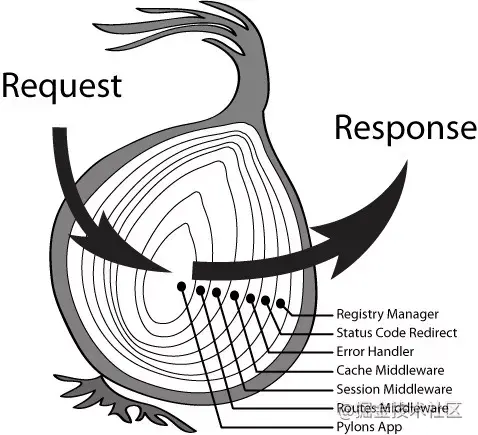

koa与egg的中间件机制

+ 中间件执行就像洋葱一样，最早use的中间件，就放在最外层。处理顺序从左到右，左边接收一个request，右边输出返回response

+ 一般的中间件都会执行两次，调用next之前为第一次，调用next时把控制传递给下游的下一个中间件。当下游不再有中间件或者没有执行next函数时，就将依次恢复上游中间件的行为，让上游中间件执行next之后的代码

大概源码实现
```js
// 注意其中的compose函数，这个函数是实现中间件洋葱模型的关键
// 场景模拟
// 异步 promise 模拟
const delay = async () => {
  return new Promise((resolve, reject) => {
    setTimeout(() => {
      resolve();
    }, 2000);
  });
}
// 中间间模拟
const fn1 = async (ctx, next) => {
  console.log(1);
  await next();
  console.log(2);
}
const fn2 = async (ctx, next) => {
  console.log(3);
  await delay();
  await next();
  console.log(4);
}
const fn3 = async (ctx, next) => {
  console.log(5);
}

const middlewares = [fn1, fn2, fn3];

// compose 实现洋葱模型
const compose = (middlewares, ctx) => {
  const dispatch = (i) => {
    let fn = middlewares[i];
    if(!fn){ return Promise.resolve() }
    return Promise.resolve(fn(ctx, () => {
      return dispatch(i+1);
    }));
  }
  return dispatch(0);
}

compose(middlewares, 1);
```
中间件是一个接收请求和响应对象的函数。换句话说，在应用程序的请求-响应循环中，这些函数可以访问各种请求和响应对象以及循环的下一个函数。中间件的 next 功能是借助一个变量来表示的，通常命名为 next。中间件功能最常执行的任务是：

+ 执行任何类型的代码
+ 更新或修改请求和响应对象
+ 完成请求-响应循环
+ 调用堆栈中的下一个中间件

### koa和express的中间件机制区别
+ koa是基于async await的洋葱圈模型
+ express是基于callback的线性模型 顺序执行
### node如何实现异步IO
在node中，I/O（输入输出）是异步非堵塞的关键，I/O操作通常比较耗时但不会独占CPU，典型的I/O比如文件读写，远程数据库读写，网络请求等，如果用同步API来进行I/O操作，在返回结果之前就只能等待，此时阻塞代码会霸占cpu，导致本进程所有代码都等待，而node.js里面的I/O API都是不会霸占CPU的（原因：node中的核心库libuv会将建立的所有I/O操作内容绑定到单个线程上。只要每个事件循环在不同的线程中，就可以运行多个事件循环，libuv为Node.js提供了跨平台、线程池、事件池、异步I/O等能力），所以是非阻塞的。拿JS中的setTimeout来打比方，当用户使用setTimeout时，JS会开辟出一个异步线程池，与主线程分开执行，结果就是之前的代码继续执行，setTimeout的代码延时执行，等成功后再调用主线程的方法

### PM2原理
+ PM2会有自己的主进程，他会将应用作为子进程再启动起来，启动子应用的方式是fork、和cluster两种。

+ PM2的核心就是PM2本身是一个主进程，他会将应用程序作为作为子进程启动（fork），然后通过进程间通信的方式来实现进程状态的管理。

