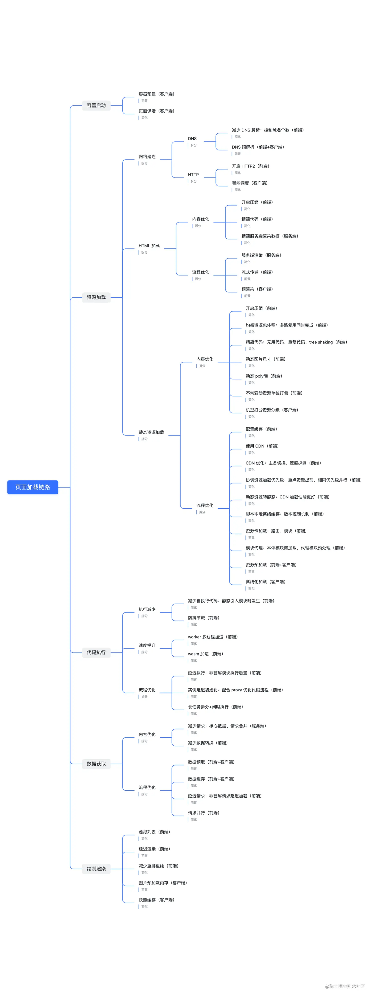

## 性能优化

所以前端的性能优化，就可以从一个经典问题 浏览器输入URL后发生什么 入手，从每一个步骤去思考优化的可能
1. 网络传输阶段

这个阶段可以：

+ DNS优化: 预解析

   DNS预解析 -- 使用 meta 标签

   `<meta http-equiv="x-dns-prefetch-control" content="on" />`

   DNS预解析 -- 使用 link 标签

   `<link rel="dns-prefetch" href="https://www.baidu.com" />`

   当浏览器访问一个域名的时候，需要解析一次DNS，获得对应域名的ip地址。

   浏览器缓存 => 系统缓存 => 路由器缓存 =>ISP(运营商)DNS缓存 => 根域名服务器 => 顶级域名服务器 => 主域名服务器的顺序逐步读取缓存，直到拿到IP地址
   
   作用：根据浏览器定义的规则，提前解析之后可能会用到的域名，使解析结果缓存到系统缓存中，缩短DNS解析时间，来提高网站的访问速度
+ HTTP优化
  + 使用HTTP缓存（强缓存/协商缓存/service worker缓存离线资源）
  + 减少HTTP请求
     - 合并CSS和JavaScript文件。
     - 使用CSS Sprites将多个小图标合并成一张大图。
     - 尽量使用字体图标（如Font Awesome）代替图片。
   + 优化资源加载
     - 压缩CSS、JavaScript和HTML文件，减少文件大小。
     - 优化图片大小，使用WebP、JPEG 2000等现代图像格式。
     - 使用懒加载（Lazy Loading）技术，仅在需要时加载图片和其他资源。
     - 使用预加载，预加载是一种优化策略，可以提前加载关键资源，以便在用户需要时立即可用。
   + 优化网络传输：
     - 使用CDN（内容分发网络）加速静态资源的加载。
     - 开启HTTP压缩（如Gzip）以减少传输数据大小。
     - 使用HTTP/2或HTTP/3协议以获得更高的传输性能。
   + 使用SSR

这里还要考虑一点，在网络传输的过程中是不是可以理解为数据体积越小速度越快？那其实打包工具的优化也可以放在这。
  + 减少打包体积？
    1. 按需加载，路由/类库
    2. Scope Hoisting 会分析出模块之间的依赖关系，尽可能的把打包出来的模块合并到一个函数中去。
    3. Tree Shaking 可以实现删除项目中未被引用的代码

2. 渲染页面阶段

这里其实就是更多的设计到一些代码层面的优化了，比如
+ 使用Web性能API：
   - 利用`requestAnimationFrame`进行动画操作，而不是`setTimeout`或`setInterval`。
   - 使用`window.performance` API监控页面性能。
   - 减少回流（reflow）和重绘（repaint）：避免频繁修改样式，尽量在修改样式之前将元素设`display: none`，完成修改后再显示

+ 使用按需加载（路由，组件，静态资源），代码分割
+ 虚拟列表
+ web worker处理长任务
+ js的async和defer，一些link标签的preload,prefetch属性

什么是代码分割？

代码分割是指，将脚本中无需立即调用的代码在代码构建时转变为异步加载的过程。

在 Webpack 构建时，会避免加载已声明要异步加载的代码，异步代码会被单独分离出一个文件，当代码实际调用时被加载至页面。

### React性能优化

1. 避免不必要的重新渲染：
   - 使用`React.memo`包装函数式组件，仅在props改变时重新渲染。
   - 在类组件中，使用`shouldComponentUpdate`或继承`React.PureComponent`来避免不必要的重新渲染。

2. 使用虚拟化列表：
   - 对于大型列表或表格，使用虚拟化（如`react-window`库）仅渲染可见部分，以提高性能。

3. 优化事件处理器：
   - 使用事件委托（Event Delegation）减少事件监听器。
   - 使用防抖（Debounce）和节流（Throttle）技术避免频繁触发事件处理器。

4. 代码分割和按需加载：
   - 使用`React.lazy`和`React.Suspense`实现组件的懒加载和按需加载。
   - 使用Webpack等构建工具进行代码分割。

5. 使用`React.Fragment`避免额外的DOM元素：
   - 使用`React.Fragment`组合多个子元素，以避免创建不必要的DOM节点。

6. 优化React Context：
   - 使用多个独立的Context来避免不必要的组件重新渲染。
   - 将Context Provider放在组件树的合适位置，以减少作用范围。

7. 使用`useCallback`和`useMemo`避免不必要的计算和渲染：
   - 使用`useCallback`保存事件处理器和回调函数的引用，避免不必要的重新创建。
   - 使用`useMemo`缓存计算结果，避免不必要的重新计算。

8. 优化CSS-in-JS：
   - 避免在组件内部创建大量CSS规则，尽量将样式提取到外部。
   - 使用`classnames`库或其他方法避免不必要的样式计算。

9. 服务器端渲染（SSR）：
   - 使用服务器端渲染（如Next.js）加快首屏渲染速度，提高SEO。

10. 监控性能：

   - 使用React DevTools和Performance API监控React应用程序的性能。
   - 使用`React.Profiler`组件收集组件渲染性能数据。


## 如何极致的优化动画性能

1. 使用CSS动画：CSS动画借助GPU加速，在大多数情况下具有更好的性能。使用transform和opacity属性，避免使用top、left等属性进行动画操作。
2. 使用requestAnimationFrame：requestAnimationFrame是浏览器提供的优化动画的方法，可以更好地与浏览器的渲染机制同步。
3. 减少重绘和回流：通过合并多个DOM修改、使用transform进行动画变换，避免频繁的DOM重绘和回流操作，以提高性能。
4. 使用硬件加速：使用CSS属性translate3d、scale3d等可以启用GPU硬件加速，提高动画的性能。
5. 避免使用阻塞操作：确保动画执行期间没有长时间的JavaScript计算或网络请求阻塞主线程。

## CDN

CDN (全称 Content Delivery Network)，即内容分发网络

构建在现有网络基础之上的智能虚拟网络，依靠部署在各地的边缘服务器，通过中心平台的负载均衡、内容分发、调度等功能模块，使用户就近获取所需内容，降低网络拥塞，提高用户访问响应速度和命中率。`CDN` 的关键技术主要有内容存储和分发技术

简单来讲，`CDN`就是根据用户位置分配最近的资源

于是，用户在上网的时候不用直接访问源站，而是访问离他“最近的”一个 CDN 节点，术语叫**边缘节点**，其实就是缓存了源站内容的代理服务器。如下图：

## 虚拟列表

和懒加载的区别

+ 懒加载主要是用于优化网络请求的，就是只加载可视部分的资源

+ 虚拟列表是优化渲染的，只渲染可视部分的列表Item，而实际上所有的列表信息是已经加载好了，只不过没渲染罢了、

+ 懒加载的计算方式 **img.offsetTop (图片距离document顶部的高度)< window.innerHeight(浏览器可视区域高度) + document.body.scrollTop(浏览器滚动过的距离);** 然后使用HTML5中自定义属性的方式 ，写一个自定义属性data-src，然后等到该加载高度时再把data-src赋值给src就行

+ 虚拟列表的计算方式:  

  虚拟列表的实现，实际上就是在首屏加载的时候，只加载`可视区域`内需要的列表项，当滚动发生时，动态通过计算获得`可视区域`内的列表项，并将`非可视区域`内存在的列表项删除。

  - 计算当前`可视区域`起始数据索引(`startIndex`)
  - 计算当前`可视区域`结束数据索引(`endIndex`)
  - 计算当前`可视区域的`数据，并渲染到页面中
  - 计算`startIndex`对应的数据在整个列表中的偏移位置`startOffset`并设置到列表上

  1. 假定`可视区域`高度固定，称之为`screenHeight`

  2. 假定`列表每项`高度固定，称之为`itemSize`

  3. 假定`列表数据`称之为`listData`

  4. 假定`当前滚动距离`称之为`scrollTop`

     则可以推断出

     列表总高度`listHeight` = listData.length * itemSize

     可显示的列表项数`visibleCount` = Math.ceil(screenHeight / itemSize)

     数据的起始索引`startIndex` = Math.floor(scrollTop / itemSize)

     数据的结束索引`endIndex` = startIndex + visibleCount

     列表显示数据为`visibleData` = listData.slice(startIndex,endIndex)

     偏移量`startOffset` = scrollTop - (scrollTop % itemSize);

布局方案：就用相对定位和绝对定位

注意⚠️:  那如果 渲染Item中的高度是动态的，也就是说ItemSize可变，又该如何计算呢。

我们可以先设定一个预估高度渲染，然后获取真实高度再缓存

高速白屏的优化： 在可视区的上方和下方设定一个缓冲区

其他优化方案: 使用 `IntersectionObserver` 监听事件 可以只监听可视区域的变化，使用 `ResizeObserver`监听内容区域宽高变

## 首页白屏优化
白屏时间即是，浏览器开始显示内容的时间，所以我们一般认为解析完`<head>`的时刻，或者开始渲染`<body>`标签就是该页面白屏结束的时间。

白屏时间: window.performance.timing.domLoading - window.performance.timing.navigationStart

首屏时间是指用户打开一个网站时，直到浏览器首页面内容渲染完成的时间。

首屏时间: window.performance.timing.domInteractive - window.performace.timing.navigationStart

1. DNS预解析
 DNS预解析 -- 使用 meta 标签
`<meta http-equiv="x-dns-prefetch-control" content="on" />`
 DNS预解析 -- 使用 link 标签
`<link rel="dns-prefetch" href="https://www.baidu.com" />`
当浏览器访问一个域名的时候，需要解析一次DNS，获得对应域名的ip地址。
浏览器缓存 => 系统缓存 => 路由器缓存 =>ISP(运营商)DNS缓存 => 根域名服务器 => 顶级域名服务器 => 主域名服务器的顺序
逐步读取缓存，直到拿到IP地址

作用：根据浏览器定义的规则，提前解析之后可能会用到的域名，使解析结果缓存到系统缓存中，缩短DNS解析时间，来提高网站的访问速度

2. 路由，组件，图片等懒加载

3. 合理是有tree shanking 减少代码体积

4. 虚拟列表

5. web worker优化长任务

6. js的async和defer，一些link标签的preload,prefetch属性

preload: 用于提前加载一些需要的依赖，这些资源会优先加载
preload 特点：

1）preload 加载的资源是在浏览器渲染机制之前进行处理的，并且不会阻塞 onload 事件；

2）preload 加载的 JS 脚本其加载和执行的过程是分离的，即 preload 会预加载相应的脚本代码，待到需要时自行调用

prefetch 是利用浏览器的空闲时间，加载页面将来可能用到的资源的一种机制；通常可以用于加载其他页面（非首页）所需要的资源，以便加快后续页面的打开速度

prefetch 特点：

1）pretch 加载的资源可以获取非当前页面所需要的资源，并且将其放入缓存至少5分钟（无论资源是否可以缓存）

2）当页面跳转时，未完成的 prefetch 请求不会被中断

7. ssr服务端渲染

客户端渲染：获取 HTML 文件，根据需要下载 JavaScript 文件并运行，生成 DOM，然后再渲染。

服务端渲染：服务端返回 HTML 文件，客户端只需解析 HTML。

优点：首屏渲染快，对搜索引擎优化（SEO）好。

缺点：配置麻烦，增加了服务器的计算压力。


**性能优化目前只是在自己的浏览器看，和用户机型实际的性能肯定有参差，那如何获取用户侧的性能指标呢？**

用URM工具，或者在代码里面埋入`window.performace`和 `window.navigator`
```js
// window.performace
// 提供了与浏览器性能相关的信息和指标。它允许开发者获取与页面加载、资源加载、导航和计时相关的性能数据
1. window.performance.timing：这是一个包含了与页面加载相关的时间戳的对象。它提供了以下属性：

   navigationStart：浏览器开始导航的时间戳。
   unloadEventStart：前一个页面 unload 事件触发的时间戳。
   unloadEventEnd：前一个页面 unload 事件完成的时间戳。
   redirectStart：重定向开始的时间戳。
   redirectEnd：重定向完成的时间戳。
   fetchStart：浏览器开始获取页面资源的时间戳。
   domainLookupStart：域名查询开始的时间戳。
   domainLookupEnd：域名查询完成的时间戳。
   connectStart：与服务器建立连接开始的时间戳。
   connectEnd：与服务器建立连接完成的时间戳。
   secureConnectionStart：安全连接开始的时间戳。
   requestStart：浏览器向服务器发送请求的时间戳。
   responseStart：接收到第一个字节的时间戳。
   responseEnd：接收到最后一个字节的时间戳。
   domLoading：开始解析 DOM 的时间戳。
   domInteractive：DOM 解析完成、文档准备就绪的时间戳。
   domContentLoadedEventStart：DOMContentLoaded 事件触发的时间戳。
   domContentLoadedEventEnd：DOMContentLoaded 事件完成的时间戳。
   domComplete：DOM 解析完成的时间戳。
   loadEventStart：load 事件触发的时间戳。
   loadEventEnd：load 事件完成的时间戳。
   
2. window.performance.navigation：这是一个包含有关页面导航的信息的对象。它提供了以下属性：

   type：导航类型，如 0 表示同步导航，1 表示重定向导航，2 表示后退或前进导航。
   redirectCount：重定向次数。

3. window.performance.memory：这是一个包含与内存使用情况相关的信息的对象。它提供了以下属性：

   jsHeapSizeLimit：JavaScript 堆内存的大小限制。
   totalJSHeapSize：JavaScript 堆内存的当前使用量。
   usedJSHeapSize：已经分配给 JavaScript 对象的堆内存。

4. window.performance.now()：这是一个方法，返回从页面加载开始到调用该方法时经过的毫秒数。它可以用于测量代码执行的时间。
```

```js
// window.navigator 
// 是一个提供有关浏览器环境和用户设备的对象。它包含了许多属性和方法，可以用于获取有关浏览器、操作系统和设备的信息。

window.navigator.userAgent：表示浏览器的用户代理字符串，其中包含了关于用户设备和浏览器的信息。通过解析该字符串，可以获取浏览器类型、版本、操作系统等信息。用正则解析

window.navigator.platform：表示用户设备的操作系统平台信息，例如 "Win32"、"MacIntel" 等。

window.navigator.language：表示用户设备的首选语言，通常是基于浏览器设置或操作系统语言。

window.navigator.appVersion：表示浏览器的版本信息。

window.navigator.cookieEnabled：表示浏览器是否启用了 Cookie。

window.navigator.onLine：表示浏览器是否处于联网状态。

window.navigator.geolocation：表示浏览器是否支持地理位置信息获取。

window.navigator.plugins：表示浏览器安装的插件列表。

window.navigator.mimeTypes：表示浏览器支持的 MIME 类型列表。

window.navigator.getBattery()：获取用户设备的电池信息。

window.navigator.vibrate()：控制设备进行振动。

window.navigator.requestMIDIAccess()：请求访问 MIDI 设备。
```