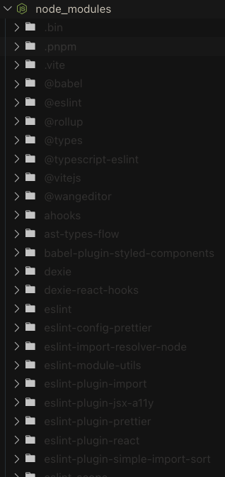
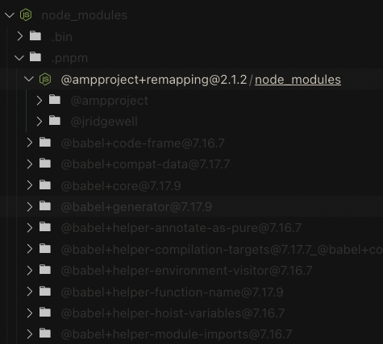
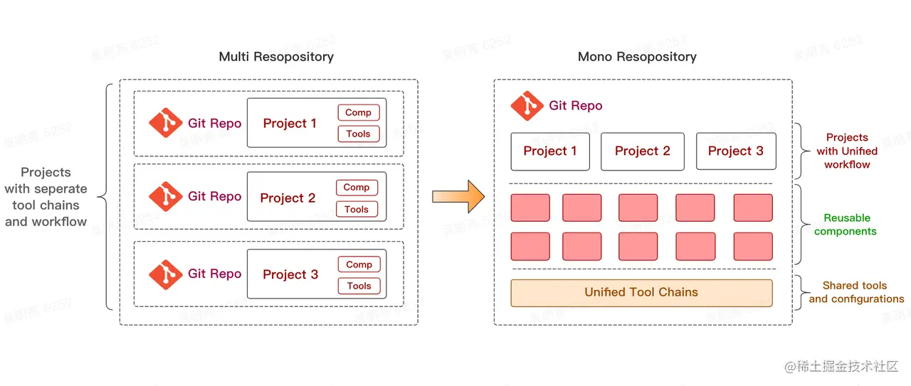

### 硬链接和软链接

> **硬连接**
>
> 硬连接指通过索引节点来进行连接。在 Linux 的文件系统中，保存在磁盘分区中的文件不管是什么类型都给它分配一个编号，称为索引节点号(Inode Index)。在 Linux 中，多个文件名指向同一索引节点是存在的。比如：A 是 B 的硬链接（A 和 B 都是文件名），则 A 的目录项中的 inode 节点号与 B 的目录项中的 inode 节点号相同，即一个 inode 节点对应两个不同的文件名，两个文件名指向同一个文件，A 和 B 对文件系统来说是完全平等的。删除其中任何一个都不会影响另外一个的访问。
>
> 硬连接的作用是允许一个文件拥有多个有效路径名，这样用户就可以建立硬连接到重要文件，以防止“误删”的功能。其原因如上所述，因为对应该目录的索引节点有一个以上的连接。只删除一个连接并不影响索引节点本身和其它的连接，只有当最后一个连接被删除后，文件的数据块及目录的连接才会被释放。也就是说，文件真正删除的条件是与之相关的所有硬连接文件均被删除。
>
> **软连接**
>
> 另外一种连接称之为符号连接（Symbolic Link），也叫软连接。软链接文件有类似于 Windows 的快捷方式。它实际上是一个特殊的文件。在符号连接中，文件实际上是一个文本文件，其中包含的有另一文件的位置信息。比如：A 是 B 的软链接（A 和 B 都是文件名），A 的目录项中的 inode 节点号与 B 的目录项中的 inode 节点号不相同，A 和 B 指向的是两个不同的 inode，继而指向两块不同的数据块。但是 A 的数据块中存放的只是 B 的路径名（可以根据这个找到 B 的目录项）。A 和 B 之间是“主从”关系，如果 B 被删除了，A 仍然存在（因为两个是不同的文件），但指向的是一个无效的链接。

简单来说 硬链接就是"深拷贝了一个文件" 软链接就是快捷方式

# yarn / pnpm / npm 区别

包管理器深入的话其实和操作系统关系很大的

这里还没学过操作系统，所以也无法特别深入

### yarn

扁平化 减少node_modules的嵌套

利用yarn.lock 锁定依赖版本 为什么？

因为一个包可能有多个版本，提升铺平只能提升一个，后面如果遇见相同包的不同版本还是要嵌套

+ 扁平化方案的问题 幽灵依赖

就是没有在 dependencies中声明依赖 但在代码里可以import 其实就是所有依赖都铺平了，那依赖的依赖就可以找到

问题就是 因为不是显示依赖 如果别的包不依赖这个包了， 那我们就跑不了了

+ yarn lock作用

先明确，package.json 中的版本号 为 `[major].[minor].[patch]`, 主要/次要/补丁，然后前面会有一些符号，如`^, ~, >, <,-, x`等，这些符号可控制版本，即package.json 中的版本号 为一个 `版本区间`，yarn.lock中的version字段是唯一版本号

> ^ 表示大于等于当前版本，并允许`minor`级别的递增。
>
> ~ 表示大于等于当前版本，并允许`patch`级别的递增。
>
> \> / >= 表示大于/大于等于当前版本即可。
>
> < / <= 表示小于/小于等于当前版本即可。
>
> \- 表示两个版本范围之间，并包括两个版本。（闭区间）
>
> x 可以在`major`, `minor`, `patch`任意位置，表示任何数字。
>
> || 表示或，任意版本或版本范围满足其一。

具体作用

> 用于锁定项目中每个依赖项的确切版本，以便在不同的开发环境中始终使用相同的依赖项版本，从而避免在生产环境部署时出现依赖项版本不一致的问题。
>
> 当您运行 `yarn install` 安装项目依赖项时，Yarn 会检查 `yarn.lock` 文件并下载列出的确切版本的依赖项。如果 `yarn.lock` 文件不存在，则 Yarn 将根据 `package.json` 文件中指定的版本范围下载符合条件的最新版本的依赖项，并将这些确切的版本记录在新生成的 `yarn.lock` 文件中。
>
> 因此，`yarn.lock` 文件确保项目依赖项的版本一致性，避免了在不同的环境中安装不同版本的依赖项可能出现的问题。

Npm3 采用扁平依赖 npm7采用 lock文件

### pnpm优势

1. 速度快
2. 高效利用磁盘空间

pnpm 内部使用`基于内容寻址`的文件系统来存储磁盘上所有的文件，这个文件系统出色的地方在于:

- 不会重复安装同一个包。用 npm/yarn 的时候，如果 100 个项目都依赖 lodash，那么 lodash 很可能就被安装了 100 次，磁盘中就有 100 个地方写入了这部分代码。但在使用 pnpm 只会安装一次，磁盘中只有一个地方写入，后面再次使用都会直接使用 `hardlink`(硬链接，不清楚的同学详见[这篇文章](https://link.juejin.cn?target=https%3A%2F%2Fwww.cnblogs.com%2Fitech%2Farchive%2F2009%2F04%2F10%2F1433052.html))。
- 即使一个包的不同版本，pnpm 也会极大程度地复用之前版本的代码。举个例子，比如 lodash 有 100 个文件，更新版本之后多了一个文件，那么磁盘当中并不会重新写入 101 个文件，而是保留原来的 100 个文件的 `hardlink`，仅仅写入那`一个新增的文件`。

3. 支持monorepo monorepo简单的说就是把所有代码放到一个仓库中

4. 更安全

### 被诟病的npm

npm1,npm2中的node_modules结构是这样的， 可以想象如果出现循环依赖或者共享依赖会发生什么，这也是一个经典梗图，node_modules比黑洞质量还大(指嵌套的深度)

```
node_modules
└─ foo
   ├─ index.js
   ├─ package.json
   └─ node_modules
      └─ bar
         ├─ index.js
         └─ package.json

```

然后yarn出现，再到npm3(现在已经有8了)，就采取扁平化管理了，但扁平化管理依然有问题

- 依赖结构的**不确定性**。
- 扁平化算法本身的**复杂性**很高，耗时较长。
- 项目中仍然可以**非法访问**没有声明过依赖的包

看这个不确定性，简单来说就是如下情况

假如现在项目依赖两个包 foo 和 bar，这两个包的依赖又是这样的:

```
foo -> babel@1.0
bar -> babel@2.0
```

那么扁平化后是以下哪种？

```
// 第一种情况
node_modules
└─ foo
└─ bar
		└─babel@2.0
└─ babel@1.0

// 第二种情况
node_modules
└─ foo
		└─ babel@1.0
└─ bar
└─babel@2.0

```

答案是: 都有可能。取决于 foo 和 bar 在 `package.json`中的位置，如果 foo 声明在前面，那么就是前面的结构，否则是后面的结构。

这就是为什么会产生依赖结构的`不确定`问题，也是 `lock 文件`诞生的原因，无论是`package-lock.json`(npm 5.x才出现)还是`yarn.lock`，都是为了保证 install 之后都产生确定的`node_modules`结构。

那用pnpm安装依赖后是什么情形呢



看这个目录，你打开vite也好，ahooks也好，这些仅仅只是一个`软链接`，都是没有node_modules目录的，那么这些包的依赖在哪儿?

打开.pnpm目录 随便打开一个包就会发现其所依赖的node_modules  这个.pnpm 就是从全局store 硬链接过来的，可以叫他虚拟store



到统一目录下后 包和包之间的依赖关系就是软链接

> 将`包本身`和`依赖`放在同一个`node_module`下面，与原生 Node 完全兼容，又能将 package 与相关的依赖很好地组织到一起，设计十分精妙。
>
> 现在我们回过头来看，根目录下的 node_modules 下面不再是眼花缭乱的依赖，而是跟 package.json 声明的依赖基本保持一致。即使 pnpm 内部会有一些包会设置依赖提升，会被提升到根目录 node_modules 当中，但整体上，根目录的`node_modules`比以前还是清晰和规范了许多。


延伸: 执行 npm run 后发生什么？

1. 运行 npm run xxx的时候，npm 会先在当前目录的 node_modules/.bin 查找要执行的程序，如果找到则运行；

2. 没有找到则从全局的 node_modules/.bin 中查找，npm i -g xxx就是安装到到全局目录；

3. 如果全局目录还是没找到，那么就从 path 环境变量中查找有没有其他同名的可执行程序。

就比如一个Vite 项目 我们执行 pnpm dev，看package.json， 实际上是执行了 “vite命令”，但如果我们直接执行vite是会报错的，因为操作系统中并没有这条指令。

所以，真正运行的，其实是node_modules/bin/vite 这个脚本文件，这个脚本文件在我们pnpm install安装依赖的时候就会被自动生成

bin 目录，这个目录不是任何一个 npm 包。目录下的文件，表示这是一个个软链接，打开文件可以看到文件顶部写着 `#!/bin/sh` ，表示这是一个脚本。

.bin 目录下的文件表示软连接，那这个bin目录下的那些软连接文件是哪里来的呢？它又是怎么知道这条软连接是执行哪里的呢？

bin字段不是在自己项目的package.json文件里面，而是在库的源代码中的package.json里面，用于在安装时创建软链指向bin中的地址

所以在 npm install 时，npm 读到该配置后，就将该文件软链接到 ./node_modules/.bin 目录下，而 npm 还会自动把node_modules/.bin加入$PATH，这样就可以直接作为命令运行依赖程序和开发依赖程序，不用全局安装了。

假如我们在安装包时，使用 `npm install -g xxx` 来安装，那么会将其中的 bin 文件加入到全局，比如 create-react-app 和 vue-cli ，在全局安装后，就可以直接使用如 vue-cli projectName 这样的命令来创建项目了

也就是说，npm i 的时候，npm 就帮我们把这种软连接配置好了，其实这种软连接相当于一种映射，执行npm run xxx 的时候，就会到 node_modules/bin中找对应的映射文件，然后再找到相应的js文件来执行。


### yalc

yalc是一个用于本地软件包开发和管理的工具。它可以让你在本地创建软件包并将其链接到其他本地项目中，而不必在NPM注册表上发布它们。这使得在本地进行开发和测试变得更加容易和灵活，而且不需要在不同项目之间频繁地进行版本控制。

`yalc publish` 对应的包先发布。然后 yalc link 链接



> 概念上很好理解，就是把**多个项目**放在**一个仓库**里面，相对立的是传统的 MultiRepo 模式，即每个项目对应一个单独的仓库来分散管理。

一般 Monorepo 的目录如下所示，在 packages 存放多个子项目，并且每个子项目都有自己的`package.json`:

```go
├── packages
|   ├── pkg1
|   |   ├── package.json
|   ├── pkg2
|   |   ├── package.json
├── package.json
```

注意MultiRepo的三个痛点:

1. 代码复用

加入我有多个项目，然后这些项目的工具函数啊，共同组件逻辑啊我们都把抽出封装成一个包发布了，然后有时候想改一行代码。我们需要修改包，然后重新发布，然后再到各个项目去更新相关的包

2. 版本管理

其实和上面说的很像，就是一个包更新后，所有依赖这个包的项目如果没即使更新依赖，可能就会出现各种不兼容的报错

3. 项目基建

> 由于在 MultiRepo 当中，各个项目的工作流是割裂的，因此每个项目需要单独配置开发环境、配置 CI 流程、配置部署发布流程等等，甚至每个项目都有自己单独的一套脚手架工具。
>
> 其实，很容易发现这些项目里的很多基建的逻辑都是重复的，如果是 10 个项目，就需要维护 10 份基建的流程，逻辑重复不说，各个项目间存在构建、部署和发布的规范不能统一的情况，这样维护起来就更加麻烦了。

## Monorepo 的收益


> 说清楚 `MultiRepo` 的痛点之后，相信你也大概能理解为什么要诞生`Monorepo`这个技术了。现在就来细致地分析一下`Monorepo`到底给现代的前端工程带来了哪些收益。
>
> 首先是**工作流的一致性**，由于所有的项目放在一个仓库当中，复用起来非常方便，如果有依赖的代码变动，那么用到这个依赖的项目当中会立马感知到。并且所有的项目都是使用最新的代码，不会产生其它项目版本更新不及时的情况。
>
> 其次是**项目基建成本的降低**，所有项目复用一套标准的工具和规范，无需切换开发环境，如果有新的项目接入，也可以直接复用已有的基建流程，比如 CI 流程、构建和发布流程。这样只需要很少的人来维护所有项目的基建，维护成本也大大减低。
>
> 再者，**团队协作也更加容易**，一方面大家都在一个仓库开发，能够方便地共享和复用代码，方便检索项目源码，另一方面，git commit 的历史记录也支持以功能为单位进行提交，之前对于某个功能的提交，需要改好几个仓库，提交多个 commit，现在只需要提交一次，简化了 commit 记录，方便协作。