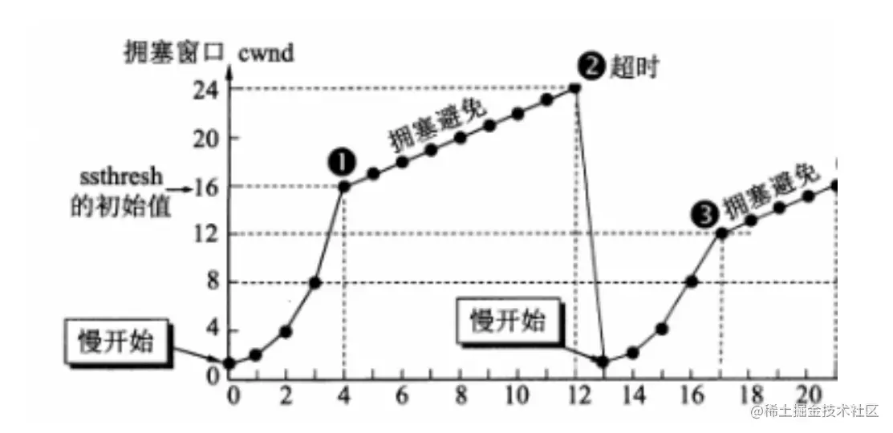
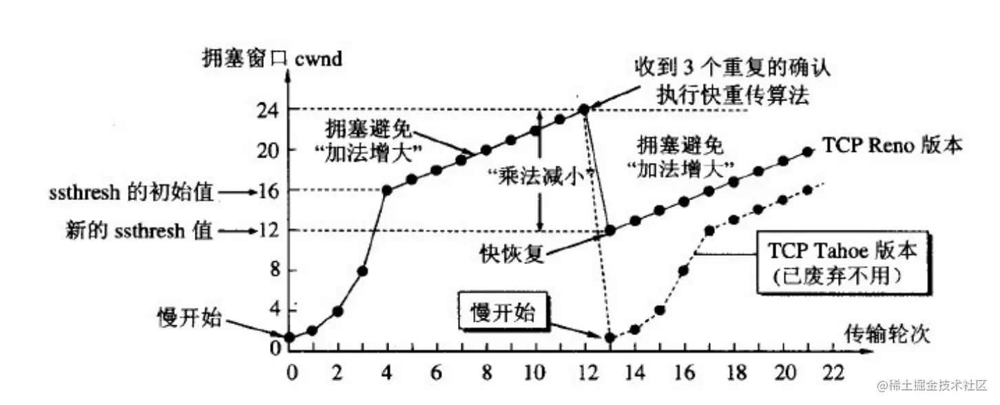
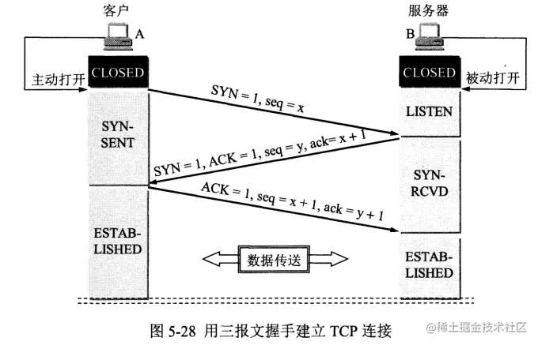
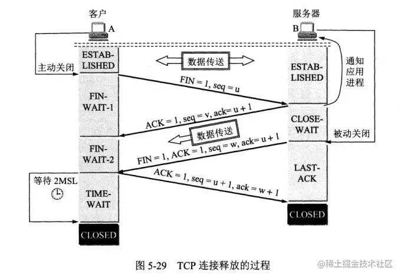
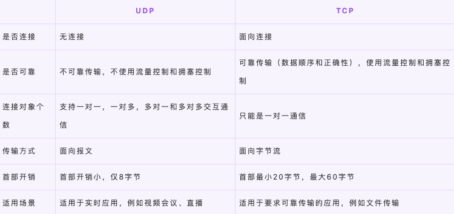

[TCP相关](https://juejin.cn/post/6844904070889603085)
### TCP如何保证可靠传输？

连接管理，校验和，序列号，确认应答，超时重传，流量控制，拥塞控制。

+ 连接管理 即三次握手和四次挥手。连接管理机制能够建立起可靠的连接，这是保证传输可靠性的前提。

+ 校验和 发送方对发送数据的二进制求和取反，然后将值填充到TCP的校验和字段中，接收方收到数据之后，以相同的方式计算校验和并进行对比。如果结果不符合预期，则将数据包丢弃。
注意：即便二者相等，也并不能确保数据包一定是正确无误的，基于某些巧合，会出现数据包错误，但发送端和接收端的校验和相等的场景。

+ 序列号 TCP将每个字节的数据都进行了编号，这就是序列号。序列号的具体作用如下：能够保证可靠性，既能防止数据丢失，又能避免数据重复。能够保证有序性，按照序列号顺序进行数据包还原。能够提高效率，基于序列号可实现多次发送，一次确认。

+ 确认应答 接收方接收数据之后，会回传ACK报文，报文中带有此次确认的序列号，用于告知发送方此次接收数据的情况。在指定时间后，若发送端仍未收到确认应答，就会启动超时重传。

+ 超时重传 具体来说，超时重传主要有两种场景：数据包丢失：在指定时间后，若发送端仍未收到确认应答，就会启动超时重传，向接收端重新发送数据包。确认包丢失：当接收端收到重复数据(通过序列号进行识别)时将其丢弃，并重新回传ACK报文。

+ 流量控制 接收端处理数据的速度是有限的，如果发送方发送数据的速度过快，就会导致接收端的缓冲区溢出，进而导致丢包……为了避免上述情况的发生，TCP支持根据接收端的处理能力，来决定发送端的发送速度。这就是流量控制。流量控制是通过在TCP报文段首部维护一个滑动窗口来实现的。

+ 拥塞控制 拥塞控制就是当网络拥堵严重时，发送端减少数据发送。拥塞控制是通过发送端维护一个拥塞窗口来实现的。可以得出，发送端的发送速度，受限于滑动窗口和拥塞窗口中的最小值。
拥塞控制方法分为：慢开始，拥塞避免快重传和快恢复。

#### TCP的重传机制
由于TCP的下层网络（网络层）可能出现丢失、重复或失序的情况，TCP协议提供可靠数据传输服务。为保证数据传输的正确性，TCP会重传其认为已丢失（包括报文中的比特错误）的包。TCP使用两套独立的机制来完成重传，一是基于时间，二是基于确认信息。

TCP在发送一个数据之后，就开启一个定时器，若是在这个时间内没有收到发送数据的ACK确认报文，则对该报文进行重传，在达到一定次数还没有成功时放弃并发送一个复位信号。

#### TCP的拥塞控制机制

TCP的拥塞控制机制主要是以下四种机制：

+ 慢启动（慢开始）
+ 拥塞避免
+ 快速重传
+快速恢复

**（1）慢启动（慢开始）**

+ 在开始发送的时候设置cwnd = 1（cwnd指的是拥塞窗口）
+ 思路：开始的时候不要发送大量数据，而是先测试一下网络的拥塞程度，由小到大增加拥塞窗口的大小。
+ 为了防止cwnd增长过大引起网络拥塞，设置一个慢开始门限(ssthresh 状态变量)
    + 当cnwd < ssthresh，使用慢开始算法
    + 当cnwd = ssthresh，既可使用慢开始算法，也可以使用拥塞避免算法
    + 当cnwd > ssthresh，使用拥塞避免算法

**（2）拥塞避免**

+ 拥塞避免未必能够完全避免拥塞，是说在拥塞避免阶段将拥塞窗口控制为按线性增长，使网络不容易出现阻塞。
+ 思路： 让拥塞窗口cwnd缓慢的增大，即每经过一个返回时间RTT就把发送方的拥塞控制窗口加一
+ 无论是在慢开始阶段还是在拥塞避免阶段，只要发送方判断网络出现拥塞，就把慢开始门限设置为出现拥塞时的发送窗口大小的一半。然后把拥塞窗口设置为1，执行慢开始算法，如图所示:

**（3）快速重传**

+ 快重传要求接收方在收到一个失序的报文段后就立即发出重复确认(为的是使发送方及早知道有报文段没有到达对方)。发送方只要连续收到三个重复确认就立即重传对方尚未收到的报文段，而不必继续等待设置的重传计时器时间到期。
+ 由于不需要等待设置的重传计时器到期，能尽早重传未被确认的报文段，能提高整个网络的吞吐量

**（4）快速恢复**

+ 当发送方连续收到三个重复确认时，就执行“乘法减小”算法，把ssthresh门限减半。但是接下去并不执行慢开始算法。
+ 考虑到如果网络出现拥塞的话就不会收到好几个重复的确认，所以发送方现在认为网络可能没有出现拥塞。所以此时不执行慢开始算法，而是将cwnd设置为ssthresh的大小，然后执行拥塞避免算法。

#### TCP的流量控制机制
一般来说，流量控制就是为了让发送方发送数据的速度不要太快，要让接收方来得及接收。TCP采用大小可变的滑动窗口进行流量控制，窗口大小的单位是字节。这里说的窗口大小其实就是每次传输的数据大小。

+ 当一个连接建立时，连接的每一端分配一个缓冲区来保存输入的数据，并将缓冲区的大小发送给另一端。
+ 当数据到达时，接收方发送确认，其中包含了自己剩余的缓冲区大小。（剩余的缓冲区空间的大小被称为窗口，指出窗口大小的通知称为窗口通告 。接收方在发送的每一确认中都含有一个窗口通告。）
+ 如果接收方应用程序读数据的速度能够与数据到达的速度一样快，接收方将在每一确认中发送一个正的窗口通告。
+ 如果发送方操作的速度快于接收方，接收到的数据最终将充满接收方的缓冲区，导致接收方通告一个零窗口 。发送方收到一个零窗口通告时，必须停止发送，直到接收方重新通告一个正的窗口。

#### TCP的可靠传输机制
TCP 的可靠传输机制是基于连续 ARQ 协议和滑动窗口协议的。

TCP 协议在发送方维持了一个发送窗口，发送窗口以前的报文段是已经发送并确认了的报文段，发送窗口中包含了已经发送但 未确认的报文段和允许发送但还未发送的报文段，发送窗口以后的报文段是缓存中还不允许发送的报文段。当发送方向接收方发 送报文时，会依次发送窗口内的所有报文段，并且设置一个定时器，这个定时器可以理解为是最早发送但未收到确认的报文段。 如果在定时器的时间内收到某一个报文段的确认回答，则滑动窗口，将窗口的首部向后滑动到确认报文段的后一个位置，此时如 果还有已发送但没有确认的报文段，则重新设置定时器，如果没有了则关闭定时器。如果定时器超时，则重新发送所有已经发送 但还未收到确认的报文段，并将超时的间隔设置为以前的两倍。当发送方收到接收方的三个冗余的确认应答后，这是一种指示， 说明该报文段以后的报文段很有可能发生丢失了，那么发送方会启用快速重传的机制，就是当前定时器结束前，发送所有的已发 送但确认的报文段。

接收方使用的是累计确认的机制，对于所有按序到达的报文段，接收方返回一个报文段的肯定回答。如果收到了一个乱序的报文 段，那么接方会直接丢弃，并返回一个最近的按序到达的报文段的肯定回答。使用累计确认保证了返回的确认号之前的报文段都 已经按序到达了，所以发送窗口可以移动到已确认报文段的后面。

发送窗口的大小是变化的，它是由接收窗口剩余大小和网络中拥塞程度来决定的，TCP 就是通过控制发送窗口的长度来控制报文 段的发送速率。

但是 TCP 协议并不完全和滑动窗口协议相同，因为许多的 TCP 实现会将失序的报文段给缓存起来，并且发生重传时，只会重 传一个报文段，因此 TCP 协议的可靠传输机制更像是窗口滑动协议和选择重传协议的一个混合体。

#### TCP粘包

默认情况下, TCP 连接会启⽤延迟传送算法 (Nagle 算法), 在数据发送之前缓存他们. 如果短时间有多个数据发送, 会缓冲到⼀起作⼀次发送 (缓冲⼤⼩⻅ socket.bufferSize ), 这样可以减少 IO 消耗提⾼性能.

如果是传输⽂件的话, 那么根本不⽤处理粘包的问题, 来⼀个包拼⼀个包就好了。但是如果是多条消息, 或者是别的⽤途的数据那么就需要处理粘包.

下面看⼀个例⼦, 连续调⽤两次 send 分别发送两段数据 data1 和 data2, 在接收端有以下⼏种常⻅的情况:
A. 先接收到 data1, 然后接收到 data2 .
B. 先接收到 data1 的部分数据, 然后接收到 data1 余下的部分以及 data2 的全部.
C. 先接收到了 data1 的全部数据和 data2 的部分数据, 然后接收到了 data2 的余下的数据.
D. ⼀次性接收到了 data1 和 data2 的全部数据.

其中的 BCD 就是我们常⻅的粘包的情况. ⽽对于处理粘包的问题, 常⻅的解决⽅案有:

+ 多次发送之前间隔⼀个等待时间：只需要等上⼀段时间再进⾏下⼀次 send 就好, 适⽤于交互频率特别低的场景. 缺点也很明显, 对于⽐较频繁的场景⽽⾔传输效率实在太低，不过⼏乎不⽤做什么处理.
+ 关闭 Nagle 算法：关闭 Nagle 算法, 在 Node.js 中你可以通过 socket.setNoDelay() ⽅法来关闭 Nagle 算法, 让每⼀次 send 都不缓冲直接发送。该⽅法⽐较适⽤于每次发送的数据都⽐较⼤ (但不是⽂件那么⼤), 并且频率不是特别⾼的场景。如果是每次发送的数据量⽐较⼩, 并且频率特别⾼的, 关闭 Nagle 纯属⾃废武功。另外, 该⽅法不适⽤于⽹络较差的情况, 因为 Nagle 算法是在服务端进⾏的包合并情况, 但是如果短时间内客户端的⽹络情况不好, 或者应⽤层由于某些原因不能及时将 TCP 的数据 recv, 就会造成多个包在客户端缓冲从⽽粘包的情况。 (如果是在稳定的机房内部通信那么这个概率是⽐较⼩可以选择忽略的)
+ 进⾏封包/拆包： 封包/拆包是⽬前业内常⻅的解决⽅案了。即给每个数据包在发送之前, 于其前/后放⼀些有特征的数据, 然后收到数据的时 候根据特征数据分割出来各个数据包

#### 为什么udp不会粘包？

+ TCP协议是⾯向流的协议，UDP是⾯向消息的协议。UDP段都是⼀条消息，应⽤程序必须以消息为单位提取数据，不能⼀次提取任意字节的数据
+ UDP具有保护消息边界，在每个UDP包中就有了消息头（消息来源地址，端⼝等信息），这样对于接收端来说就容易进⾏区分处理了。传输协议把数据当作⼀条独⽴的消息在⽹上传输，接收端只能接收独⽴的消息。接收端⼀次只能接收发送端发出的⼀个数据包,如果⼀次接受数据的⼤⼩⼩于发送端⼀次发送的数据⼤⼩，就会丢失⼀部分数据，即使丢失，接受端也不会分两次去接收。

### 三握手和四挥手

老老老老老的不能在老的问题了 三握手四挥手

这次总结 直接彻底弄懂

TCP协议什么最关键？ 可靠对吧，他一定要确认客户端和服务器都没毛病才能确认连接进行数据传输，好，那如何确认客户端和服务器都没毛病？ 是不是要确认他们都可以正常的发送和接受数据才行？

了解这点，再看三握手，一下就通透了。

看上图，什么SYN，ACK，seq，还有个小写的ack，这都是啥？

不急，一步一步来。

1. 第一次握手

第一次握手是啥？ 客户端发送了一个SYN = 1和 seq=x(状态转为SYN-SENT,简单理解为发送状态,服务器变成监听状态)，先看SYN(synchronous建立联机)报文，这大写的我们就把它理解为标识符，这个标识符是1，那我服务器看到这个会想什么？

~~哦，猛1寻0是吧~~ 哦，你要跟我建立联机了，还给我发了一个值为x(占32位，用来标识从TCP源端向目的端发送的字节流)的seq(Sequence number(顺序号码))。

 此时什么情况是已知的？ 我，服务器，明确的知道你客户端——是可以正常发送数据的！而我服务器是可以正常接收数据。其他的呢？你客户端能不能接受数据？我服务端能不能正常发送数据？你客户端知道这些情况嘛？ 啥都不知道，所以，第二次握手来了。

2. 第二次握手

第二次握手相比第一次握手 多了一个ACK和ack，这二者有啥区别？ 刚刚说了，大写的我们就把它理解为标识符，那这个ACK(acknowledgement确认)，就是服务器告诉客户端，好嘞，我收到你的连接请求了，俺可以和你连接哦。然后服务器也随机生成了一个seq = y，这些都好理解，那ack = x + 1，是什么意思？我们想想看，就回到一开始的问题，**是不是要确认他们都可以正常的发送和接受数据才行**，也就是说，作为服务端，我需要知道你客户端可以正常发送接收，我自己也可以发送接收，我们俩都没问题，就连接。

那在第一次握手后，服务端明确了两点，自己能正常接收和服客户端能正常发送，那就还需要确认自己能否正常发送和客户端能否正常接收，于是乎 他发了seq(表明自己能正常发送)，和ack(和客户端的seq相关，表明自己能正常接收)。发送报文后，服务端转成SYN—RCVD

3. 第三次握手

第二次握手后，客户端是不是就知道了服务端能正常发送和正常接收？也知道了自己能正常发送和正常接收，所以他又把seq和ack发回去了，那服务端看到你客户端的ack，哦，他就了然了，他就知道自己刚刚发过去的seq被你接收到了，那你也没毛病我也没毛病，咱俩就喜结连理开始连接吧。 

所以 简单点说 三次握手 首先就是双方都要确认收到对方seq 如果没有第三次，那服务器就无法知道客户端有没有接收到自己的seq了.

4. 思考题

知道什么是三握手后，再思考一下，seq = x + 1, ack = x + 1，又是什么意思，为什么不能直接等于x呢？

我们知道，按照定义seq是要发送的第一个字节的序号，ack等于他收到的seq序列号加上字节流数据的长度，他代表期望收到的下一个字节的序号，同时他也代表这个序号前的字节我都已经收到了。

那按道理来说 连接过程又没数据，为啥不是 ack = x + 0 ? 这里就是SYN报文的原因了，TCP 协议规定SYN报文虽然不携带数据， 但是也要消耗1个序列号， 所以后两次握手客户端和服务端都需要向对方回复 x+1 或 y+1 。

那最后一次的seq = x + 1又是为什么了，最后一次已经不发送SYN报文了，难道是ACK报文也要占一个序号？ 不不不，ACK是可以携带数据的，所以在不携带数据的情况下，它就不消耗序号了，其实最后一次再发送seq是无意义的，但这个字段总要有个值嘛，又不能空着，那我们看刚刚说的ack是什么 **代表期望收到的下一个字节的序号**，那你ack都期望我下一次发送的seq是x + 1了，那我就发x + 1 咯

5. 为什么需要三次握手

刚刚已经回答了，要确认他们都可以正常的发送和接受数据才行

 第一次握手：客户端发送网络包，服务端收到了。 这样服务端就能得出结论：客户端的发送能力、服务端 的接收能力是正常的。

 第二次握手：服务端发包，客户端收到了。 这样客户端就能得出结论：服务端的接收、发送能力，客户端 的接收、发送能力是正常的。不过此时服务器并不能确认客户端的接收能力是否正常。

 第三次握手：客户端发包，服务端收到了。 这样服务端就能得出结论：客户端的接收、发送能力正常，服 务器自己的发送、接收能力也正常。

 因此，需要三次握手才能确认双方的接收与发送能力是否正常。

######  而假设只有两次握手

1. 如客户端发出连接请求，但因连接请求报文丢失而未收到确认，于是客户端再重传一次连接请求
2. 后来收到了确认，建立了连接
3. 数据传输完毕后，就释放了连接
4. 客户端共发出了两个连接请求报文段，其中第一个丢失，第二个到达了服务端，但是第一个丢失的报文段只是在某些网络结点长时间滞留了，延误到连接释放以后的某个时间才到达服务端
5. 此时服务端误认为客户端又发出一次新的连接请求，于是就向客户端发出确认报文段，同意建立连接，不采用三次握手，只要服务端发出确认，就建立新的连接了
6. 此时客户端忽略服务端发来的确认，也不发送数据，则服务端一直等待客户端发送数据，浪费资源

6. 其他注意点

*第一次、第二次握手不可以携带数据，第三次握手的时候，是可以携带数据的*

半连接队列 ：服务器第一次收到客户端的SYN 报文之后，就会处于 SYN_RCVD 状态，此时双方还没有完全建立其连接，服务器会把此种状态下请求连接放在一个队列

全连接队列 ：已经完成三次握手，建立起连接的就会放在全连接队列中。如果队列满了就有可能会出现丢包现象。

SYN-ACK 重传次数的问题： 服务器发送完SYN-ACK包，如果未收到客户确认包，服务器进行首次重传，等待一段时间仍未收到客户确认包，进行第二次重传。如果重传次数超过系统规定的最大重传次数，系统将该连接信息从半连接队列中删除。 注意，每次重传等待的时间不一定相同，一般会是指数增长，例如间隔时间为 1s，2s，4s，8s……

### 接下来看四次挥手

当我们的应用程序不需要数据通信了，就会发起断开 TCP 连接。建立一个连接需要三次握手，而终止一个连接需要经过四次挥手。

注意 FIN包和SYN包一样 不携带数据 但要消耗序列

1. 第一次挥手

客户端发FIN包 告诉你服务端我不爱啦 我要跟你分手！(客户端不再给服务端发送数据，但还能接受数据)

2. 第二次挥手

服务端说ok ok，(这里的ACK，seq，ack 就不解释了)，anyWay anyWay，我服务端作为一个舔狗，这时候你是你客户端不爱，单方面跟我分而已，我服务端又没说不爱，万一我还想跟你嘘寒问暖呢? (指服务端还要给客户端发送数据) 所以不能马上断，要等我服务端不想舔了才行。

3. 第三次挥手

舔了半天你没反应，那我服务端也累了，不想干了，那就分好了！于是乎服务端就像客户端也发了个FIN包，表示咱俩完啦！

4. 第四次挥手

客户端回复 okok 可算完了，你太缠人了淦。注意这里的等待2MSL再CLOSED是什么意思，就是我客户端害得确保你收到我的ok ok回复，彻底拉黑我，不然万一你没收到，你还以为我于心不忍继续纠缠我怎么办？ 所以不是立刻释放TCP链接的。这里也可以看出来是服务端先进入CLOSE状态

至此，一段绝美爱恋就此结束

那为什么TCP断开连接要四次挥手？

TCP 使用四次挥手的原因是因为 TCP 的连接是全双工的，所以需要双方分别释放到对方的连接，单独一方的连接释放，只代表不能再向对方发送数据，连接处于的是半释放的状态。

最后一次挥手中，客户端会等待一段时间再关闭的原因，是为了防止发送给服务器的确认报文段丢失或者出错，从而导致服务器 端不能正常关闭。

### TCP / IP 四层协议

**应用层 (application layer)**：直接为应用进程提供服务。应用层协议定义的是应用进程间通讯和交互的规则，不同的应用有着不同的应用层协议，如 HTTP协议（万维网服务）、FTP协议（文件传输）、SMTP协议（电子邮件）、DNS（域名查询）、webSocket等。

**传输层 (transport layer)**：有时也译为运输层，它负责为两台主机中的进程提供通信服务。该层主要有以下两种协议：

- 传输控制协议 (Transmission Control Protocol，TCP)：提供面向连接的、可靠的数据传输服务，数据传输的基本单位是报文段（segment）；
- 用户数据报协议 (User Datagram Protocol，UDP)：提供无连接的、尽最大努力的数据传输服务，但不保证数据传输的可靠性，数据传输的基本单位是用户数据报。

**网络层 (internet layer)**：有时也译为网际层，它负责为两台主机提供通信服务，并通过选择合适的路由将数据传递到目标主机。

**数据链路层 (data link layer)**：负责将网络层交下来的 IP 数据报封装成帧，并在链路的两个相邻节点间传送帧，每一帧都包含数据和必要的控制信息（如同步信息、地址信息、差错控制等）。

**物理层 (physical Layer)**：确保数据可以在各种物理媒介上进行传输，为数据的传输提供可靠的环境。

最后两层应该合并为链路层的 

### TCP/IP 如何保证数据包传输的有序可靠？

对字节流分段并进行编号然后`通过 ACK 回复`和`超时重发`这两个机制来保证。

 （1）为了保证数据包的可靠传递，发送方必须把已发送的数据包保留在缓冲区；

 （2）并为每个已发送的数据包启动一个超时定时器；

 （3）如在定时器超时之前收到了对方发来的应答信息（可能是对本包的应答，也可以是对本包后续包的应答），则释放该数据包占用的缓冲区;

 （4）否则，重传该数据包，直到收到应答或重传次数超过规定的最大次数为止。
 
 （5）接收方收到数据包后，先进行CRC校验，如果正确则把数据交给上层协议，然后给发送方发送一个累计应答包，表明该数据已收到，如果接收方正好也有数据要发给发送方，应答包也可方在数据包中捎带过去。

## TCP和UDP
### TCP 和 UDP的概念及特点
TCP 和 UDP都是传输层协议，他们都属于TCP/IP协议族：

（1）UDP

UDP的全称是用户数据报协议，在网络中它与TCP协议一样用于处理数据包，是一种无连接的协议。在OSI模型中，在传输层，处于IP协议的上一层。UDP有不提供数据包分组、组装和不能对数据包进行排序的缺点，也就是说，当报文发送之后，是无法得知其是否安全完整到达的。
它的特点如下：
1. 面向无连接

首先 UDP 是不需要和 TCP一样在发送数据前进行三次握手建立连接的，想发数据就可以开始发送了。并且也只是数据报文的搬运工，不会对数据报文进行任何拆分和拼接操作。
具体来说就是：

+ 在发送端，应用层将数据传递给传输层的 UDP 协议，UDP 只会给数据增加一个 UDP 头标识下是 UDP 协议，然后就传递给网络层了
+ 在接收端，网络层将数据传递给传输层，UDP 只去除 IP 报文头就传递给应用层，不会任何拼接操作

2. 有单播，多播，广播的功能

UDP 不止支持一对一的传输方式，同样支持一对多，多对多，多对一的方式，也就是说 UDP 提供了单播，多播，广播的功能。

3. 面向报文

发送方的UDP对应用程序交下来的报文，在添加首部后就向下交付IP层。UDP对应用层交下来的报文，既不合并，也不拆分，而是保留这些报文的边界。因此，应用程序必须选择合适大小的报文

4. 不可靠性

首先不可靠性体现在无连接上，通信都不需要建立连接，想发就发，这样的情况肯定不可靠。
并且收到什么数据就传递什么数据，并且也不会备份数据，发送数据也不会关心对方是否已经正确接收到数据了。
再者网络环境时好时坏，但是 UDP 因为没有拥塞控制，一直会以恒定的速度发送数据。即使网络条件不好，也不会对发送速率进行调整。这样实现的弊端就是在网络条件不好的情况下可能会导致丢包，但是优点也很明显，在某些实时性要求高的场景（比如电话会议）就需要使用 UDP 而不是 TCP。

5. 头部开销小，传输数据报文时是很高效的。

UDP 头部包含了以下几个数据：

+ 两个十六位的端口号，分别为源端口（可选字段）和目标端口
+ 整个数据报文的长度
+ 整个数据报文的检验和（IPv4 可选字段），该字段用于发现头部信息和数据中的错误

因此 UDP 的头部开销小，只有8字节，相比 TCP 的至少20字节要少得多，在传输数据报文时是很高效的。

（2）TCP
TCP的全称是传输控制协议是一种面向连接的、可靠的、基于字节流的传输层通信协议。TCP 是面向连接的、可靠的流协议（流就是指不间断的数据结构）。
它有以下几个特点：
1. 面向连接
面向连接，是指发送数据之前必须在两端建立连接。建立连接的方法是“三次握手”，这样能建立可靠的连接。建立连接，是为数据的可靠传输打下了基础。
2. 仅支持单播传输
每条TCP传输连接只能有两个端点，只能进行点对点的数据传输，不支持多播和广播传输方式。
3. 面向字节流
TCP不像UDP一样那样一个个报文独立地传输，而是在不保留报文边界的情况下以字节流方式进行传输。
4. 可靠传输
对于可靠传输，判断丢包、误码靠的是TCP的段编号以及确认号。TCP为了保证报文传输的可靠，就给每个包一个序号，同时序号也保证了传送到接收端实体的包的按序接收。然后接收端实体对已成功收到的字节发回一个相应的确认(ACK)；如果发送端实体在合理的往返时延(RTT)内未收到确认，那么对应的数据（假设丢失了.将会被重传。
5. 提供拥塞控制
当网络出现拥塞的时候，TCP能够减小向网络注入数据的速率和数量，缓解拥塞。
6. 提供全双工通信
TCP允许通信双方的应用程序在任何时候都能发送数据，因为TCP连接的两端都设有缓存，用来临时存放双向通信的数据。当然，TCP可以立即发送一个数据段，也可以缓存一段时间以便一次发送更多的数据段（最大的数据段大小取决于MSS）

#### 二者区别

#### TCP和UDP的使用场景

+ TCP应用场景： 效率要求相对低，但对准确性要求相对高的场景。因为传输中需要对数据确认、重发、排序等操作，相比之下效率没有UDP高。例如：文件传输（准确高要求高、但是速度可以相对慢）、接受邮件、远程登录。
+ UDP应用场景： 效率要求相对高，对准确性要求相对低的场景。例如：QQ聊天、在线视频、网络语音电话（即时通讯，速度要求高，但是出现偶尔断续不是太大问题，并且此处完全不可以使用重发机制）、广播通信（广播、多播）。

#### UDP协议为什么不可靠？
UDP在传输数据之前不需要先建立连接，远地主机的运输层在接收到UDP报文后，不需要确认，提供不可靠交付。总结就以下四点：

+ 不保证消息交付：不确认，不重传，无超时
+ 不保证交付顺序：不设置包序号，不重排，不会发生队首阻塞
+ 不跟踪连接状态：不必建立连接或重启状态机
+ 不进行拥塞控制：不内置客户端或网络反馈机制