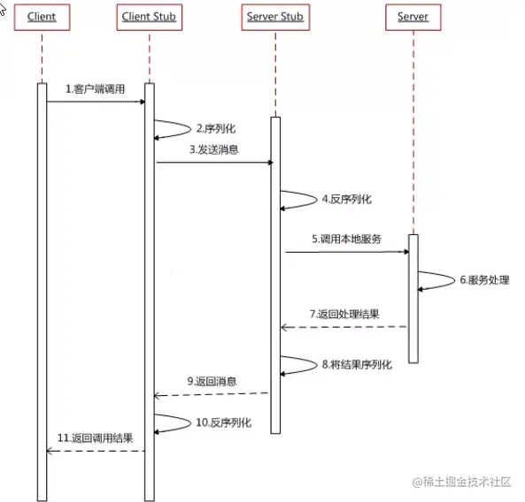
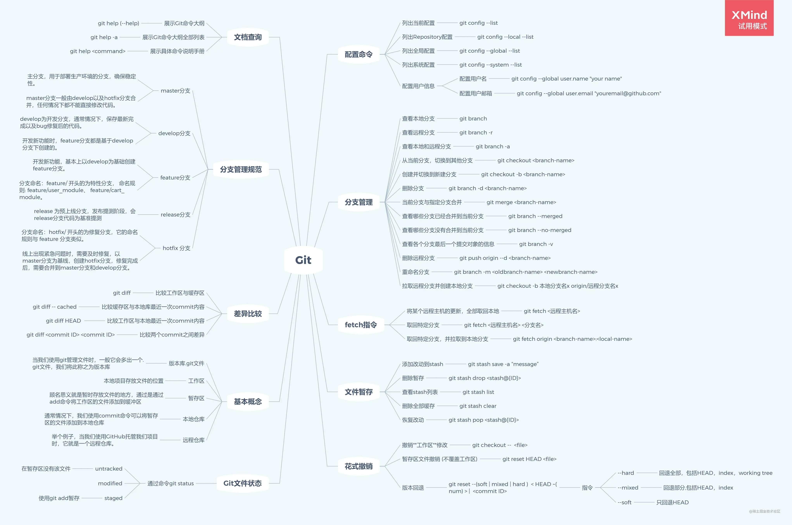
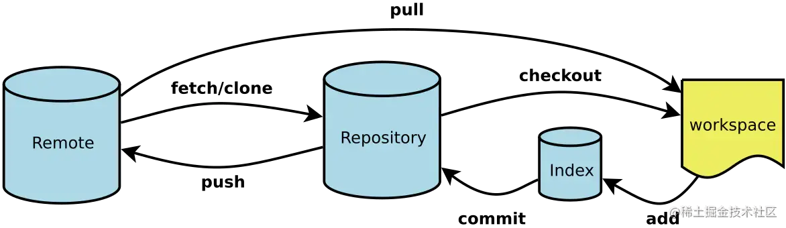
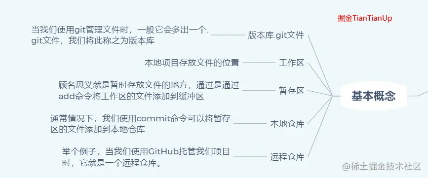
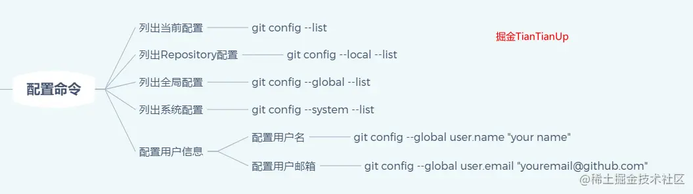
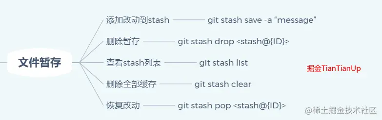

参与的项目就是WeTest平台建设，分[国际站](https://www.wetest.net/)和[国内站](https://wetest.qq.com/)。

干的活基本就是普通前端该干的活了，写页面，写组件，调样式，调接口等🤔 不过也算了解到了一些新的名词吧。

## Rpc
Remote Procedure Call 远程过程调用 **让分布式或者微服务系统中不同服务之间的调用像本地调用一样简单。**

就是 RPC 主要是基于 TCP/IP 协议(或者是HTTP协议)的，而 HTTP 服务主要是基于 HTTP 协议的。

> 应用层(application-layer)的任务是通过应用进程间的交互来完成特定网络应用。**HTTP 属于应用层协议，它会基于TCP/IP通信协议来传递数据（HTML 文件, 图片文件, 查询结果等）。HTTP协议工作于客户端-服务端架构为上。浏览器作为HTTP客户端通过 URL 向HTTP服务端即WEB服务器发送所有请求。Web服务器根据接收到的请求后，向客户端发送响应信息。HTTP协议建立在 TCP 协议之上。
>
> **运输层(transport layer)的主要任务就是负责向两台主机进程之间的通信提供通用的数据传输服务**。TCP是传输层协议，主要解决数据如何在网络中传输。相比于UDP,**TCP** 提供的是**面向连接**的，**可靠的**数据传输服务。

该协议允许一台计算机的程序调用另一台计算机的子程序，无需额外的为这个交互过程编写逻辑代码

RPC 只是一种概念、一种设计，就是为了解决 **不同服务之间的调用问题**, 它一般会包含有 **传输协议** 和 **序列化协议** 这两个。



HTTP采用的是 浏览器----服务器 BS模式

RPC采用的是 客户端----服务器 CS模式

其他不同

第一点:

1. ajax使用dns做为寻址服务
2. rpc一般是在内网寻址 

第二点： 

1. ajax应用层使用http（html/json）
1. rpc通信到时候一般会使用二进制协议，性能优势

rpc可以不使用HTTP协议进行数据传输，甚至可以使用自定义的协议

使用RPC的主要优势包括：

1. **抽象网络细节**：RPC将网络通信的细节抽象掉了，使得开发人员可以专注于业务逻辑的实现，而无需关注底层网络通信细节，大大提高了开发效率。
2. **分布式系统通信**：RPC可以在分布式系统中实现不同服务之间的通信，允许不同的服务在不同的计算机上运行，从而实现分布式系统的高可用性、可扩展性和负载均衡。
3. **性能优化**：RPC可以通过优化协议、编码和序列化等方式提高通信性能和效率，例如使用二进制协议、压缩数据等技术可以减少网络带宽的消耗。
4. **语言无关性**：RPC协议可以跨越不同的编程语言和操作系统，使得不同平台上的应用程序可以进行相互调用和数据传输。

RPC协议的实现方式有很多，常见的包括以下几种：

1. **HTTP协议**：基于HTTP协议实现的RPC框架包括gRPC和Thrift等，它们使用HTTP/2作为底层传输协议，可以提供高效、可靠的RPC通信，并支持多种编程语言和平台。
2. **TCP协议**：基于TCP协议实现的RPC框架包括Dubbo和gRPC等，它们使用二进制协议作为数据传输格式，可以提供更快速、更可靠的RPC通信，但对于网络环境要求较高。
3. **UDP协议**：基于UDP协议实现的RPC框架包括Apache Thrift等，它们可以提供更高的性能和更低的延迟，但需要在应用层自行处理数据丢失和重传等问题。

**序列化协议用的是pb**

##### 项目中前端调用node rpc的简单过程

###### PB文件

protocol buffer 用于序列化数据结构 其实就是类似于xml, json，相比二者的优势是支持多平台和语言，一条消息数据序列化后的大小也比前俩者要小 是Google开发的一种轻量级、高效的序列化数据结构的格式，也是一种数据交换的格式。pb序列化后的数据通常是二进制格式，可以在不同语言和平台之间进行高效、可靠的数据传输和存储。

pb可以通过定义proto文件来描述数据结构，然后使用相关的代码生成工具来生成序列化和反序列化代码，这样就可以在不同语言的应用中使用相同的数据结构。同时，pb序列化格式的空间效率和解析速度也使得RPC框架的通信效率得到了提高，从而可以更快地进行数据传输和处理

1. 空间效率高：pb序列化后的数据通常比其他格式更小，这在网络传输和存储时可以节省带宽和存储空间。
2. 解析速度快：pb序列化和反序列化的速度都非常快，这在高并发的网络应用中非常有优势。
3. 易于维护和更新：pb格式的数据可以根据定义的proto文件进行版本管理和升级，这样可以保证不同版本的应用可以相互兼容，而且也可以在不同语言和平台之间进行互操作。

拿实习项目举例，工程项目中会有两个文件夹, web下放前端相关，app下放中端相关

前端就正常写，与正常开发没区别，写页面，写交互，用到数据的时候封装service函数然后调用。

然后service这里调用的接口，其实就是node层的接口了，然后我们看app的目录结构

```
# 主要就三个
controller # 负责权限管理，接收数据，组装和分配数据给service并处理返回service的处理结果
service # 处理和请求后端
router # 路由配置

# 然后像middleware，extend这些就不用管了，比较杂
```

前端 service 请求接口 进入 node层的router，根据route调用controller中的相关函数

controller 中 调用 service的rpc层接口，并对前端req/后端res进行处理后请求/返回

简单过程就是这样，不过有个比较叼的写法是rpc调用没有写路径，也没用类似pont这样的工具自动生成，而是写了autoRpcRequest的方法，根据请求接口函数名来自动生成请求路径，所以函数命名一定要规范，要和后端提供的一致

代码没看懂，从 new Error里面拿到函数名，看傻了

`/([a-zA-Z]+)\.([a-zA-Z]+)/.exec(new Error().stack.split('\n', 3)[2])`

然后这就是一个基本的带rpc项目了 记得参数校验

> 调用过程就是 客户端肯定先和服务端那边建立连接，然后通过调用pb中的同名方法就可以，数据也是根据pb来进行传输的
>
> 1. 加载 Protobuf 文件
>
> 客户端首先需要加载包含服务和方法定义的 Protobuf 文件，该文件包含了客户端需要调用的服务和方法名称以及输入输出参数的类型定义。客户端可以通过 Protocol Buffers 提供的代码生成工具生成对应的客户端代码，在编译客户端代码的过程中会同时生成与服务端相同的 Protobuf 文件。
>
> 2. 创建 Channel
>
> 客户端需要创建一个到远程服务的连接，该连接也被称为 Channel。在创建 Channel 时，需要指定服务端的地址和端口号，以及一些连接参数，例如连接超时时间等。客户端可以通过提供不同的连接参数来控制连接的行为，例如连接是否需要加密等。
>
> 3. 创建 Stub
>
> 客户端需要创建一个与服务端对应的 Stub 对象，该对象会根据 Protobuf 文件中定义的服务和方法名称，生成对应的方法调用代码。Stub 对象包含了连接到服务端的 Channel 对象，可以使用该 Channel 对象来发送请求和接收响应。
>
> 4. 调用远程服务
>
> 客户端通过 Stub 对象调用服务端的函数，Stub 会将请求编码成 Protobuf 格式的二进制数据，并发送到服务端。服务端接收到请求后，会解码二进制数据，并根据请求调用对应的函数。函数的执行结果会被编码成 Protobuf 格式的二进制数据，并返回给客户端。
>
> 6. 处理响应
>
> 客户端接收到服务端返回的响应后，需要将其解码成对应的数据类型，以便进行进一步的处理。客户端可以根据请求的返回值类型，将响应数据解码成对应的对象或者基本数据类型。如果服务端返回的数据是流式数据，客户端需要使用流式 API 来处理响应数据。
>
> 7. 关闭 Channel
>
> 客户端在不需要继续使用连接时，需要显式地关闭 Channel，以释放资源并断开与服务端的连接。
>
> 以上就是 gRPC 客户端调用远程服务的详细流程。

## Git复习

四个区域





###### 配置命令



###### 基础命令

+ `git status:` 查看仓库状态

+ `git diff:` 文件 查看该文件的修改

+ `git log:` 查看修改日志
+ `git reflog` 查看历史操作记录

+ `git add: <file>:` 添加文件到缓存区

+ `git switch` 切换分支相关
+ `git branch` 分支相关，删除-d，重命名-m
+ `git checkout <cmt>` 现在作用分离出来后，可以理解为主要用于操控HEAD，比如分离HEAD, 就是把HEAD从指向分支改成指向某一特定版本
+ `git commit -m "":` 提交暂存区的代码到本地仓库

```
git commit --amend 可以修复最近一次提交
简单的说就是上一个commit里面有想修改或者遗漏的内容，又不想新推一个commit，就用commit --amend
git commit -a 只提交暂存取现有的文件，不会提交新建的
```


###### 本地操作

+ `git reabse [cmt]，把当前HEAD的父版本指向cmt`

​	可以线性操作，比如把一个分支中的 一段记录转移到另一个分支上， rebase 就可以理解为 重新建立基础(父版本)

​	`git rebase -i [版本区间] `

唤起交互式rebase界面， 可以选择 交换 合并 之前的记录

+ 用于撤销

  + `git reset`

    直接撤销，多用于本地，移动HEAD到上一个commit， 比如 `git reset <cmt ID>` ，然后有 hard，soft，mixed三个参数，mixed是默认的，移动HEAD后清空暂存区，保留工作区，soft是都保留，hard是都清空

  + `git revert ` 

    多用于远程，建立一个和之前版本相同的新版本 不会覆盖老版本，比如有 c0<c1<c2，执行git revert c2，则会出现c0<c1<c2<c2'，且c2'内容和c1一致

+ `git cherry-pick <cmt>` 复制版本号，英文意思就是择优挑选，就是选择一些版本到当前分支上作为HEAD的父版本


###### 远程操作

+ `git push:` 将新版本内容提交到远程仓库
+ `git fetch`:  在 `git clone` 后，本地会产生一个 origin/branch 的分支，此分支会一直指向远程仓库的新版本(再fetch后)
+ git pull === git fetch + git merge, git pull --rebase === git fetch + git rebase


###### 暂存操作

有时你想切换分支，但你正在处理当前项目的一个未完成部分。你不想对半成品进行提交。Git 缓存允许你这样做。**git stash 命令**使你能够在不提交当前分支的情况下切换分支。



还有其他命令，就不多说，这里可以通过POP这个词，可以理解到Stash是个栈


###### 相对引用

不用版本号指定 通过对当前版本的相对位置来

^ 向上移动一个 后面跟数字表示在不同父节点之间转移

`~<n>` 向上移动n个

###### git tag 

永远指向某个提交记录的唯一标识

git tag 有锚点的作用 所以 git describe 用来描述最近的锚点


`git grep` 查询变动中的详细内容

##### 面试题

+ `git merge` 和 `git rebase` 的区别

​	`git merge`会让两个分支的提交按照时间进行排序，并且会把最新的两个commit合成一个commit，最后的分支树呈现非线性的结构

​	`git rebase `形成一个线性的分支树

+  rebase 可以修改分支历史和合并分支

即merge保留分支树，rebase不会

### 名词 SaaS,laaS,PaaS

+ SaaS 软件即服务

Software

本质上可以理解为把软件需求移动到浏览器/或者说某个载体上

大部分B端产品都可以认为是saas

比如可以理解 淘宝 对于 淘宝商家来说 就是一个saas

+ PaaS 平台即服务

Platform

就是提供平台，不恰当的比喻就是大部分的开源项目其实都可以理解为paas

通过一个平台来定制自己的需求

比如谷歌的人脸识别，科大语音识别，百度高德地图接口等

又或者说一些编译器其实也可以理解为pass

+ Iaas 基础设施即服务

Infrastructure

把买服务器这个东西放到云上

我们常用的阿里云 华为云等都是laas 通俗点就是 云储存服务

# 微服务和微前端

关于微服务，简单了解一下容器技术

就比如工程部署到云服务器上，部署个Node做的后端，那你要装Node，要装包，装好后才能跑，各种依赖啥的,

然后考虑到负载均衡，又要在不止一个服务器上跑，假设你的项目node版本是16，换了个服务器，那个服务器上再跑一个node版本是14的项目，那G，得重新找，这就导致又要换个机器，然后再重新搞一次

所以需要一个方案，能自动配环境，能一个服务器跑多个工程

后来有了虚拟机，不过虚拟机太大又麻烦，所以容器技术就来了

底层知识前端不需要过多了解，只需要知道一台服务器上可以跑很多容器，每个容器都有独立的环境，跑着不同的项目即可。

 

那什么是微服务，其实也只需要了解，介绍这个只是便于理解微前端

微服务其实简单的说就是一个抽象拆分的过程，这个怎么理解，从前端的角度来说，最简单的抽象就是把一些共同逻辑抽象成函数啊，开发的时候抽象出公有组件啊，这就是一个抽象过程。

微服务其实就和这类似，比如一个超市管理系统，他的模块有人工，货品，促销，订单等，如果后端开发把这些服务放在同一个工程service下，整个项目会非常大，一点小小的改动可能就会影响全局，包括数据库，里面也会有很多的表。

所以就需要把这些服务单独拆分出来，每个模块对应一个服务工程，有着自己的数据库，那后端开发人员只需要负责自己的模块，订单的错误找不到商品的头上来

这样每个单独的服务就可以理解为一个微服务，这些服务工程之间语言不限，框架不限，只提供接口，只共享数据

当然这只是一个简单的理解，真实的微服务肯定要复杂的多，什么链路跟踪之类的，不过那就不是我们需要了解的了。


那根据微服务来衍生，就能简单理解微前端了。

把前端各种页面当成模块，进行拆分独立开发，技术不限，共享数据。

一些比较老的实现方式，比如用Nginx反向代理，其实就是不同的route对应不同的项目，不是SPA，这样就会导致做不到局部刷新，是等同于访问了一个全新资源/打开了一个全新网站，然后还有个就是用 iframe，这点其实有很多争吵，有些觉得iframe完全够用，不需要微前端，有些人就觉得iframe不好用，各有各的理

iframe 优点 ：

- iframe 自带的样式、环境隔离机制使得它具备天然的 沙盒机制 。
- 嵌入 子应用比较 简单 。

iframe 缺点 ：

- iframe功能之间的跳转是无效的，刷新页面 无法保存 状态。
- URL的记录完全无效，刷新会返回首页。
- 主应用 劫持 快捷键操作，事件冒泡 不穿透 到主文档树上。
- 模态弹窗的背景是无法覆盖到整个应用。
- iframe应用加载失败，内容发生错误主应用无法感知， 通信麻烦 。

然后现在的微前端方案就是 **组合式应用路由开发**

简单点说，就是我们先把之前说好的子模块，或者说子应用单独开发好，单独部署好，然后在主应用中配置相关微前端方案的config文件，设置好name啊，URL啊，然后解析的时候微前端框架就会根据这个配置文件找到对应的子应用，然后再渲染子应用的地方构建出一个容器，把子应用添加进去。

然后关于如何解析子应用的html,css,js等，不多说了。

然后关于css,js的隔离问题

###### shadow DOM 解决父子隔离

> 核心是Shadow DOM。它可以让一个dom拥有自己的“影子”DOM树，这个DOM树不能在主文档中被任意访问，可以拥有局部样式规则， 天然实现了样式隔离 ，如上图所示，被代理的dom节点称为shadow host，shadow tree中的根节点称为shadow root。
>
> 比如我们常用的`<video>`标签，一个标签就实现了一个简易的播放器，但其实它是由一些看不到的dom封装而成的，这里就是使用了shadow DOM。

兄弟隔离其实就是可以在各选择器上加上个前缀，比如随机的id，又或者以这个子应用的URL来区分

关于Js就得用框架提供的一些sandbox类了，不多说

##### 如何全局通信呢

这就是一个关键点了，不同框架不同方案，以qiankun为例子，采用发布订阅的方式，需要共享的数据调用qiankun提供的API，它会把所有的共享数据挂在到window.gloabState上

至此，微前端的概念就这样

### 配置Host

**host可以理解为本地DNS服务器 比网络上的DNS的优先级更高**

配置host作用

+ 加快域名解析 绕过DNS污染和劫持

+ 可以将域名临时指向测试服务器IP 这样就不影响他人和线上应用

  

### 图片知识

+ jpg：
  体积小，有损压缩，适合颜色复杂、尺寸大的图，如：banner、商品图、视频封面、照片等。
  压缩品质在 70 左右，一般看不出画质缺失，体积可减少到 1/4 左右。
+ png：
  无损压缩，索引颜色，颜色越多体积越大，颜色少于 256 种的时候或需要半透明背景的时候才适合使用。
  格式有 png8（支持索引透明）、png24（不支持透明）、png32（支持半透明），半透明背景非常占用体积，如无需要尽量纯色背景。
  颜色简单的图标、插画、线框图适合 png，尺寸大、颜色复杂的不适用，体积会非常大，尽量用 jpg。
+ svg：
  其实就是代码，描述矢量规则，体积最小，画图标、logo 等线条类型的东西比较适合。
  不适合复杂图形，体积会非常大，比如用 svg 画一个证书，好几兆，解析都很困难


picuture标签设置图片不适配问题


# GA埋点

GA 埋点是指在网页或移动应用程序中嵌入 Google Analytics（GA）代码以收集用户行为数据的过程。GA 是一种网站分析工具，可以帮助网站和移动应用程序的所有者收集和分析关于用户活动的数据，包括访问量、流量来源、页面浏览量、用户交互、转化率等指标。

在 GA 中，每个跟踪项都对应一个唯一的跟踪代码，称为“UA-XXXXX-Y”。此代码需要嵌入到网页或移动应用程序中，以便 GA 可以跟踪用户的活动并将数据发送到 GA 服务器进行分析。GA 埋点通常使用 JavaScript 或 SDK 进行实现。

GA 埋点可以收集各种与用户行为有关的数据，包括：

1. 访问量和页面浏览量：GA 可以跟踪页面的访问量和浏览量，并可以提供有关每个页面的详细信息，如页面路径、平均停留时间、跳出率等指标。

2. 流量来源和用户分析：GA 可以跟踪流量来源，包括搜索引擎、社交媒体、广告和直接访问等，并可以提供有关访问者的信息，如地理位置、设备类型、年龄和性别等。

3. 用户交互和转化率：GA 可以跟踪用户的交互行为，如点击、滚动、表单提交等，并可以提供有关转化率的信息，如销售量、注册量、下载量等。

GA 埋点的好处是可以帮助网站和移动应用程序的所有者了解用户行为，从而优化网站和应用程序的设计和运营。例如，他们可以了解哪些页面受到用户的欢迎，哪些功能被用户频繁使用，哪些广告或营销策略效果最佳等，从而优化网站和应用程序的设计、推广和运营策略。

需要注意的是，GA 埋点涉及到用户隐私和数据保护等问题，因此在实施 GA 埋点时需要遵守相关的法律法规和隐私政策，确保用户的数据受到保护。例如，在收集用户数据时，需要获取用户的同意，并明确告知用户数据的用途和处理方式；在使用 GA 工具时，需要配置数据保护功能，如匿名 IP 地址和禁用数据共享等，以保护用户的隐私。

此外，还需要注意 GA 埋点的实施方法和数据收集方式，以确保数据的准确性和可靠性。例如，需要正确配置跟踪代码和跟踪参数，避免重复跟踪和误报等问题；需要使用有效的过滤器和维度，以排除无效数据和分析数据的不同维度。

总之，GA 埋点是一种非常有用的网站分析工具，可以帮助网站和移动应用程序的所有者了解用户行为和优化运营策略，但需要遵守相关的法律法规和隐私政策，并注意数据的准确性和可靠性。

一个使用 React 实现 Google Analytics 埋点的示例组件：

```javascript
import React, { useEffect } from 'react';
import ReactGA from 'react-ga';

const GAEventTracker = ({ category, action, label, value }) => {
  useEffect(() => {
    ReactGA.initialize('UA-XXXXX-Y'); // 替换为你的 Google Analytics 跟踪代码
  }, []);

  const trackEvent = () => {
    ReactGA.event({
      category,
      action,
      label,
      value,
    });
  };

  return (
    <div onClick={trackEvent}>
      {/* 在这里添加你需要跟踪的内容 */}
    </div>
  );
};

export default GAEventTracker;
```

在这个示例中，我们使用了 `react-ga` 库来实现 Google Analytics 埋点。在组件中，我们通过 `useEffect` 钩子来初始化 Google Analytics，然后定义 `trackEvent` 函数来跟踪事件。在组件的返回值中，我们添加了需要跟踪的内容，并将 `onClick` 事件绑定到 `trackEvent` 函数上，以便在用户点击该元素时触发埋点事件。

使用这个组件时，你可以像这样传入需要跟踪的信息：

```javascript
<GAEventTracker category="Button" action="Click" label="Submit" value={1}>
  <button>提交</button>
</GAEventTracker>
```

在这个示例中，我们跟踪了一个按钮的点击事件，其中 `category` 表示事件类别，`action` 表示事件动作，`label` 表示事件标签，`value` 表示事件价值。这些参数可以根据具体的需求进行调整。

需要注意的是，使用 Google Analytics 埋点时需要遵守相关的法律法规和隐私政策，并注意数据的准确性和可靠性。例如，在收集用户数据时，需要获取用户的同意，并明确告知用户数据的用途和处理方式；在使用 Google Analytics 工具时，需要配置数据保护功能，如匿名 IP 地址和禁用数据共享等，以保护用户的隐私。

当使用 GA 埋点时，需要设置以下参数：

1. `category`：事件类别，用于描述事件的类型或分类。例如，“按钮点击”、“表单提交”等。

2. `action`：事件动作，用于描述事件的具体操作。例如，“点击”、“提交”等。

3. `label`：事件标签，用于描述事件的具体内容或属性。例如，按钮的名称、表单的字段名称等。

4. `value`：事件价值，用于描述事件的重要程度或价值。例如，订单的金额、会员等级等。

在上面的 React 组件中，我们将这些参数作为组件的 props 进行传递，并在组件内部使用 `ReactGA.event()` 方法来发送事件。具体来说：

1. `category`：代表事件类别，是一个字符串类型的参数，可以用来区分不同类型的事件。

2. `action`：代表事件动作，也是一个字符串类型的参数，可以用来描述事件的具体操作。

3. `label`：代表事件标签，同样是一个字符串类型的参数，可以用来描述事件的具体内容或属性。

4. `value`：代表事件价值，是一个数值类型的参数，可以用来描述事件的重要程度或价值。

举个例子，如果我们想要跟踪一个按钮的点击事件，可以按照以下方式设置 props：

```javascript
<GAEventTracker
  category="Button"
  action="Click"
  label="Submit"
  value={1}
>
  <button>提交</button>
</GAEventTracker>
```

在这个例子中，我们设置了一个按钮的点击事件，其中 `category` 为“Button”表示按钮类型，`action` 为“Click”表示点击操作，`label` 为“Submit”表示提交事件，`value` 为 1 表示事件的价值。这些参数可以根据具体的需求进行调整。

需要注意的是，GA 埋点的参数设置需要遵循一定的规范和标准，以保证数据的准确性和一致性。在设置参数时，需要根据具体的业务需求和场景进行选择和调整。


+ 分片上传 重点

1. 搜索

> 先本地计算md5，然后搜索该md5是否存在，如果存在，则可以实现"秒上传"，立即完成本次上传(即不会重复上传)
>
> 用 hash-wasm 计算 文件的ArrayBuffer

2. 获取上传ID

> 在上传前，获取一个唯一的ID标识当前上传

3. 分片上传文件

> 分片上传文件 大小为1MB 最后一片数据<=1 MB

如何切片？

`利用 Blob.prototype.slice` 方法，然后生成器函数

```ts
slice(file: File) {
        let i = 0;
        let start = 0;
        while (true) {
            const end = start + MB;
            const blob = file.slice(start, end);
            if (blob.size === 0) break;
            yield { chunk: ++i, blob } as Slice;
            start = end;
        }
    }

async batchUpload(id: string, file: File, cb: () => void) {
        const batch = 5;
        let sliceDone = false;
        const slicer = this.slice(file);
        while (!sliceDone) {
            const slices: Slice[] = [];
            for (let i = 0; i < batch; ++i) {
                const slice = slicer.next();
                if (slice.done) {
                    sliceDone = true;
                    break;
                }
                slices.push(slice.value as Slice);
            }
            await Promise.all(slices.map((s) => this.upload(id, s, cb)));
        }
    }
```


# 全埋点

全埋点，也叫无埋点、无码埋点、无痕埋点、自动埋点。全埋点是指无需应用程序开发工程师写代码或者只写少量的代码，即可预先自动收集用户的所有或者绝大部分的行为数据，然后就可以根据实际的业务分析需求从中筛选出所需行为数据并进行分析。

事实上，无论是『无埋点』还是『全埋点』，它们的核心技术基础是一致的，都是通过植入代码在所有页面路径变更时，和页面上的可交互事件元素触发动作时，通过放置『监听器』来实现数据采集。所以，与其说它们是不需要埋点，还不如说是代码帮开发者完成了埋点的繁琐工作（代码无侵入）。无埋点按具体作用的层级不同，又分为三种：

1）页面级无埋点：直接采集应用进入与退出，采集难度不高，可统计页面停留时长、页面来源、用户行为流水等信息，对应大同SDK（dt_pgin/dt_pgout）

2）元素级无埋点：通过采集页面上元素的曝光与点击，数据上报后再通过”圈选“来定义那些元素是业务需要关注的指标，实现方式最难，需要自动计算元素唯一id(XPath)，并需要规避业务代码频繁变更导致的XPath 变更，web前端页面一般采集a,button,input,textarea等标签。

autotracker SDK 采集同时支持页面级和元素级，目前可采集的全埋点事件有：页面进入，页面停留，页面滚动，元素点击，元素曝光，元素停留。只需要开发人员按照正确的方式集成，然后初始化 SDK 并开启相关配置，即可在对应的事件触发时，自动采集事件和相关属性。


hash路由模式与history路由模式是前端两种不同的路由切换方案。hash路由模式是在页面url后面缀加#号与相应的页面url，切换页面需要改变url后的哈希值，哈希值变化不会触发页面的刷新，但会触发页面的hashchange事件，事件触发后会页面会根据#号后的路由判断应该展示哪些页面。autotracker如果需要通过原生的方法监听路由变化，在hash路由模式下就需要监听hashchange的事件。

history路由模式利用了 HTML5 History Interface 中新增的pushState、replaceState方法，调用pushState方法会改变URL地址且页面不会进行刷新，往浏览器历史记录中新增一条记录；replaceState同样会改变url且不会导致页面刷新，但是他不会新增浏览器历史记录，而是将替换最近的一条历史记录。这两个方法应用于修改浏览器的历史记录栈，调用back、forward、go等方法则可以访问浏览器的历史记录栈，且不会造成页面的刷新。

需要注意的是history.back、history.forward、history.go方法的调用会触发popstate事件，但history.replaceState和history.pushState 不会触发 popState事件，因此需要对这种特殊情况进行处理。

同时需要注意的是，页面url的hash改变后，同时触发hashChange事件与popState事件，因为hash的改变也会新增一条浏览器历史记录栈。


针对history的replaceState、pushState两个方法执行不会触发popState事件的问题，可以通过扩展原生事件的方法，使得方法的执行可以触发事件。以扩展pushState方法为例，将history的原始pushState方法进行替换，在新方法中执行原始pushState方法，但是会dispatchEvent一个原始事件，同时监听dispatch的事件，这样用户在调用pushState方法的时候，就会触发事件的分发，从而实现方法事件的监听，下面为简单的代码演示。

```js
const extendEvent = (type) => {
  const { history } = window;
  const orig = history[type];
  return function () {
    const result = orig.apply(this, arguments);
    const e = new Event(type);
    e.arguments = arguments;
    window.dispatchEvent(e);
    return result;
  };
};
window.history.pushState = extendEvent('pushState');
```

hash路由模式下，url变化后会触发hashChange事件与popState事件，可以保留前一次的path与hash，比较前后path是否变化，如果path不变而hash变化，则说明触发的是hashChange事件。vue3.0 哈希路由模式不会触发 hashchange 事件，同样可以根据前后的path与hash是否改变，判断触发的是什么事件。


前端埋点是指在前端代码中植入统计代码，用于采集用户行为数据，以便进行数据分析和优化。前端埋点可以分为命令式埋点和声明式埋点两种方式。

命令式埋点是指在前端代码中通过调用特定的方法或函数来记录用户行为数据，然后将数据发送到服务器进行分析。命令式埋点需要手动编写埋点代码来记录每个需要统计的事件，并且需要在代码中显式地调用埋点方法，因此通常需要开发人员手动维护埋点代码，工作量比较大。

下面是命令式埋点的示例代码：

```js
// 命令式埋点示例，通过手动编写埋点代码来记录点击事件
function handleClick(event) {
  // 记录点击事件
  const eventData = {
    eventName: 'click',
    target: event.target.tagName,
    x: event.clientX,
    y: event.clientY
  };
  sendEventDataToServer(eventData);
}

// 注册点击事件监听器
document.addEventListener('click', handleClick);
```

声明式埋点是指通过在HTML标签上添加特定的属性或标记来实现统计用户行为数据的功能。声明式埋点不需要手动编写埋点代码，可以在HTML代码中直接添加统计逻辑，从而简化了埋点的过程。声明式埋点通常使用第三方埋点库来实现，例如Google Analytics、百度统计等。

下面是声明式埋点的示例代码：

```html
<!-- 声明式埋点示例，通过在HTML标签上添加特定的属性来统计点击事件 -->
<button data-track-id="button-1" data-track-event="click">Click me</button>
```

上述代码中，`data-track-id`和`data-track-event`是自定义的属性，用于标识需要统计的元素和事件类型。通过使用第三方埋点库，可以自动地采集这些数据，并将其发送到服务器进行分析。

总之，命令式埋点和声明式埋点各有优缺点，开发人员可以根据实际需求和项目情况选择合适的方式。需要注意的是，无论是哪种方式，都需要遵循相关的隐私政策和法律法规，确保用户的隐私和数据安全。


GA（Google Analytics）埋点是一种声明式埋点方式，通过在HTML标签上添加特定的属性或标记来实现统计用户行为数据的功能。例如，可以在链接上添加`onclick`事件来触发GA统计代码：

```html
<a href="https://example.com" onclick="ga('send', 'event', 'button', 'click', 'Example link');">Example link</a>
```

在上述代码中，`onclick`事件会触发GA统计代码，用于统计用户点击链接的行为数据。通过这种方式，可以在HTML代码中直接添加统计逻辑，从而简化了埋点的过程。

需要注意的是，GA埋点需要在网站中引入GA统计代码，并且需要遵循相关的隐私政策和法律法规，确保用户的隐私和数据安全。同时，也需要根据实际需求和项目情况，选择合适的埋点方式和统计指标，以便更好地进行数据分析和优化。


可视化埋点是一种前端埋点的方式，它使用可视化交互界面，让非技术人员也能够方便地进行数据采集和分析。通常情况下，可视化埋点工具会在网站或应用程序中嵌入一个脚本文件，并提供一个可视化的界面，用于定义需要统计的事件和参数。用户可以通过界面中的操作，选择需要统计的元素、事件类型和参数，从而实现数据采集和分析的功能。

可视化埋点的优点在于，它可以让非技术人员也能够方便地进行数据采集和分析，无需编写复杂的代码或使用专业的统计工具。同时，可视化埋点也可以帮助开发人员更快速地实现数据采集和分析的功能，减少开发工作量和时间成本。

可视化埋点的缺点在于，它的灵活性和精确性可能会受到一定的限制，无法满足所有的数据采集和分析需求。此外，可视化埋点工具也可能会增加网站或应用程序的加载时间和资源消耗，影响用户体验和性能。

一些常见的可视化埋点工具包括Mixpanel、Amplitude、Segment、Heap等，它们提供了丰富的功能和界面，可以帮助用户快速地进行数据采集和分析。同时，也可以根据实际需求和项目情况，选择合适的可视化埋点工具和统计指标，以便更好地进行数据分析和优化。