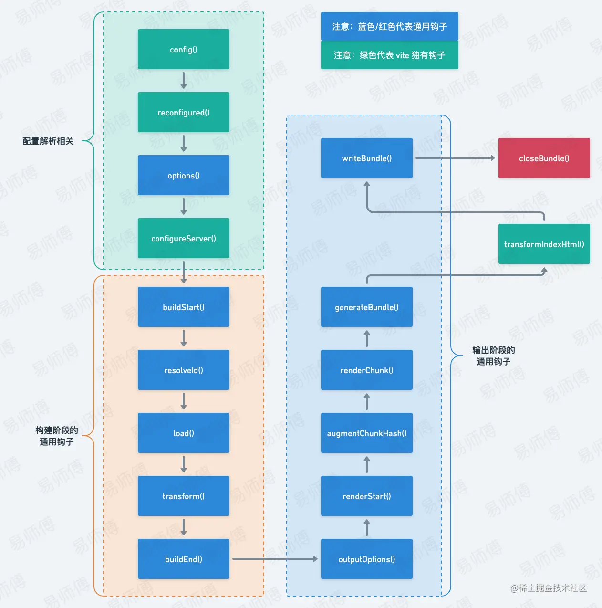

小小的深入学习一下vite

学习Vite之前 建议先去看一下ES Module 和 CommonJs的区别
## 概览
启动

> 先用 esbuild 进行预构建
>
> - 将非 `ESM` 规范的代码转换为符合 `ESM` 规范的代码；
> - 将第三方依赖内部的多个文件合并为一个，减少 `http` 请求数量；
>
> 然后不需要构建module graph，浏览器会根据ESM规范对各个模块发起请求，发起请求以后，`dev server` 端会通过 `middlewares` 对请求做拦截，然后对源文件做 `resolve`、`load`、`transform`、`parse` 操作，然后再将转换以后的内容发送给浏览器。

更新

> `dev server` 在监听到文件发生变化以后，只需要通过 `ws` 连接通知浏览器去重新加载变化的文件，剩下的工作就交给浏览器去做了。

打包，通过 rollup来打包，和bundle的构建打包过程一致了。
Rollup分为build（构建）阶段和output generate（输出生成）阶段。主要过程如下：

+ 获取入口文件的内容，包装成module，生成抽象语法树（AST）
+ 对入口文件抽象语法树进行依赖解析
+ 生成最终代码
+ 写入目标文件

打包产物：

与webpack产物的最大区别就是没有额外的注入代码

额外代码：
+ webpack自己的兼容代码，目的是自己实现require，modules.exports，export，让浏览器可以兼容cjs和esm语法
+ （可以理解为，webpack自己实现polyfill支持模块语法，rollup是利用高版本浏览器原生支持esm(所以rollup无需代码注入)）

### Tree shanking

Tree Shaking 是一种在构建过程中移除未使用代码（死代码）的优化技术。这个术语源于将未使用的代码想象成树上的枯萎叶子，而通过 "摇动"（Shaking）树来摘除这些叶子。Tree Shaking 的主要目标是减小构建产物的体积，从而提高应用程序的加载性能。

Tree Shaking 的工作原理主要依赖于以下几个方面：

1. 静态模块结构：Tree Shaking 依赖于 ES 模块（ECMAScript Module）的静态导入和导出语句。由于 ES 模块的依赖关系在代码解析阶段就已经确定，这使得构建工具可以准确地识别出未使用的代码。

2. 代码分析：构建工具（如 Webpack、Rollup 等）会分析项目中的模块依赖关系，生成一个依赖图。然后，构建工具会检查依赖图中的每个模块，确定其导出的成员是否在其他模块中被使用。

3. 移除未使用代码：构建工具会遍历依赖图，将未使用的模块成员标记为死代码。然后，在输出构建产物时，这些死代码会被移除。这样，最终的构建产物只包含实际使用的代码，从而减小了文件体积。

需要注意的是，Tree Shaking 只能移除未使用的模块成员，而无法移除模块内部的死代码。为了进一步优化构建产物，可以结合其他代码优化技术，如代码压缩（UglifyJS、Terser 等）和作用域提升（Scope Hoisting）。

总之，Tree Shaking 是一种用于移除未使用代码的优化技术。通过使用 Tree Shaking，开发者可以减小构建产物的体积，提高应用程序的加载性能。为了充分利用 Tree Shaking，建议使用 ES 模块，并确保构建工具和配置支持 Tree Shaking。


## 先看看vite和Webpack的区别

**webpack是先打包再启动开发服务器，vite是直接启动开发服务器，然后按需编译依赖文件。**

##### 下面详细来说：

- webpack先打包，再启动开发服务器，请求服务器时直接给予打包后的结果；
- vite直接启动开发服务器，请求哪个模块再对哪个模块进行实时编译；
- 由于现代浏览器本身就支持ES Modules，会主动发起请求去获取所需文件。vite充分利用这点，将开发环境下的模块文件，就作为浏览器要执行的文件，而不是像webpack先打包，交给浏览器执行的文件是打包后的；
- 由于vite启动的时候不需要打包，也就无需分析模块依赖、编译，所以启动速度非常快。当浏览器请求需要的模块时，再对模块进行编译，这种按需动态编译的模式，极大缩短了编译时间，当项目越大，文件越多时，vite的开发时优势越明显；
- 在HRM方面，当某个模块内容改变时，让浏览器去重新请求该模块即可，而不是像webpack重新将该模块的所有依赖重新编译；
- 当需要打包到生产环境时，vite使用传统的rollup进行打包，所以，vite的优势是体现在开发阶段，另外，由于vite使用的是ES Module，所以代码中不可以使用CommonJs；

简单点来说就是，webPack会先从你的入口文件开始，逐层寻找你的依赖，然后在统一打包编译，再由浏览器运行


## Vite在官网上的介绍

选Vite 可以解决两个问题

1. 缓慢的服务器启动 开发模式下

esbuild预构建 + ESM模块 no bundle 模式

2. 缓慢的更新

利用websocket监听，支持了动态模块热替换（HMR）：允许一个模块 “热替换” 它自己，而不会影响页面其余部分

Vite 同时利用 HTTP 头来加速整个页面的重新加载（再次让浏览器为我们做更多事情）：源码模块的请求会根据 `304 Not Modified` 进行协商缓存，而依赖模块请求则会通过 `Cache-Control: max-age=31536000,immutable` 进行强缓存，因此一旦被缓存它们将不需要再次请求。

生产模式下还是会用rollup打包

> 尽管原生 ESM 现在得到了广泛支持，但由于嵌套导入会导致额外的网络往返，在生产环境中发布未打包的 ESM 仍然效率低下（即使使用 HTTP/2）。为了在生产环境中获得最佳的加载性能，最好还是将代码进行 tree-shaking、懒加载和 chunk 分割（以获得更好的缓存）

不用esbuild打包的原因

> Vite 目前的插件 API 与使用 `esbuild` 作为打包器并不兼容。尽管 `esbuild` 速度更快，但 Vite 采用了 Rollup 灵活的插件 API 和基础建设，这对 Vite 在生态中的成功起到了重要作用。目前来看，我们认为 Rollup 提供了更好的性能与灵活性方面的权衡。
>
> 即便如此，`esbuild` 在过去几年有了很大进展，我们不排除在未来使用 `esbuild` 进行生产构建的可能性。我们将继续利用他们所发布的新功能，就像我们在 JS 和 CSS 最小化压缩方面所做的那样，`esbuild` 使 Vite 在避免对其生态造成干扰的同时获得了性能提升。

静态资源分为两类：预构建内容和业务代码。其中，预构建内容通常是由项目中的第三库生成的，采用强缓存策略，业务代码则采用协商缓存策略。

协商缓存，通常需要在发起请求时，在请求头中添加 `If-None-Match` 字段，携带请求文件对应的 `ETag` 信息。当 `dev server` 收到请求时，会将请求头的 `ETag` 和请求文件的 `ETag` 信息做对比，如果没有变化，返回 `304` 通知浏览器使用本地缓存，反之则返回新的文件内容。

在获取请求文件的 `ETag` 信息这一块儿，`Vite` 有自己的一套处理逻辑。

在 `dev server` 内部，有一个缓存对象 - `moduleGraph`, 用来缓存请求过的文件内容和对应的 `ETag` 信息。

当 `dev server` 启动以后，这个对象是空的。此时如果浏览器发起业务代码请求，`dev server` 需要根据请求，将请求 `url` 解析为文件的本地路径(`resolve`)、读取文件内容(`load`)、对文件内容做转换(`transform` - 如 `less` 转换为 `css`)、计算 `ETag`，并缓存到 `moduleGraph` 中。 此时，如果请求中 `If-None-Match` 字段中携带的 `ETag` 信息和新计算的 `ETag` 信息一致，`server` 端会将状态码设置为 `304`，不返回转换以后的内容。

当浏览器再次请求相同文件时，`dev server` 会根据请求路径直接从缓存中去读取文件内容和 `ETag` 信息，然后和请求中 `If-None-Match` 字段中携带的 `ETag` 信息做比较。如果一致，`server` 端直接将状态码设置为 `304`，通知浏览器使用本地缓存。

了解了这些，那么首次访问应用时协商缓存为什么没有起作用就好理解了。因为这个时候，`dev server` 内部的缓存为空，所有的请求都需要经历 `resolve`、`load`、`transform` 的过程，导致响应耗时较久。

做一个简单的总结:

- 开发模式下，请求预加载文件采用强缓存策略，请求业务文件采用协商缓存策略。
- 首次访问应用请求业务文件时，尽管会命中协商缓存，但 `sever` 端依旧会进行 `resolve`、`load`、`transform` 操作，导致响应需要消耗一定的时间。
- 二次访问应用，强缓存和协商缓存同时起作用，性能很好。

其实，关于结论中提到的第二点，我们还是有办法进行优化的，比如说采取 `Webpack5` 的缓存策略，在 `dev server` 关闭之前将 `moduleGraph` 缓存到本地，等到再次启动时读取本地缓存。


## Vite插件

##### 1. vite 独有的钩子

1. `enforce` ：值可以是`pre` 或 `post` ， `pre` 会较于 `post` 先执行；
2. `apply` ：值可以是 `build` 或 `serve`  亦可以是一个函数，指明它们仅在 `build` 或 `serve` 模式时调用；
3. `config(config, env)` ：可以在 vite 被解析之前修改 vite 的相关配置。钩子接收原始用户配置 config 和一个描述配置环境的变量env；
4. `configResolved(resolvedConfig)` ：在解析 vite 配置后调用。使用这个钩子读取和存储最终解析的配置。当插件需要根据运行的命令做一些不同的事情时，它很有用。
5. `configureServer(server)` ：主要用来配置开发服务器，为 dev-server (connect 应用程序) 添加自定义的中间件；
6. `transformIndexHtml(html)` ：转换 index.html 的专用钩子。钩子接收当前的 HTML 字符串和转换上下文；
7. `handleHotUpdate(ctx)`：执行自定义HMR更新，可以通过ws往客户端发送自定义的事件；

##### 2. vite 与 rollup 的通用钩子之构建阶段

1. `options(options)` ：在服务器启动时被调用：获取、操纵Rollup选项，严格意义上来讲，它执行于属于构建阶段之前；
2. `buildStart(options)`：在每次开始构建时调用；
3. `resolveId(source, importer, options)`：在每个传入模块请求时被调用，创建自定义确认函数，可以用来定位第三方依赖；
4. `load(id)`：在每个传入模块请求时被调用，可以自定义加载器，可用来返回自定义的内容；
5. `transform(code, id)`：在每个传入模块请求时被调用，主要是用来转换单个模块；
6. `buildEnd(error?: Error)`：在构建阶段结束后被调用，此处构建结束只是代表所有模块转义完成；

##### 3. vite 与 rollup 的通用钩子之输出阶段

1. `outputOptions(options)`：接受输出参数；
2. `renderStart(outputOptions, inputOptions)`：每次 bundle.generate 和 bundle.write 调用时都会被触发；
3. `augmentChunkHash(chunkInfo)`：用来给 chunk 增加 hash；
4. `renderChunk(code, chunk, options)`：转译单个的chunk时触发。rollup 输出每一个chunk文件的时候都会调用；
5. `generateBundle(options, bundle, isWrite)`：在调用 bundle.write 之前立即触发这个 hook；
6. `writeBundle(options, bundle)`：在调用 bundle.write后，所有的chunk都写入文件后，最后会调用一次 writeBundle；
7. `closeBundle()`：在服务器关闭时被调用



重点就是`fs`（文件系统）和`path`（文件路径）两个模块

用`fs.readdirSync` 读取文件夹/文件 然后筛选`isFile`

对文件夹进行递归调用 文件放入routeOption对象里面

先注册虚拟模块，autoRoute，然后在resolveId中捕获该模块（不然会报错，因为虚拟模块不对应实际文件，是在内存中生存的，在构建过程中动态创建和处理）

在configServer里面来进行操作，configSerser接受的参数是dev server实例，然后server.middlewares.use，在这当中调用生成路由的函数并response即可。


Vite的首评加载会很慢，可以通过prefetch来优化

[参考](https://juejin.cn/post/7125753214489591821)

#### Webpack / Rollup / Parcel

`Webpack`、`Rollup`、`Parcel` 统称为`静态模块打包器`。

这一类构建工具，通常需要指定入口 - `entry`，然后以 `entry` 为起点，通过分析整个项目内各个源文件之间的依赖关系，构建一个模块依赖图 - `module graph`，然后再将 `module graph` 分离为三种类型的 `bundle`: `entry` 所在的 `initial bundle`、`lazy load` 需要的 `async bundle` 和自定义分离规则的 `custome bundle`。

这几个构建工具各有优势:

- `Webpack` 大而全，配置灵活，生态丰富，是构建工具的首选。
- `Parcel` 号称零配置，使用简单，适合不太需要定制化构建的项目使用。
- `Rollup` 推崇 `ESM` 标准开发，打包出来的代码干净，适用于组件库开发。

#### Vite / Esbuild

新一代构建工具。

`esbuild`, 基于 `go` 语言实现，代码直接编译成机器码(不用像 js 那样先解析为字节码，再编译为机器码)，构建速度比 `webpack` 更快。

`vite`, 开发模式下借助浏览器对 `ESM` 的支持，采用 `nobundle` 的方式进行构建，能提供极致的开发体验；生产模式下则基于 `rollup` 进行打包构建。

> `Webpack` 是一个静态模块打包器，它会以 `entry` 指定的入口文件为起点，分析整个项目内各个源文件之间的依赖关系，构建一个模块依赖图 - `module graph`，然后将 `module graph` 分离为多个 `bundle`。在构建 `module graph` 的过程中，会使用 `loader` 处理源文件，将它们转化为浏览器可以是识别的 `js`、`css`、`image`、`音视频`等。

### 初探 Vite 预构建

使用过 `Vite` 的同学都知道，开发阶段 `Vite` 会对项目中使用的第三方依赖如 `react`、`react-dom`、`lodash-es` 等做`预构建`操作。

之所以要做`预构建`，是因为 `Vite` 是基于浏览器原生的 `ESM` 规范来实现 `dev server` 的，这就要求整个项目中涉及的所有源代码必须符合 `ESM` 规范。

而在实际开发过程中，业务代码我们可以严格按照 `ESM` 规范来编写，但第三方依赖就无法保证了，比如 `react`。这就需要我们通过 `Vite` 的`预构建`功能将非 `ESM` 规范的代码转换为符合 `ESM` 规范的代码。

另外，尽管有些第三方依赖已经符合 `ESM` 规范，但它是由多个子文件组成的，如 `lodash-es`。如果不做处理就直接使用，那么就会引发请求瀑布流，这对页面性能来说，简直就是一场灾难。同样的，我们可以通过 `Vite` 的`预构建`功能，将第三方依赖内部的多个文件合并为一个，减少 `http` 请求数量，优化页面加载性能。

综上，`预构建`，主要做了两件事情：

- 将非 `ESM` 规范的代码转换为符合 `ESM` 规范的代码；
- 将第三方依赖内部的多个文件合并为一个，减少 `http` 请求数量；

### 二次预构建

`预构建`，最关键的一步就是找到项目中所有的第三方依赖。 那 `Vite` 是怎么做到快速获取项目中所有的第三方依赖呢？

在解释这个问题之前，我们先来聊一聊 `Webpack`、`Rollup`、`Parcel` 这一类`静态打包器`是如何打包代码的。以 `Webpack` 为例，整个打包过程可以分为构建模块依赖图 - `module graph` 和将 `module graph` 分离为多个 `bundles` 两个步骤。其中，构建 `module graph` 是重中之重。

`Webpack` 构建 `module graph` 的过程，可以拆解成下面几个步骤：

1. 找到入口文件 `entry` 对应的 `url`, 这个 `url` 一般为相对路径；
2. 将 `url` 解析为绝对路径，找到源文件在本地磁盘的位置，并构建一个 `module` 对象；
3. 读取源文件的内容；
4. 将源文件内容解析为 `AST` 对象，分析 `AST` 对象，找到源文件中的`静态依赖`(import xxx from 'xxx') 和`动态依赖`(import('xx'))对应的 `url`, 并收集到 `module` 对象中；
5. 遍历第 4 步收集到的`静态依赖`、`动态依赖`对应的 `url`，重复 2 - 5 步骤，直到项目中所有的源文件都遍历完成。

在构建 `module graph` 过程中，我们就可以知道整个项目涉及的所有源文件对应的 `url`，然后就可以从这些 `url` 中过滤出第三方依赖。

同样的，`Vite` 在`预构建`的时候也是基于类似的机制去找到项目中所有的第三方依赖的。和 `Webpack` 不同， `Vite` 另辟蹊径，借助了 `Esbuild` 比 `Webpack` 更快的打包能力，对整个项目做一个全量打包。打包的时候，通过分析`依赖关系`，得到项目中所有的源文件的 `url`，然后分离出第三方依赖。

这样，`Vite` 就可以对找到的第三方依赖做转化、合并操作了。

`预构建`功能非常棒，但在实际的项目中，并不能保证所有的第三方依赖都可以被找到。如果出现下面的这两种情况， `Esbuild` 也无能为力:

- `plugin` 在运行过程中，动态给源码注入了新的第三方依赖；
- `动态依赖`在代码运行时，才可以确定最终的 `url`；

当出现这两种情况时，`Vite` 会触发`二次预构建`。

### 3.0的优化

`3.0` 版本对第三方依赖的请求和业务代码的请求有不同的处理逻辑。当浏览器请求业务代码时，`dev server` 只要完成源代码转换并收集到依赖模块的 `url`，就会给浏览器发送 `response`。而第三方依赖请求则不同，`dev server` 会等首屏期间涉及的所有模块的依赖关系全部解析完毕以后，才会给浏览器发送 `response`。这就导致了，如果发现有未`预构建`的第三方依赖，第三方依赖的请求会一直被阻塞，直到`二次预构建`完成为止。

有了这种操作，当然就不需要 `reload` 操作了。

## Vite 的快

`Vite` 的快，主要体现在两个方面: 快速的冷启动和快速的热更新。而 `Vite` 之所以能有如此优秀的表现，完全归功于 `Vite` 借助了浏览器对 `ESM` 规范的支持，采取了与 `Webpack` 完全不同的 `unbundle` 机制。

#### 快速的冷启动

就是启动项目的时间，大伙都知道Vite比webpack要快不少。这个问题，主要是由 `Webpack` 内部的核心机制 - `bundle` 模式引发的。

`Webpack` 能大行其道，归功于它划时代的采用了 `bundle` 机制。通过这种 `bundle` 机制，`Webpack` 可以将项目中各种类型的源文件转化供浏览器识别的 `js`、`css`、`img` 等文件，建立源文件之间的依赖关系，并将数量庞大的源文件合并为少量的几个输出文件。

`bundle` 工作机制的核心部分分为两块：构建模块依赖图 - `module graph` 和将 `module graph` 分解为最终供浏览器使用的几个输出文件。

构建 `module graph` 的过程可以简单归纳为:

1. 获取配置文件中 `entry` 对应的 `url` (这个 `url` 一般为相对路径);
2. `resolve` - 将 `url` 解析为绝对路径，找到源文件在本地磁盘的位置，并构建一个 `module` 对象；
3. `load` - 读取源文件的内容;
4. `transform` - 使用对应的 `loader` 将源文件内容转化为浏览器可识别的类型；
5. `parse` - 将转化后的源文件内容解析为 `AST` 对象，分析 `AST` 对象，找到源文件中的静态依赖(`import xxx from 'xxx'`) 和动态依赖(`import('xx')`)对应的 `url`, 并收集到 `module` 对象中；
6. 遍历第 `5` 步收集到的静态依赖、动态依赖对应的 `url`，重复 `2` - `6` 步骤，直到项目中所有的源文件都遍历完成。

分解 `module graph` 的过程也可以简单归纳为:

1. 预处理 `module graph`，对 `module graph` 做 `tree shaking`；
2. 遍历 `module graph`，根据静态、动态依赖关系，将 `module graph` 分解为 `initial chunk`、`async chunks`；
3. 优化 `initial chunk`、 `async chunks` 中重复的 `module`；
4. 根据 `optimization.splitChunks` 进行优化，分离第三方依赖、被多个 `chunk` 共享的 `module` 到 `common chunks` 中；
5. 根据 `chunk` 类型，获取对应的 `template`；
6. 遍历每个 `chunk` 中收集的 `module`，结合 `template`，为每个 `chunk` 构建最后的输出内容；
7. 将最后的构建内容输出到 `output` 指定位置；

`Webpack` 的这种 `bundle` 机制，奠定了现代静态打包器(如 `Rollup`、`Parcel`、`Esbuild`)的标准工作模式。

然而成也萧何败萧何，强大的 `bundle` 机制，也引发了构建速度缓慢的问题，而且项目规模越大，构建速度越是缓慢。其主要原因是构建 `module graph` 的过程中，涉及到大量的文件 `IO`、文件 `transfrom`、文件 `parse` 操作；以及分解 `module graph` 的过程中，需要遍历 `module graph`、文件 `transform`、文件 `IO` 等。这些操作，往往需要消耗大量的时间，导致构建速度变得缓慢。

开发模式下，`dev server` 需要 `Webpack` 完成整个工作链路才可以启动成功，这就导致构建过程耗时越久，`dev server` 启动越久。

为了加快构建速度，`Webpack` 也做了大量的优化，如 `loader` 的缓存功能、`webpack5` 的持久化缓存等，但这些都治标不治本，只要 `Webpack` 的核心工作机制不变，那 `dev server` 启动优化，依旧是一个任重道远的过程(基本上永远都达不到 `Vite `那样的效果)。


而Vite采取了与 `Webpack` 截然不同的 `unbundle` 机制。

`unbundle` 机制，顾名思义，不需要做 `bundle` 操作，即不需要构建、分解 `module graph`，源文件之间的依赖关系完全通过浏览器对 `ESM` 规范的支持来解析。这就使得 `dev server` 在启动过程中只需做一些初始化的工作，剩下的完全由浏览器支持

- `unbundle` 机制，顾名思义，不需要做 `bundle` 操作，即不需要构建、分解 `module graph`，源文件之间的依赖关系完全通过浏览器对 `ESM` 规范的支持来解析。这就使得 `dev server` 在启动过程中只需做一些初始化的工作，剩下的完全由浏览器支持。这和 `Webpack` 的 `bundle` 机制一比，简直就是降维打击，都有点欺负人了 。

  那有的同学就会问，源文件的 `resolve`、`load`、`transform`、`parse` 什么时候做呢 ？

  答案是浏览器发起请求以后，`dev server` 端会通过 `middlewares` 对请求做拦截，然后对源文件做 `resolve`、`load`、`transform`、`parse` 操作，然后再将转换以后的内容发送给浏览器。

  这样，通过 `unbundle` 机制， `Vite` 便可以在 `dev server` 启动方面获取远超于 `Webpack` 的优秀体验。

  最后再总结一下， `unbundle` 机制的核心:

  - 模块之间的依赖关系的解析由浏览器实现；
  - 文件的转换由 `dev server` 的 `middlewares` 实现并做缓存；
  - 不对源文件做合并捆绑操作；

#### 快速的热更新

Webpack:

`dev server` 启动以后，会 `watch` 源文件的变化。当源文件发生变化后，`Webpack` 会重新编译打包。这个时候，由于我们只修改了一个文件，因此只需要对这个源文件做 `resolve`、 `load`、 `transfrom`、`parse` 操作，依赖的文件直接使用缓存，因此 `dev server` 的响应速度比冷启动要好很多。

`dev server` 重新编译打包以后，会通过 `ws` 连接通知浏览器去获取新的打包文件，然后对页面做局部更新。

Vite:

由于 `Vite` 采用 `unbundle` 机制，所以 `dev server` 在监听到文件发生变化以后，只需要通过 `ws` 连接通知浏览器去重新加载变化的文件，剩下的工作就交给浏览器去做了。

## Vite的慢

和 `bundle` 机制有利有弊一样，`unbundle` 机制给 `Vite` 在 `dev server` 方面获得巨大性能提升的同时，也带来一些负面影响，那就是`首屏`和`懒加载`性能的下降

Webpack:

浏览器向 `dev server` 发起请求， `dev server` 接受到请求，然后将已经打包构建好的首屏内容发送给浏览器。整个过程非常普遍，没有什么可说的，不存在什么性能问题。

Vite:

由于 `unbundle` 机制，首屏期间需要额外做以下工作:

- 不对源文件做合并捆绑操作，导致大量的 `http` 请求；
- `dev server` 运行期间对源文件做 `resolve`、`load`、`transform`、`parse` 操作；
- 预构建、二次预构建操作也会阻塞首屏请求，直到预构建完成为止；

和 `Webpack` 对比，`Vite` 把需要在 `dev server` 启动过程中完成的工作，转移到了 `dev server` 响应浏览器请求的过程中，不可避免的导致首屏性能下降。

不过首屏性能差只发生在 `dev server` 启动以后第一次加载页面时发生。之后再 `reload` 页面时，首屏性能会好很多。原因是 `dev server` 会将之前已经完成转换的内容缓存起来。

和首屏一样，由于 `unbundle` 机制，动态加载的文件，需要做 `resolve`、`load`、`transform`、`parse` 操作，并且还有大量的 `http` 请求，导致懒加载性能也受到影响。

此外，如果懒加载过程中，发生了二次预构建，页面会 `reload`，对开发体验也有一定程度的影响

### Esbuild

我们提到过开发模式下使用 `Vite` 会有首屏性能下降的负面效果。之所以会造成首屏性能下降，一方面是 `dev server` 需要完成预构建才可以响应首屏请求；另一方面是需要对请求文件做实时转换。

> 我们都知道 `vite` 本身使用的 `rollup` 打包，`vite` 的插件也和 `rollup` 的插件机制相吻合； `esbuild` 是用于在开发环境中对文件进行处理，也有自己的声明周期钩子函数，由于对文件的分割和 `css` 支持还不太友好，暂未应用到打包环节。

那么Vite是如何利用Esbuild提升性能的？

首先我们要知道，Esbuild要比一般的打包器要快很多

而 `Esbuild` 之所以能这么快，主要原因有两个:

- `Go` 语言开发，可以多线程打包，代码直接编译成机器码；

  `Webpack` 一直被人诟病构建速度慢，主要原因是在打包构建过程中，存在大量的 `resolve`、`load`、`transform`、`parse` 操作，而这些操作通常是通过 `javascript` 代码来执行的。要知道，`javascript` 并不是什么高效的语言，在执行过程中要先编译后执行，还是单线程并且不能利用多核 `cpu` 优势，和 `Go` 语言相比，效率很低。

- 可充分利用多核 `cpu` 优势；

#### 关键 API - transfrom & build

`Esbuild` 并不复杂。它对外提供了两个 `API` - `transform` 和 `build`，使用起来非常简单。

`transfrom`，转换的意思。通过这个 api，我们可以将 `ts`、`jsx`、`tsx` 等格式的内容转化为 `js`。 `transfrom` 只负责文件内容转换，并不会生成一个新的文件。

`build`，构建的意思，根据指定的单个或者多个入口，分析依赖，并使用 `loader` 将不同格式的内容转化为 js 内容，生成一个或多个 `bundle` 文件。

`Esbuild` 对外提供的 `hook` 比较简单，总共 `4` 个:

- `onResolve`, 解析 `url` 时触发，可自定义 `url` 如何解析。如果 `callback` 有返回 `path`，后面的同类型 `callback` 将不会执行。所有的 `onResolve` `callback` 将按照对应的 `plugin` 注册的顺序执行。
- `onLoad`, 加载模块时触发，可自定义模块如何加载。 如果 `callback` 有返回 `contents`，后面的同类型 `callback` 将不会执行。所有的 `onLoad` `callback` 将按照对应的 `plugin` 注册的顺序执行。
- `onStart`, 每次 `build` 开始时都会触发，没有入参，因此不具有改变 `build` 的能力。多个 `plugin` 的 `onStart` 并行执行。
- `onEnd`, 每次 `build` 结束时会触发，入参为 `build` 的结果，可对 `result` 做修改。所有的的 `onEnd` 将按照对应的 `plugin` 注册的顺序执行。

正是有了 `onResolve`、`onLoad`、`onStart`、`onEnd`，我们可以在 `build` 过程中的解析 `url`、加载模块内容、构建开始、构建结束阶段介入，做自定义操作。

#### 预构建

先来回顾一下为什么要做预构建。

原因有两点:

- 将非 `ESM` 规范的代码转换为符合 `ESM` 规范的代码；
- 将第三方依赖内部的多个文件合并为一个，减少 `http` 请求数量；

要完成预构建，最关键的两点是找到项目中所有的第三份依赖和对第三方依赖做合并、转换。借助 `Esbuild`，`Vite` 很轻松的实现了这两个诉求。

- **寻找第三方依赖**

  寻找第三方依赖的过程非常简单，分为两步:

  1. 定义一个带 `onResolve hook` 和 `onLoad hook` 的 `esbuild plugin`；
  2. 执行 `esbuild` 的 `build` 方法做打包构建；

  和 `Webpack`、`Rollup`、`Parcel` 等构建工具一样，`Esbuild` 在做打包构建时也要构建模块依赖图 - `module graph`

  在构建 `module graph` 时，第一步就是解析模块的绝对路径，这个时候就会触发 `onResolve hook`。在 `onResolve hook` 触发时，会传入模块的路径。根据模块的路径，我们就可以判断出这个模块是第三方依赖还是业务代码。

  举个 🌰，

  ```javascript
  // main.tsx
  
  import react from 'react';
  import CustomeComponent from './components/CustomeComponent';
  ...
  复制代码
  ```

  在对 `main.tsx` 的内容做 `parser` 操作时，能知道 `main.tsx` 依赖 `react` 和 `CustomeComponent`，然后开始解析 `react` 和 `CustomeComponent`。

  解析 `react`、`CustomeComponent` 时，会触发 `onResolve hook`，入参分别为 `'react'` 和 `'./components/CustomeComponent'`。根据入参，我们可以很清楚的区分 `'react'` 是第三方依赖，`'./components/CustomeComponet'` 是业务代码。

  这样，`esbuild` 完成构建，项目中的第三方依赖也就收集完毕了。所有的第三方依赖会收集到一个 `deps` 列表中。

- **合并、转换第三方依赖**

  知道了项目中的第三方依赖以后，再做合并、转换操作就非常简单了。

  这一步， `Vite` 直接通过 `esbuild` 提供的 `build` 方法，指定 `entryPoints` 为收集到的第三方依赖，`format` 为 `esm`，再做一次打包构建。

  这一次，会对第三方依赖做合并、转换操作。打包构建完成以后，再把构建内容输出到 `/node_modules/.vite/deps` 下。

这样，通过两次 `esbuild.build`，预构建就完成了。

#### middlewares 中内容转换

`Vite` 中源文件的转换是在 `dev server` 启动以后通过 `middlewares` 实现的。

当浏览器发起请求以后，`dev sever` 会通过相应的 `middlewares` 对请求做处理，然后将处理以后的内容返回给浏览器。

`middlewares` 对源文件的处理，分为 `resolve`、`load`、`transform`、`parser` 四个过程：

1. `resolve` - 解析 `url`，找到源文件的绝对路径；

2. `load` - 加载源文件。如果是第三方依赖，直接将预构建内容返回给浏览器；如果是业务代码，继续 `transform`、`parser`。

3. `transfrom` - 对源文件内容做转换，即 `ts` -> `js`, `less` -> `css` 等。转换完成的内容可以直接返回给浏览器了。

4. `parser` - 对转换以后的内容做分析，找到依赖模块，对依赖模块做预转换 - `pre transform` 操作，即重复 `1` - `4`。

   `pre transform` 是 `Vite` 做的一个优化点。预转换的内容会先做缓存，等浏览器发起请求以后，如果已经完成转换，直接将缓存的内容返回给浏览器。

`Vite` 在处理步骤 `3` 时，是通过 `esbuild.transform` 实现的，对比 `Webpack` 使用各个 `loader` 处理源文件，那是非常简单、快捷的。


### Prefetch优化懒加载

[参考](https://juejin.cn/post/7131636427183357965)

### 为什么懒加载性能会差

首先我们先来解释一下为什么通过 `Vite` 启动 `dev server` 以后，懒加载性能会差(注意：性能差仅限于 `dev server` 启动以后首次打开应用的某一个页面)。

原因有两点：

- 大量的 `http` 请求；
- `dev server` 实时对浏览器请求的文件做 `transform`；

由于 `Vite` 采取了 `unbundle` 机制，源文件并没有像 `webpack` 那样做合并捆绑，这就导致了不管是首屏还是懒加载，都会因为请求 `js`、`css` 等资源产生大量的 `http` 请求。另外，在请求过程中，`dev server` 需要对源文件做实时转换。其中，实时转换源文件是影响最大的。

这两种情形，和我们常用的优化手段如减少 `http` 请求、提前对源文件做处理背道而驰，也就导致了懒加载性能下降。

知道了性能下降的原因，那我们就可以针对性的做性能优化了。

`http` 请求数量多这个问题，影响较小，因此小编只重点关注源文件实时处理这个问题。解决方案也很简单，就是在用户点击某个页面之前，提前向 `dev server` 发起请求，让 `dev server` 提前去对请求文件做 `transform`,等到真正需要加载某个资源时，直接返回已经 `transform` 的资源。

这种手段也就是我们常说的 `prefetch`。

